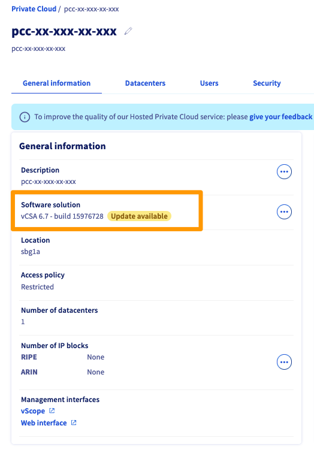

**Dernière mise à jour le 01/12/2022**

## Objectif

Lorem ipsum dolor sit amet, consectetur adipiscing elit. Vestibulum dignissim eros at tortor finibus accumsan. Fusce vel gravida augue, nec hendrerit erat. Nullam non magna nec lacus mattis dignissim. Phasellus vel suscipit ipsum, nec mollis eros. Cras laoreet ex dolor, sit amet imperdiet ipsum sodales quis. Aenean mattis et augue sit amet sodales. Etiam sed est ex. Phasellus fermentum, urna non faucibus tempor, massa sem maximus elit, et venenatis leo arcu non tellus.

**Nulla condimentum rhoncus nisl eget efficitur. Quisque sit amet nisl id velit vestibulum tempus nec id purus. Cras venenatis lectus ligula, id laoreet nisi vulputate id.**

## Prérequis

- Posséder une offre [Hosted Private Cloud powered by VMware](https://www.ovhcloud.com/fr/enterprise/products/hosted-private-cloud/){.external}.
- Être connecté à [l'espace client OVHcloud](https://www.ovh.com/auth/?action=gotomanager&from=https://www.ovh.com/fr/&ovhSubsidiary=fr).
- Être connecté aux [API OVHCloud](https://api.ovh.com/console){.external}.
- Avoir [créé ses identifiants pour l'API OVHCloud](https://docs.ovh.com/fr/customer/first-steps-with-ovh-api/){.external}.

## En pratique

### Etape 1 - Récupération des informations de votre service Hosted Private Cloud

Connectez-vous aux APIv6 OVHcloud en suivant le guide « [Premiers pas avec les API OVHcloud](https://docs.ovh.com/fr/api/first-steps-with-ovh-api/) ».

Une fois identifié, suivez les trois étapes décrites ci-dessous.

#### 1.1 - Récupération des informations de votre service Hosted Private Cloud via l'API OVHcloud

##### **Récupération de votre range**

> [!api]
>
> @api {GET} /dedicatedCloud/{serviceName}/datacenter/{datacenterId}/host/{hostId}
>

Renseignez les champs de l'appel avec les informations suivantes :

**serviceName** : renseignez ...  
**hostId** : renseignez ... 
**datacenterId** : renseignez ...

Prenez note du résultat obtenu et passez à l'étape suivante.

##### **Récupération de votre type de stockage**

> [!api]
>
> @api {GET} /dedicatedCloud/{serviceName}/datacenter/{datacenterId}/filer/{filerId}
>

Renseignez les champs de l'appel avec les informations suivantes :

**serviceName** : renseignez ...  
**filerId** : renseignez ... 
**datacenterId** : renseignez ...

Prenez note du résultat obtenu et passez à l'étape suivante.

##### **Vérification de la localisation de votre service**

L'objectif de cette étape est de vérifier si votre service Hosted Private Cloud se situe dans la room 29 de RBX2.

> [!api]
>
> @api {GET} /dedicatedCloud/{serviceName}/datacenter/{datacenterId}/filer/{filerId}/location
>

Renseignez les champs de l'appel avec les informations suivantes :

**serviceName** : renseignez ...  
**filerId** : renseignez ... 
**datacenterId** : renseignez ...

Prenez note du résultat obtenu (`Yes` ou `No`) et passez à l'étape suivante.

#### 1.2 Récupération des informations de votre PCC dans vSphere

Rendez vous dans la vue `Mise en réseau` de votre client vSphere puis dans `Sécurité` et enfin cliquez sur l'onglet `Upgrade`.

Prenez note de la version de votre NSX-V.

{.thumbnail}

#### 1.3 - Récupération des informations de votre PCC dans l'espace client OVHcloud

Connectez-vous à l'[espace client OVHcloud](https://www.ovh.com/auth/?action=gotomanager&from=https://www.ovh.com/fr/&ovhSubsidiary=fr) avec un compte administrateur.

Cliquez sur l'onglet `Hosted Private Cloud`{.action}, sélectionnez votre service dans la liste `VMware`{.action}.

Dans l'onglet `Informations générales`{.action}, récupérez la version de votre vSphere.

{.thumbnail}

### Etape 2 - Déterminer votre cas d'usage

Vous devez maintenant avoir récupéré les informations suivantes :

- Host ID ;
- Filer ID ;
- localisation ou non du Filer ID dans la Room 29 de RBX2 ;
- version de votre NSX-V ;
- version de vSphere.

Déterminez maintenant, en fonction de ces informations et grâce au tableau ci-dessous, votre cas d'usage (première colonne). Cliquez sur le cas d'usage pour obtenir les étapes du cycle de vie de votre service.

> [!primary]
>
> La dernière colonne déterminera votre cas d'usage en fonction de votre besoin d'utiliser la solution NSX-T.

| Cas d'usage               | Range              | Type de stockage | Room 29 | Version de NSX-V | Version de vSphere | Besoin de NSX-T |
|---------------------------|--------------------|------------------|---------|------------------|--------------------|-----------------|
| [Use-case n°1](#usecase1) | DC 2014/2016 (AMD) | Leclerc V1/V2    | No      | 6.4.14           | 6.7                | Non             |
| [Use-case n°2](#usecase2) | DC 2014/2016 (AMD) | Leclerc V1/V2    | No      | 6.4.14           | 6.7                | Oui             |

### Etape 3 - Etapes du cycle de vie en fonction de votre cas d'usage

#### Cas d'usage n°1 

Voici la liste des actions pour votre cas d'usage :

- 30/09/2022 DC EOL : (Action Customer) Customer needs to migrate to new ranges (new vDC Essentials or Premier)
- 31/03/23 LV1/LV2 EOL : (Action Customer) Customer needs to "Storage motion" to new 2020 DS
- 15/10/2023 vSphere 6.7 EOL : (Action OVHcloud) upgrade to vSphere 7.0

#### Cas d'usage n°2 

- 30/09/2022 DC EOL : (Action Customer) Customer needs to migrate to new ranges (new vDC Essentials or Premier)
- 31/03/23 LV1/LV2 EOL : (Action Customer) Customer needs to ""Storage motion"" to new 2020 DS
- 15/10/2023 vSphere6.7 EOL : (Action OVHcloud) upgrade to vSphere 7.0
- 15/01/2024 NSX-v EOL : (Action Customer) Customer needs to migrate to NSX-T"

#### Cas d'usage n°3 

## Aller plus loin

Échangez avec notre communauté d'utilisateurs sur <https://community.ovh.com>.