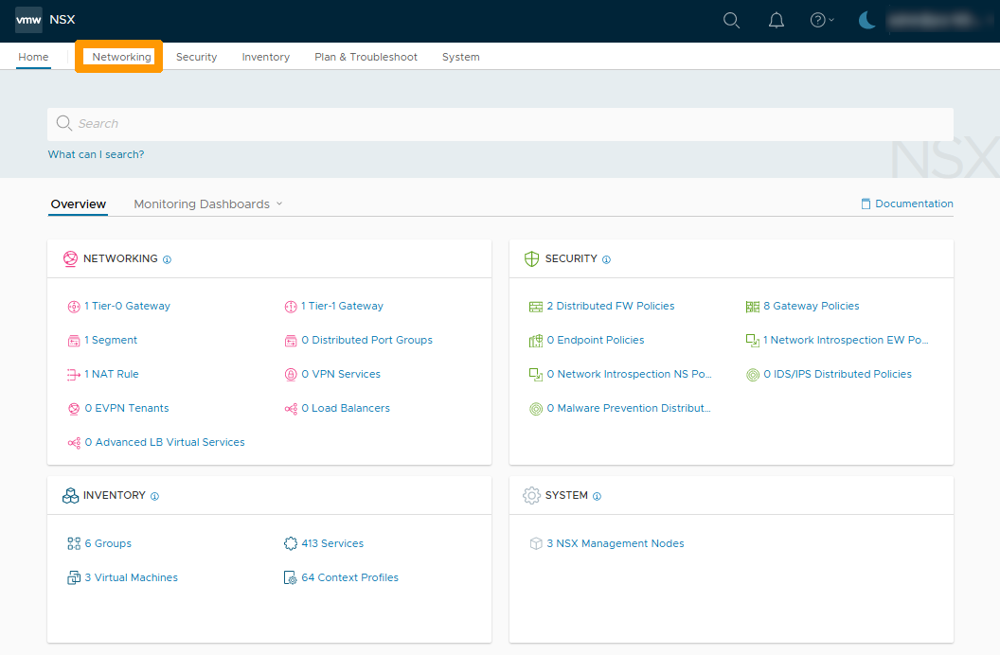
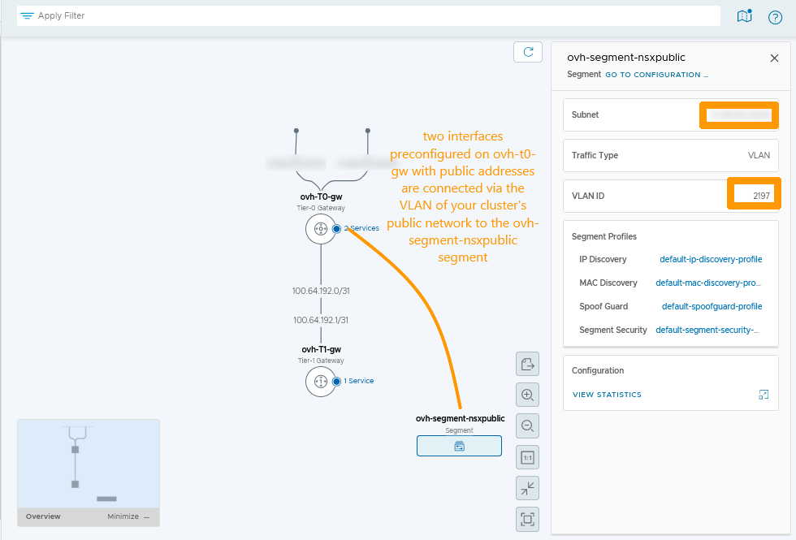
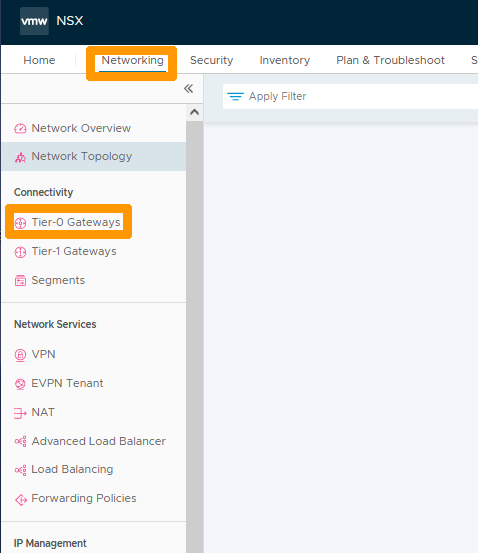
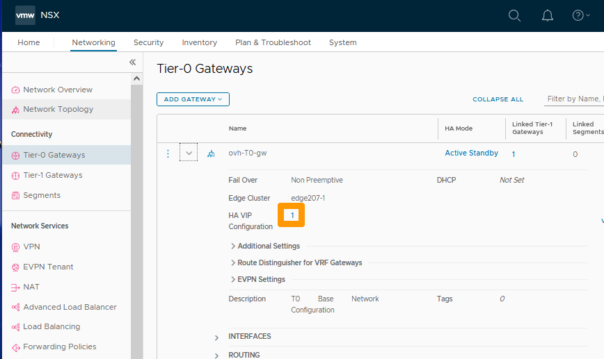
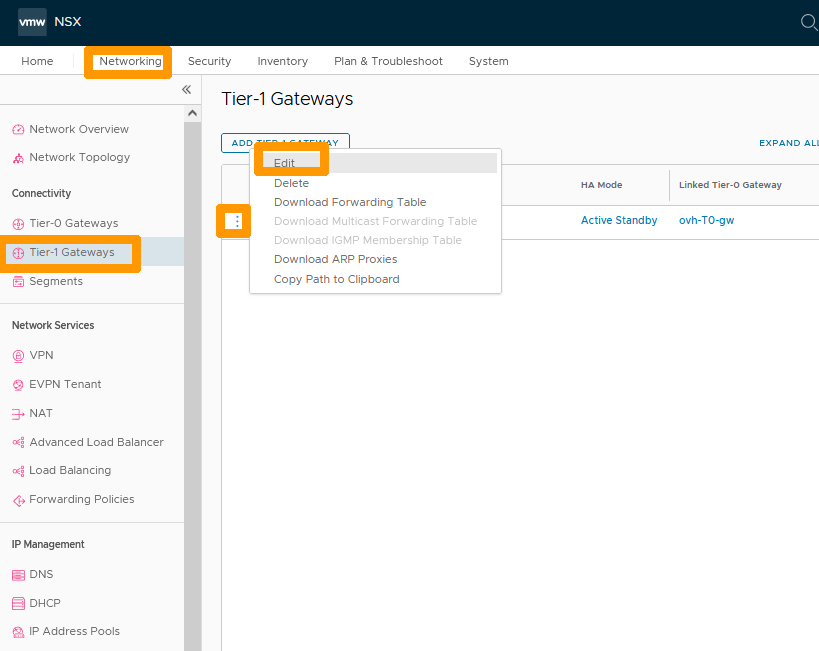
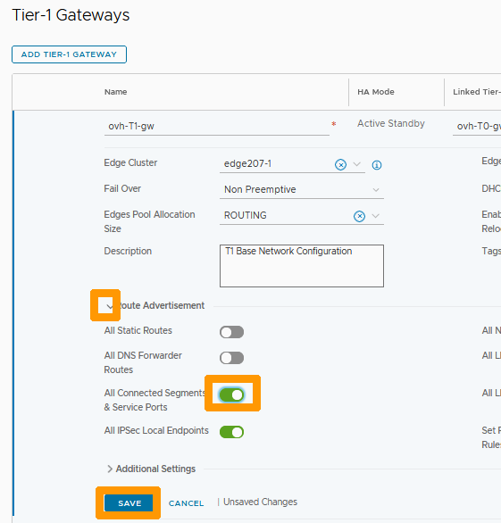

**Dernière mise à jour le 27/02/2023**

## Objectif

NSX est une solution de gestion de réseau logicielle **Sofware Defined Networking (SDN)** fournie par VMware. OVHcloud propose ce service en remplacement de NSX-v dans son offre Hosted Private Cloud Powered by VMware. Deux hôtes sont déployés avec, sur chacun d'entre eux, une machine virtuelle dédiée à NSX, ce qui permet une redondance en cas de défaillance d'un des hôtes.

Lorsqu'un client souscrit à l'offre NSX et qu'elle est activée, une préconfiguration est appliquée avec ces deux passerelles :

- **ovh-T0-gw** : cette passerelle est le point d'entrée réseau de votre cluster. Elle est préconfigurée avec deux interfaces et une adresse IP virtuelle. Elle est de type **Tier-0 Gateways** (nord-sud).
- **ovh-T1-gw** : cette passerelle est dans la catégories des **Tier-1 Gateways** (est-ouest). Il est possible de créer des segments (VLAN ou Overlay) qui lui seront connectés. Elle est reliée à **ovh-T0-gw** pour les liaisons exterieures aux clusters (physique et Internet). 

Il est possible de créer de nouvelles passerelles de type **Tier-1 Gateways** et de les relier à la passerelle **ovh-T0-gw**. 

OVHcloud fournit un bloc de 8 adresses IP publiques, certaines sont réservées. L'adresse **HA VIP** est préconfigurée, elle est utilisée pour le SNAT par défaut sur les futurs segments internes.

Par défaut, les routes ne sont pas activées. Les segments créés derrière la passerelle **ovh-T1-gw** peuvent communiquer entre eux mais pas au-delà.

**Ce guide est une introduction à NSX dans un cluster Hosted Private Cloud by VMware.**

> [!warning]
> OVHcloud vous met à disposition des services dont la configuration, la gestion et la responsabilité vous incombent. Il vous appartient donc de ce fait d’en assurer le bon fonctionnement.
>
> Ce guide a pour but de vous accompagner au mieux sur des tâches courantes. Néanmoins, nous vous recommandons de faire appel à un [prestataire spécialisé](https://partner.ovhcloud.com/fr/) si vous éprouvez des difficultés ou des doutes concernant l’administration, l’utilisation ou la mise en place d’un service sur un serveur.
>

## Prérequis

- Être contact administrateur de l'infrastructure [Hosted Private Cloud powered by VMware](https://www.ovhcloud.com/fr/enterprise/products/hosted-private-cloud/), celui-ci recevant les identifiants de connexion.
- Avoir un identifiant utilisateur actif avec les droits spécifiques pour NSX (créé dans l'[espace client OVHcloud](https://www.ovh.com/auth/?action=gotomanager&from=https://www.ovh.com/fr/&ovhSubsidiary=fr))

## En pratique

### Connexion à l'interface d'administration de NSX

La connexion à NSX se fait à partir de l'URL de votre cluster fournie par OVHcloud, sous la forme `https://pcc-xxxxx.ovh.xx`.

Depuis la page d'accueil de votre cluster, cliquez sur l'icône `NSX`{.action}.

{.thumbnail}

Saisissez vos informations d'identification et cliquez sur `LOG IN`{.action}.

> [!warning]
> Pour s'authentifier sur l'interface NSX, il faut utiliser un compte fourni par OVHcloud suivi du nom FQDN de votre cluster sous la forme `admin@pcc-xxxxx.ovh.xx`. 
>

{.thumbnail}

L'interface NSX s'affiche alors.

{.thumbnail}

### Affichage de la configuration par défaut

Nous allons voir la topologie du réseau configurée par défaut lors du déploiement du service **NSX**.

Via l'interface **NSX**, cliquez sur l'onglet `Networking`{.action}.

{.thumbnail}

Une vue de l'ensemble des éléments du réseau est affichée.

Cliquez à gauche sur `Network Topology`{.action}.

{.thumbnail}

Le schéma ci-dessous représente la topologie réseau avec ces informations :

- Les deux interfaces physiques qui permettent une redondance de l'accès Internet en cas de défaillance (ces deux interfaces utilisent des adresses IP publiques qui ne sont pas utilisables pour la configuration client).
- La passerelle nord-sud (**ovh-T0-gw**) qui assure la liaison entre le réseau physique (Internet et VLAN sur vRack) et les réseaux internes (Overlays) de votre cluster.
- La liaison entre les passerelles **ovh-T0-gw** et **ovh-T1-gw** qui se fait au travers d'adresses IP réservées à cet usage.
- La passerelle est-ouest (**ovh-T1-gw**) qui gère les communications entre les réseaux internes (segments de type overlay) du cluster. Il est aussi possible d'effectuer des connexions avec des VLAN sur des vRacks.
- **ovh-segment-nsxpublic** qui est un segment réseau connecté au réseau public OVHcloud sur un VLAN. Il contient le réseau des adresses publiques utilisables pour les configurations clients. Cliquez sur l'icône en dessous pour afficher ce segment. Vous trouverez plus d'informations concernant les segments dans le guide « [Gestion des segments dans NSX](https://docs.ovh.com/fr/private-cloud/nsx-segment-management) ».

{.thumbnail}

Ce segment contient deux informations :

- L'adresse IP publique virtuelle **HA VIP**.
- Le numéro VLAN utilisé sur votre réseau public de votre cluster vSphere.

Les connexions au travers de VLAN sur la passerelle **ovh-T0-gw** n'apparaissent pas dans la topologie réseau de NSX, même si elle existe.

{.thumbnail}

### Affichage de l'adresse IP virtuelle HA VIP

Nous allons voir comment afficher les adresses IP virtuelles attachées à la passerelle **ovh-T0-gw**.

Une seule adresse IP virtuelle est affectée lors de la livraison de NSX, elle sert pour le SNAT sur les segments attachés à la passerelle **ovh-T0-gw**.

> [!primary]
> Il n'est pour le moment pas possible de créer de nouvelles adresses IP virtuelles sur la passerelle **ovh-T0-gw**, mais cette fonctionnalité devrait être bientôt disponible.
> 

Restez sur l'onglet `Networking`{.action} et cliquez à gauche sur `Tier-0 Gateways`{.action} dans la catégorie **Connectivity**.

{.thumbnail}

Cliquez sur le bouton de déroulement `>`{.action} à gauche de **Name** pour afficher la configuration.

{.thumbnail}

Cliquez sur le `Numéro`{.action} à droite de **HA VIP Configuration**.

{.thumbnail}

Vous voyez l'adresse IP virtuelle publique qui est utilisable dans vos configurations **NSX**, cliquez sur `Close`{.action} pour fermer cette fenêtre.

{.thumbnail}

### Information sur la configuration par défaut du NAT

Une configuration SNAT par défaut est appliquée, ce qui permet l'accès Internet à partir de tous les réseaux connectés à la passerelle **ovh-T0-gw**, ceux qui sont reliés au travers de segments de type VLAN et ceux qui sont en overlay.

Depuis l'onglet `Networking`{.action}, cliquez sur `NAT`{.action} pour afficher la configuration par défaut des règles de NAT.

La règle par défaut pour le **SNAT** montre que l'on utilise l'adresse IP virtuelle pour faire la translation depuis les réseaux internes vers Internet.

{.thumbnail}

### Activation de la route sur tous les segments connectés à votre passerelle ovh-T1-gw

Par défaut, les segments qui se trouvent derrière la passerelle  **ovh-T1-gw** n'ont pas le routage activé sauf avec un autre segment connecté sur cette passerelle. Nous allons voir comment faire pour l'activer si nécessaire.

Depuis l'onglet `Networking`{.action}, cliquez sur `Tier-1 Gateways`{.action}. Cliquez ensuite sur le bouton `...`{.action} à gauche de la passerelle **ovh-T1-gw** et choisissez `Edit`{.action} dans le menu qui s'affiche.

{.thumbnail}

Cliquez sur la `flèche`{.action} à gauche de **Route Advertisement** et activez l'option **All Connected Segments & Service Ports**. Cliquez ensuite sur `SAVE`{.action}.

{.thumbnail}

Cliquez sur `CLOSE EDITING`{.action}.

{.thumbnail}

Le routage est à présent activé sur les segments membres de la passerelle **ovh-T1-gw**.

Vous venez de voir la configuration par défaut. Vous pouvez consulter les autres guides OVHcloud concernant NSX pour créer des segments, gérer le DHCP, faire de la redirection de port en DNAT, du Load balancing, du VPN, etc...

## Aller plus loin

[Gestion des segments dans NSX](https://docs.ovh.com/fr/private-cloud/nsx-segment-management)

Si vous avez besoin d'une formation ou d'une assistance technique pour la mise en oeuvre de nos solutions, contactez votre commercial ou cliquez sur [ce lien](https://www.ovhcloud.com/fr/professional-services/) pour obtenir un devis et demander une analyse personnalisée de votre projet à nos experts de l’équipe Professional Services.

Échangez avec notre communauté d'utilisateurs sur <https://community.ovh.com>.
