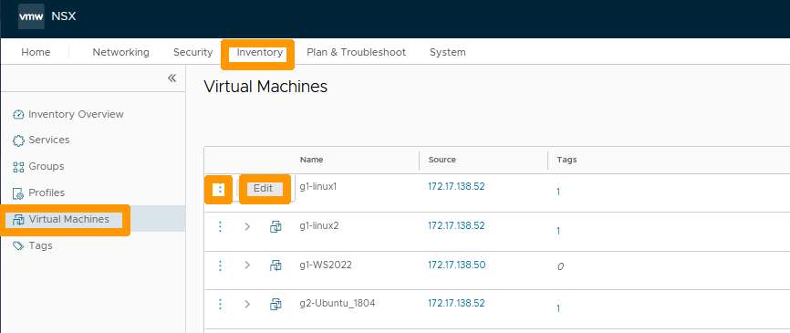
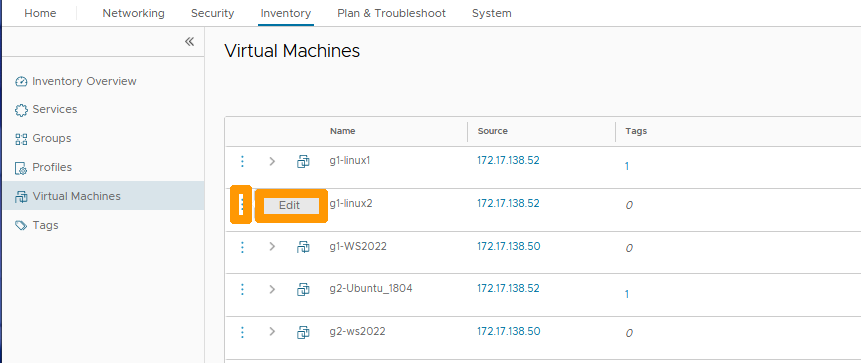
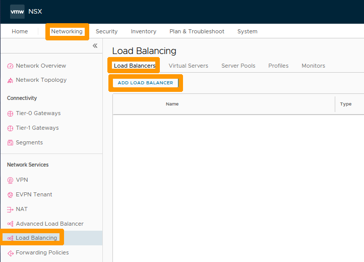
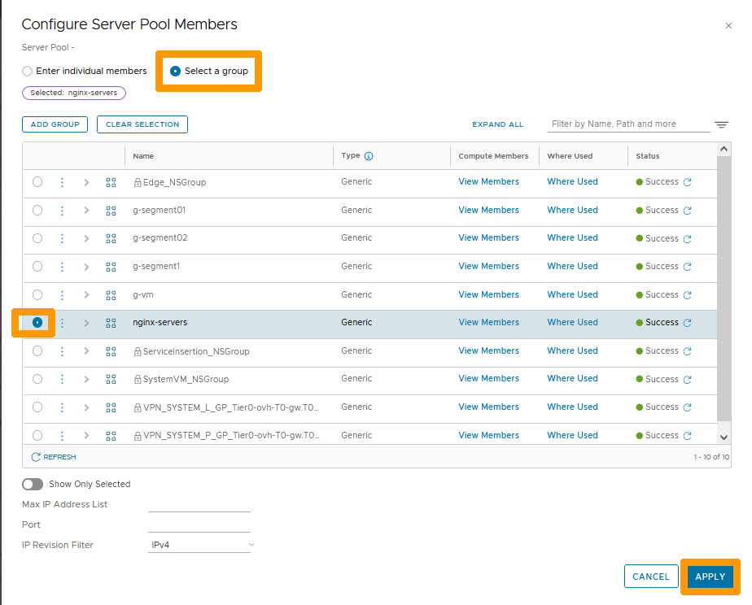

**Last updated 27th February 2023**

## Objective

NSX allows load balancing on a level 4 (TCP or UDP) layer or level 7 (HTTP or HTTPS) layer.

**Learn how to set up load balancing in NSX**

> [!warning]
> OVHcloud provides services for which you are responsible, with regard to their configuration and management. It is therefore your responsibility to ensure that they work properly.
>
> This guide is designed to assist you as much as possible with common tasks. However, we recommend contacting a [specialist provider](https://partner.ovhcloud.com/en-gb/) if you experience any difficulties or doubts when it comes to managing, using or setting up a service on a server.
>

## Requirements

- Being an administrative contact of your [Hosted Private Cloud infrastructure](https://www.ovhcloud.com/en/enterprise/products/hosted-private-cloud/) to receive login credentials.
- A user account with access to the [OVHcloud Control Panel](https://ca.ovh.com/auth/?action=gotomanager&from=https://www.ovh.com/world/&ovhSubsidiary=we).
- Having **NSX** deployed with two segments configured in your NSX configuration, you can use this guide [Segment management in NSX](https://docs.ovh.com/us/en/private-cloud/nsx-segment-management).
- Two virtual machines with NGINX enabled on one segment.

## Instructions

We will :

- Enable Load Balancing on the gateway **ovh-T1-gw**.
- Create a server pool from two virtual machines that use a web server running on port 80.
- Add a virtual server in the Load Balancer configuration which contains our server pool.
- Set a NAT rule to redirect to the virtual server.

### Creating the tag on both virtual machines.

To simplify the administration of the Load Balancer, we will use a tag on the two virtual machines in the future server pool.

In the NSX interface go to the `Inventory`{.action} tab and click on `Virtual Machines`{.action} on the left.

Then click on the `three vertical dots`{.action} to the left of the first virtual machine and choose `Edit`{.action} from the menu.

{.thumbnail}

Replace **Tag** with `loadbl`, then click `Add Item(s) loadbl`{.action} below.

{.thumbnail}

Change **Scope** to `nginx`{.action}, then click `Add Item(s) nginx`{.action} below.

{.thumbnail}

Click the `+`{.action} sign next to your tag to add it to your virtual machine.

{.thumbnail}

The tag appears, click `SAVE`{.action}.

{.thumbnail}

Click the `three vertical dots`{.action} to the left of the second virtual machine and choose `Edit`{.action} from the menu.

{.thumbnail}

Replace **Tag** with `load`{.action} and select the `Tag: loadbl Scope: nginx`{.action} that just appeared below.

{.thumbnail}

Click the `+`{.action} sign next to your tag to add it to your second virtual machine.

{.thumbnail}

Click `SAVE`{.action} to add the tag to your virtual machine.

{.thumbnail}

Stay on **Inventory**, click `Tags`{.action} and click on the `number`{.action} to the right of the marker you created.

{.thumbnail}

You can see your two virtual machines using the same tag.

{.thumbnail}

### Add group with created tag

Select `Groups`{.action} on the left and click `ADD GROUP`{.action}.

{.thumbnail}

Enter `nginx-server` below **Name** and click `SET`{.action} under **Compute Members**.

{.thumbnail}

Click `+ ADD CRITERION`{.action}.

{.thumbnail}

Keep **Virtual Machine Tag Equals** and select your `loadbl`{.action} tag with its `nginx`{.action} scope and click `APPLY`{.action}.

{.thumbnail}

Click `SAVE`{.action}.

{.thumbnail}

Click `View Members`{.action} to the right of the group.

{.thumbnail}

The list of virtual machines is automatically added to the group based on the criteria in your tag.

{.thumbnail}

### Activating the Load Balancer

Go to the `Networking`{.action} tab and click on `Load Balancing`{.action} in the **Network Services** section on the left.

Then go to the `Load Balancers`{.action} tab and click `ADD LOAD BALANCER`{.action}.

{.thumbnail}

Enter `loadbalancer-on-t1` below **Name**, select `ovh-T1-gw`{.action} under **Attachment** and click `SAVE`{.action}.

{.thumbnail}

Click `NO`{.action}.

{.thumbnail}

The Load Balancer is created and activated on the **ovh-T1-gw** gateway.

{.thumbnail}

### Server pool creation

Go to the `Server Pools`{.action} tab and click `ADD SERVER POOL`{.action}.

{.thumbnail}

Enter `sp-nginx` below **Name** and click `Select Members`{.action} under **Members/Group**.

{.thumbnail}

Click `Select a group`{.action} and choose the `nginx-servers`{.action} group you created then click `APPLY`{.action}.

{.thumbnail}

Click `SAVE`{.action} to apply your changes.

{.thumbnail}

Your server pool is created with your two virtual machines that are members of the group.

{.thumbnail}

### Virtual server creation

Your server pool is created with your two virtual machines which are members of the group. Go to the `Virtual Servers`{.action} tab and click on `ADD VIRTUAL SERVER`{.action}.

{.thumbnail}

Select `L4 TCP`{.action}.

{.thumbnail}

Fill in this information :

- **Name** : Name of your virtual server `vs-nginx`.
- **IP Address**: Front-end IP address of your virtual server on the same network as your NGINX virtual machines `192.168.102.3`.
- **Port** : Port `80`{.action}.
- **Load Balancer**: Your load balancer `loadbalancer-on-t1`{.action}.
- **Server Pool**: Your server pool `sp-nginx`{.action}.

Then click `SAVE`{.action}.

{.thumbnail}

Your virtual server is active. If you connect from a machine that uses a segment on a gateway of type **Tier-1 Gateways** with this URL `http://192.168.102.3`, the Load Balancer will connect to one of the two virtual machines configured in your group.

### Adding a NAT rule

Go to `NAT`{.action} in the **Network Services** section on the left and click `ADD NAT RULE`{.action}.

{.thumbnail}

Enter `to-lb-virtual-server`{.action} in your rule **Name** with these options :

- **Action** : `DNAT`{.action}.
- **Destination IP** : A virtual IP address of your T0 such as `198.51.100.1`.
- **Translated IP** : IP address of your virtual server `192.168.102.103`.
- **Service PORT** : Choose the predefined port `HTTP| 80`{.action}.

Then click `SAVE`{.action}.

{.thumbnail}

Your rule is active. If you click on `http://virtual-ip-address-on-T0` you will be connected to your virtual server which will redirect the flow to one of the servers in your group.

{.thumbnail}

## Go further 

[Getting started with NSX](https://docs.ovh.com/us/en/private-cloud/nsx-first-steps/)

[Segment management in NSX](https://docs.ovh.com/us/en/private-cloud/nsx-segment-management/)

[Implementing NAT for port redirections in NSX](https://docs.ovh.com/us/en/private-cloud/nsx-configure-nat-redirection)

[VMware NSX Load Balancer documentation](https://docs.vmware.com/en/VMware-NSX-T-Data-Center/3.2/administration/GUID-D39660D9-278B-4D08-89DF-B42C5400FEB2.html)

Join our community of users on <https://community.ovh.com/en/>.

