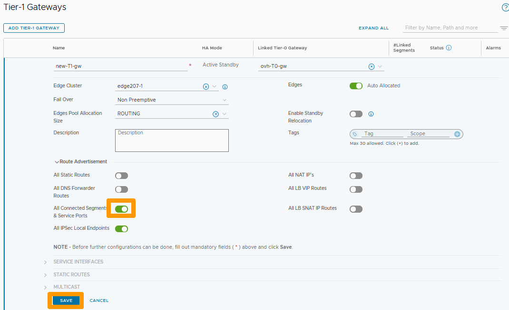
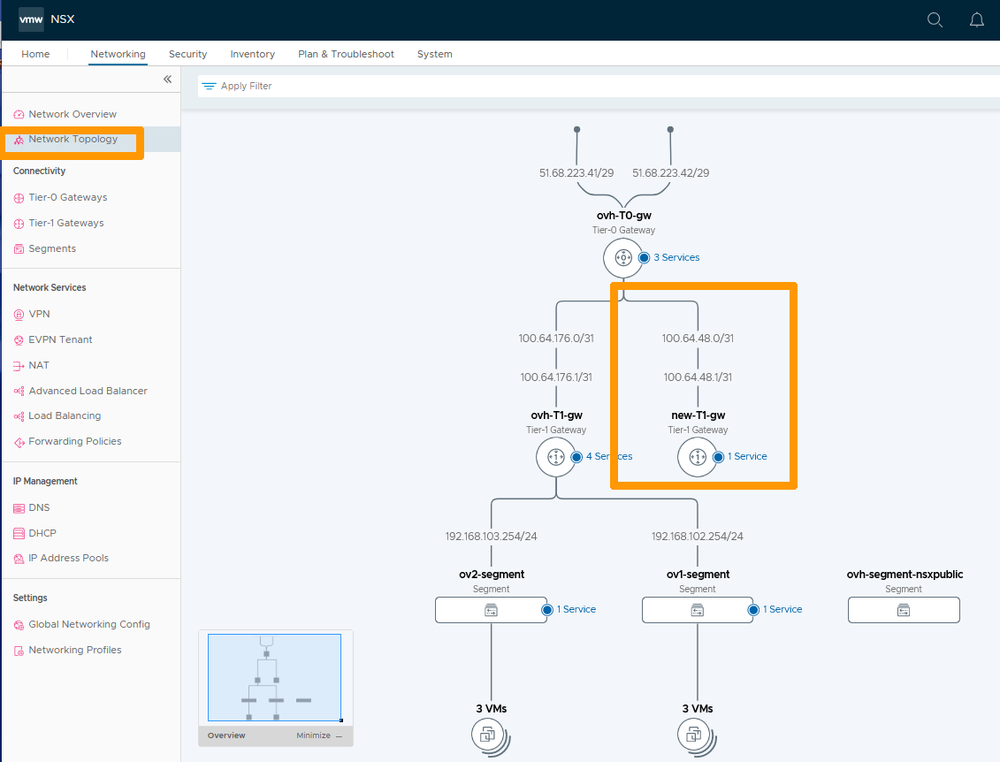
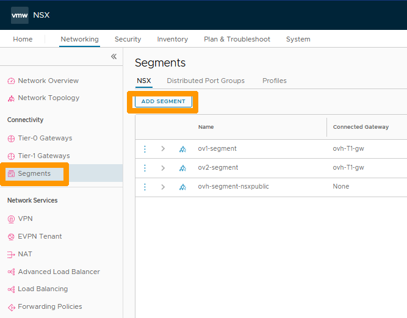

**Last updated 27th February 2023**

## Objective

OVHcloud provides you with NSX with two gateways, a north-south gateway (ovh-T0-gw) and an east-west gateway (ovh-T1-gw). You can create additional east-west gateways.

**Learn how to add an east-west (Tier-1 Gateway) gateway to your NSX configuration.**

> [!warning]
> OVHcloud provides services for which you are responsible, with regard to their configuration and management. It is therefore your responsibility to ensure that they work properly.
>
> This guide is designed to assist you as much as possible with common tasks. However, we recommend contacting a [specialist provider](https://partner.ovhcloud.com/asia/directory/) if you experience any difficulties or doubts when it comes to managing, using or setting up a service on a server.
>

## Requirements

- Being an administrative contact of your [Hosted Private Cloud infrastructure](https://www.ovhcloud.com/asia/enterprise/products/hosted-private-cloud/) to receive login credentials
- A user account with access to the [OVHcloud Control Panel](https://ca.ovh.com/auth/?action=gotomanager&from=https://www.ovh.com/asia/&ovhSubsidiary=asia)
- Having **NSX** deployed.

> [!warning]
> Through your NSX interface, you can create north-south gateways. 
> We strongly advise you not to do it because some options are not available and you will not be able to make such a gateway work correctly.

For more information on NSX at OVHcloud, please refer to our [Getting started with NSX](https://docs.ovh.com/asia/en/private-cloud/nsx-first-steps/) guide.

## Instructions

We will add a new east-west gateway (Tier-1-Gateways) and link it to the north-south gateway provided by OVHcloud (ovh-T0-gw).

Next, we will create a segment and attach a virtual machine to it.

### Creation of the new east-west gateway

In the NSX interface, go to the `Networking`{.action} tab and click on `Tier-1 Gateway`{.action} on the left.

Then click on `ADD TIER-1 GATEWAY`{.action}.

{.thumbnail}

Enter the name of your new gateway as `new-T1-gw`{.action} below **Name** and fill in these parameters:

- **Linked Tier-0-Gateway** : Your north-south gateway `ovh-T0-gw`{.action}.
- **Edge Cluster** : Your `edgeXXX-X`{.action}.
- **Fail Over** : `Non Preemptive`{.action}.
- **Edge Pool Allocation Size** : `Routing`{.action}.

Then click the `Down Arrow`{.action} to the left of **Route Advertisement**.

{.thumbnail}

Select the `button`{.action} to the right of **All Connected Segment & Service Ports** if you want to connect outside this gateway, then click `SAVE`{.action}.

{.thumbnail}

Click `NO`{.action}.

{.thumbnail}

Your new gateway is displayed and we can see it connected to your north-south gateway (ovh-T0-gw).

{.thumbnail}

Click `Network Topology`{.action} in the vertical menu bar to the left to view your network topology and to display your new **new-T1-gw** gateway connected to **ovh-T0-gw**.

{.thumbnail}

### Adding a segment on your new gateway

Go to `Segments`{.action} on the left and click `ADD SEGMENT`{.action}.

{.thumbnail}

Fill in this information : 

- **Name** : Name of your segment `ov3-segment`{.action}.
- **Connected Gateway** : Your new gateway `new-T1-gw`{.action}.
- **Transport Zone** : Your subnet `192.168.120.254/24`.

Click `SAVE`{.action}.

{.thumbnail}

Click `NO`{.action}.

{.thumbnail}

Your new segment is created and connected to your new **new-T1-gw** gateway. 

{.thumbnail}

### Displaying a complete configuration with a virtual machine on your segment.

The segment created is of type Overlay but it is possible to add a segment of type VLAN and connect it to your new gateway.

Use our guide on [segment management in NSX](https://docs.ovh.com/asia/en/private-cloud/nsx-segment-management/) to add a new virtual machine to your new segment.

Then click `Network Topology`{.action}.

{.thumbnail}

## Go further 

[Getting started with NSX](https://docs.ovh.com/asia/en/private-cloud/nsx-first-steps/)

[Segment management in NSX](https://docs.ovh.com/asia/en/private-cloud/nsx-segment-management/)

[VMware documentation for adding a Tier-1 Gateway](https://docs.vmware.com/en/VMware-NSX-T-Data-Center/3.2/administration/GUID-EEBA627A-0860-477A-95A7-7645BA562D62.html)

If you need training or technical assistance to implement our solutions, contact your sales representative or click on [this link](https://www.ovhcloud.com/asia/professional-services/) to get a quote and ask our Professional Services experts for a custom analysis of your project.

Join our community of users on <https://community.ovh.com/en/>.
