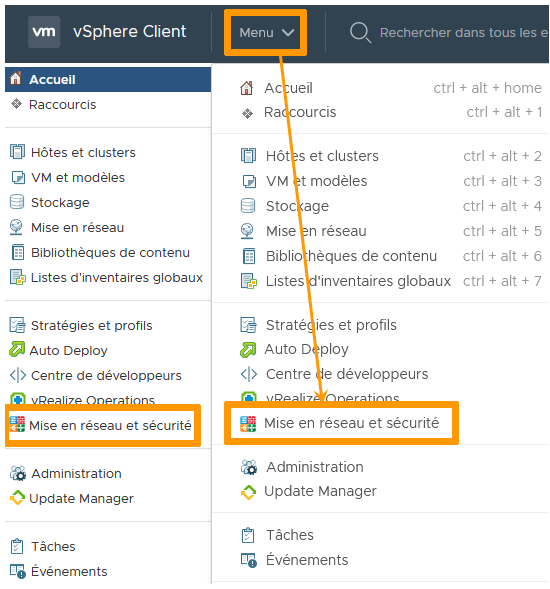
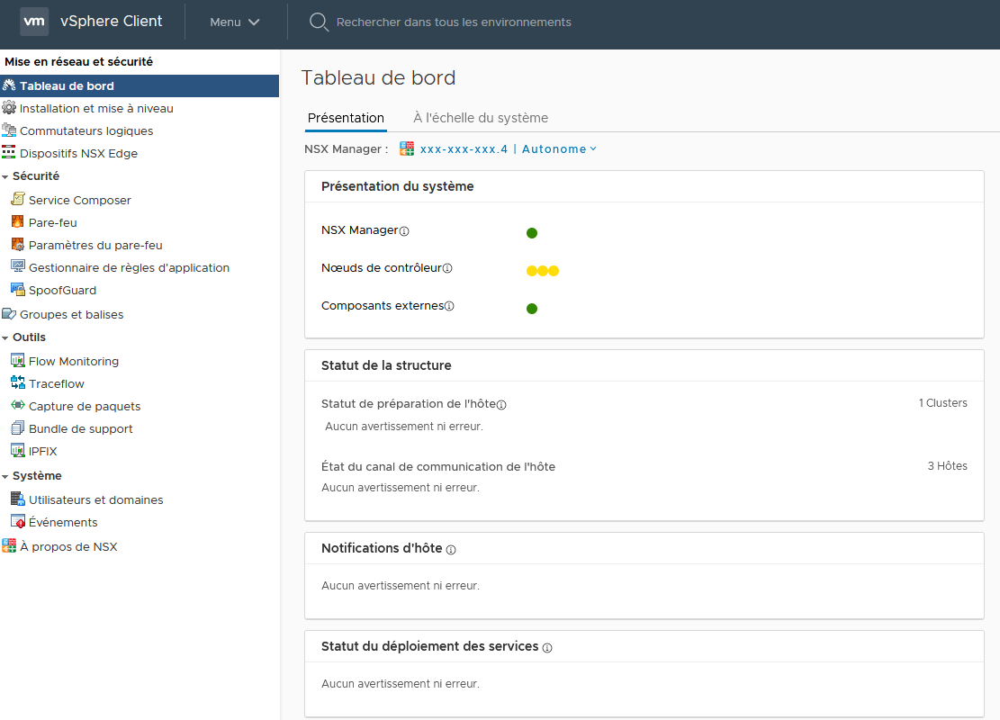

**Dernière mise à jour le 17/11/2021**

## Objectif

NSX est une solution de Software Defined Network (SDN) développée par VMware qui s’active au niveau du vCenter et qui se pilote directement depuis l'interface vSphere. Avec NSX, configurez les règles d’accès à vos réseaux, créez votre politique de sécurité et déployez en quelques minutes les différents services réseau nécessaires à la construction de votre infrastructure.

**Ce guide vous présente cette interface.**

## Prérequis

- Posséder un identifiant utilisateur actif avec les droits spécifiques pour NSX
- Être connecté à votre [interface vSphere](../connexion-interface-vsphere/)

## En pratique

VMWare NSX est disponible depuis l'interface vSphere uniquement.

Depuis la page d’accueil du client vSphere, cliquez sur la catégorie `Mise en réseau et sécurité`{.action} dans la barre d'outil à gauche de votre écran.
Vous pouvez également cliquer sur `Mise en réseau et sécurité`{.action} dans le Menu déroulant.

{.thumbnail}

Vous avez alors accès au Tableau de bord NSX avec tous les menus associés.

{.thumbnail}

> [!primary]
>
> Pour accéder à l'API NSX, vous devez utiliser https://nsx.pcc-x-x-x-x.ovh.com/api
>
> Exemple pour récupérer votre configuration firewall: 
>
> ```
> curl -u "admin:xxxx" -XGET "https://nsx.pcc-x-x-x-x.ovh.com/api/4.0/firewall/globalroot-0/defaultconfig"
> ```
>
> Pour des raisons de sécurité /api/1.0/ ne sont pas prises en charge.
> 


## Aller plus loin

Échangez avec notre communauté d'utilisateurs sur <https://community.ovh.com>.
