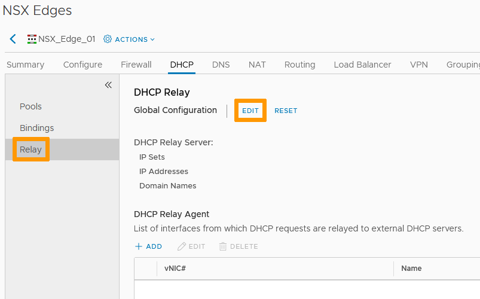
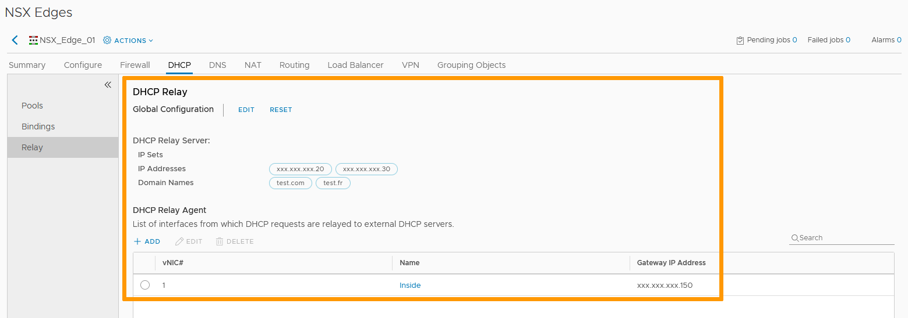

**Dernière mise à jour le 22/11/2021**

## Objectif

Le DHCP permet une attribution automatique d'IPs aux machines virtuelles résidantes derrière votre NSX Edge Services Gateway.

**Ce guide explique comment paramètrer le service DHCP**

## Prérequis

- Être contact administrateur du [Hosted Private Cloud infrastructure](https://www.ovhcloud.com/fr/enterprise/products/hosted-private-cloud/), pour recevoir des identifiants de connexion.
- Avoir un identifiant utilisateur actif avec les droits spécifiques pour NSX (créé dans l'[espace client OVHcloud](https://www.ovh.com/auth/?action=gotomanager&from=https://www.ovh.com/fr/&ovhSubsidiary=fr))

## En pratique

### Accès à l'interface

Dans l'interface vShere, allez dans le Tableau de bord `Mise en réseau et sécurité`{.action}.

{.thumbnail}

Sur la gauche de votre écran, naviguez vers `Dispositifs NSX Edge`{.action} puis cliquez sur le dispositif à paramétrer.

{.thumbnail}

Dans la section `DHCP`{.action},  il y a 3 options:

- Pools
- Liaisons
- Relais

Nous allons paramétrer ces 3 services.    

Commençons par `Pools`{.action}.

{.thumbnail}

### Menu Pools

Le menu `Pools`{.action} permet d'activer les fonctions traditionnelles du DHCP.    
Ajoutons un scope et démarrons le service.

Cliquez sur `+ Ajouter`{.action}    
Dans la fenêtre Nouveau DHCP Pool , remplissez les informations nécessaires :
- Adresse IP de début est la premère IP utilisable par le service DHCP
- Adresse IP de fin est la dernière IP utilisable par le service DHCP
- Nom de domaine est optionnel mais peut être utile pour votre dns
- Serveur de noms principal et secondaire sont vos paramètres dns personnalisés (vous pouvez activez la configuration automatique dns)
- Passerelle par défaut est également optionnelle
- Masque de sous-réseau
- Vous pouvez activer la non expiration des baux ou leur duréé si besoin.
- D'autres options avancées sont dans la section `Options DHCP`{.action} mais sont hors du cadre de ce guide

{.thumbnail}

Cliquez sur `Ajouter`{.action}.    
Le pool DHCP est prêt mais vous devez appuyer sur `Démarrer`{.action} puis `Publier`{.action} pour lancer le service et enregistrer les changements.

{.thumbnail}

Le DHCP est opérationel.     
Le status du service et les informations basiques sont visibles.

{.thumbnail}

### Menu Liaisons

Sur la gauche, cliquez sur `Liaisons`{.action}.    
Cette option réserve une address IP à une interface réseau particulière en fonction d'informations spécifiques.    
Cliquez sur `+ Ajouter`{.action} quand vous êtes prêts.

{.thumbnail}

Il y a 2 façons de créer une liaison:
- Utiliser la liaison de carte réseau de VM
- Utiliser la liaison MAC

Pour la liaison de carte réseau de VM, entrez les informations suivantes:

- Interface: l'interface de l'Edge Services Gateway qui distribuera les addresses
- Nom de la VM: VM cible
- Index VM vNIC: Nom de la carte réseau cible
- Nom d'hôte 
- IP Address: Addresse réservée
- Masque de sous-réseau
- Nom de domaine (option)
- Passerelle par défaut (option)
- Vous pouvez activer la non expiration des baux ou leur duréé si besoin.

{.thumbnail}

N'oubliez pas vos `Paramètres DNS`{.action}.    
Vous pouvez les rentrez manuellement ou les configurer automatiquement.     
Cliquez sur `Ajouter`{.action}.

{.thumbnail}

Cliquez sur `+ Ajouter`{.action} et sélectionnez Utiliser la liaison MAC.

- Adresse MAC: Adresse MAC de la carte réseau cible  
- Nom d'hôte 
- IP Address: Addresse réservée
- Masque de sous-réseau
- Nom de domaine (option)
- Passerelle par défaut (option)
- Vous pouvez activer la non expiration des baux ou leur duréé si besoin.

{.thumbnail}

N'oubliez toujours pas vos `Paramètres DNS`{.action}.       
Cliquez sur `Ajouter`{.action}.

{.thumbnail}

`Publier`{.action} vos changements.

{.thumbnail}

Les Liaisons DHCP et leurs paramètres de base sont maintenant visibles.

{.thumbnail}

### Menu Relais

For our last option, click on `Relay`{.action}.   
*The set up of a DCHP relay implies the existence of routes to the target DHCP servers*    
We'll first create the Global Configuration by clicking `Edit`{.action}.    

{.thumbnail}

You can add:
- pre existing IP sets set up in your NSX Edge Services Gateway
- IP adresses of DHCP servers
- Domain Names

Click `Save`{.action} when ready.

{.thumbnail}

Now click `+ Add`{.action} to set up an agent.     

{.thumbnail}

The vNIC will be the Edge Services Gateway interface that will forward the dhcp requests.    
The Gateway Address is the adress that will forward the requests.    
Click `Add`{.action}.

{.thumbnail}

We will then `Publish`{.action} the changes.

{.thumbnail}

Your DHCP Relay is now functional after a short wait.

{.thumbnail}

Bravo et merci.

## Aller plus loin

Échangez avec notre communauté d'utilisateurs sur <https://community.ovh.com>.
