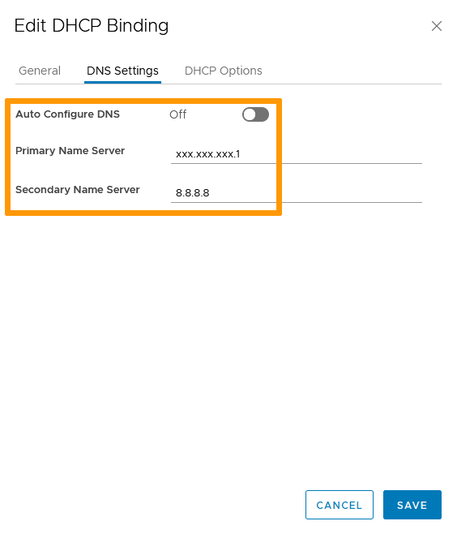
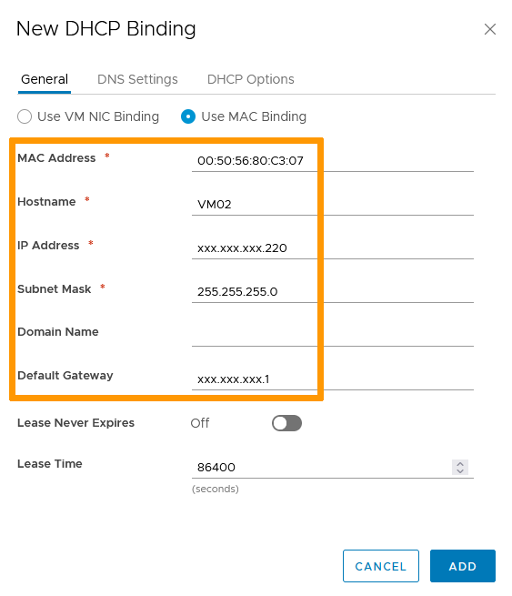

**Dernière mise à jour le 22/11/2021**

## Objectif

Le DHCP permet une attribution automatique d'IPs aux machines virtuelles résidantes derrière votre NSX Edge Services Gateway.

**Ce guide explique comment paramètrer le service DHCP**

## Prérequis

- Disposer d'un utilisateur ayant accès  à [l'interface de gestion NSX](https://docs.ovh.com/fr/private-cloud/acceder-a-l-interface-de-gestion-nsx/)

## En pratique

### Accès à l'interface

Dans l'interface vShere, allez dans le Tableau de bord `Mise en réseau et sécurité`{.action}.

{.thumbnail}

Sur la gauche de votre écran, naviguez vers `Dispositifs NSX Edge`{.action} puis cliquez sur le dispositif à paramétrer.

{.thumbnail}

Dans la section `DHCP`{.action},  il y a 3 options:

- Pools
- Liaisons
- Relais

Nous allons paramétrer ces 3 services.    

Commençons par `Pools`{.action}.

{.thumbnail}

### Menu Pools

Le menu `Pools`{.action} permet d'activer les fonctions traditionnelles du DHCP.    
Ajoutons un scope et démarrons le service.

Cliquez sur `+ Ajouter`{.action}    
Dans la fenêtre Nouveau DHCP Pool , remplissez les informations nécessaires :
- Adresse IP de début est la premère IP utilisable par le service DHCP
- Adresse IP de fin est la dernière IP utilisable par le service DHCP
- Nom de domaine est optionnel mais peut être utile pour votre dns
- Serveur de noms principal et secondaire sont vos paramètres dns personnalisés (vous pouvez activez la configuration automatique dns)
- Passerelle par défaut est également optionnelle
- Masque de sous-réseau
- Vous pouvez activer la non expiration des baux ou leur duréé si besoin.
- D'autres options avancées sont dans la section `Options DHCP`{.action} mais sont hors du cadre de ce guide

{.thumbnail}

Cliquez sur `Ajouter`{.action}.    
Le pool DHCP est prêt mais vous devez appuyer sur `Démarrer`{.action} puis `Publier`{.action} pour lancer le service et enregistrer les changements.

{.thumbnail}

Le DHCP est opérationel.     
Le status du service et les informations basiques sont visibles.

{.thumbnail}

### Menu Bindings

Now on the left side, click on `Bindings`{.action}.    
Bindings will always assign the same dhcp address to a specific network interface, depending on a specific information.    
Click on `+ Add`{.action} when ready.

{.thumbnail}

There are 2 ways to create bindings:
- VM NIC Binding: the IP address will be set for a specific VM network interface
- MAC Binding: the IP address will be set for a specific MAC address

For VM NIC Binding, type in the information as follow

- Interface: Edge Services Gateway interface that will be distributing the address
- VM Name: VM that will receive the address
- VM vNIC Index: Which network adapter on the VM will be assigned the address
- Host Name: DNS name of the VM (optional)
- IP Address: Address reserved for the NIC
- Subnet Mask: Subnet mask
- Domain Name: Domain name (optional)
- Default Gateway: Default Gateway
- You can set never ending leases or mofify lease times if that's a requirement

{.thumbnail}

Don't forget your `DNS Settings`{.action}.    
They can be put manually or configured automatically.     
Click on `Save`{.action} when done.

{.thumbnail}

Now we'll click on `+ Add`{.action} again but will chose Use MAC Binding.

- MAC Address: Target NIC MAC address 
- Host Name: DNS name of the VM (optional)
- IP Address: Address reserved for the NIC
- Subnet Mask: Subnet mask
- Domain Name: Domain name (optional)
- Default Gateway: Default Gateway
- You can set never ending leases or mofify lease times if that's a requirement

{.thumbnail}

Again, do not forget your `DNS Settings`{.action}.    
Click on `Save`{.action} when done.

{.thumbnail}

We will now `Publish`{.action} our changes.

{.thumbnail}

The DHCP Bindings and their basic settings are now visible.

{.thumbnail}

### Menu Relay

For our last option, click on `Relay`{.action}.   
*The set up of a DCHP relay implies the existence of routes to the target DHCP servers*    
We'll first create the Global Configuration by clicking `Edit`{.action}.    

{.thumbnail}

You can add:
- pre existing IP sets set up in your NSX Edge Services Gateway
- IP adresses of DHCP servers
- Domain Names

Click `Save`{.action} when ready.

{.thumbnail}

Now click `+ Add`{.action} to set up an agent.     

{.thumbnail}

The vNIC will be the Edge Services Gateway interface that will forward the dhcp requests.    
The Gateway Address is the adress that will forward the requests.    
Click `Add`{.action}.

{.thumbnail}

We will then `Publish`{.action} the changes.

{.thumbnail}

Your DHCP Relay is now functional after a short wait.

{.thumbnail}

Bravo et merci.

## Aller plus loin

Échangez avec notre communauté d'utilisateurs sur <https://community.ovh.com>.
