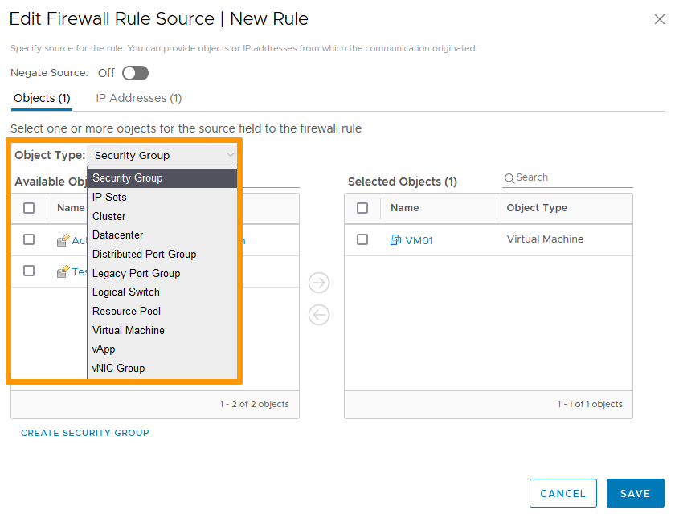
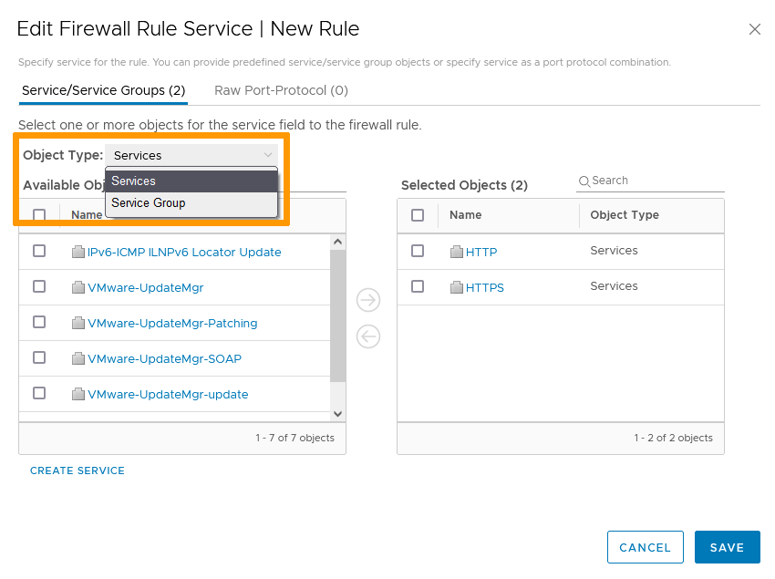
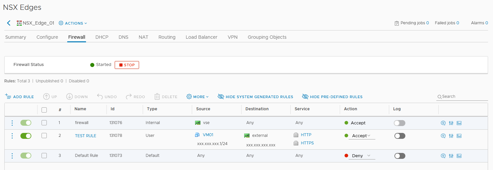

**Dernière mise à jour le 25/11/2021**

## Objectif

Le service de pare-feu NSX accepte ou refuse le trafic réseau en fonction de règles appliquées à des objets ou groupes d'objets.

**Ce guide explique comment créer ces règles**

## Prérequis

- Être contact administrateur du [Hosted Private Cloud infrastructure](https://www.ovhcloud.com/fr/enterprise/products/hosted-private-cloud/), pour recevoir des identifiants de connexion.
- Avoir un identifiant utilisateur actif avec les droits spécifiques pour NSX (créé dans l'[espace client OVHcloud](https://www.ovh.com/auth/?action=gotomanager&from=https://www.ovh.com/fr/&ovhSubsidiary=fr))
- Avoir déployer une [NSX Edge Services Gateway](https://docs.ovh.com/fr/private-cloud/comment-deployer-une-nsx-edge-gateway/)

## En pratique

### Accès à l'interface

Dans l'interface vSphere, allez dans le Tableau de bord `Mise en réseau et sécurité`{.action}.

{.thumbnail}

Sur la gauche de votre écran, naviguez vers `Dispositifs NSX Edge`{.action} puis cliquez sur le dispositif à paramétrer.

{.thumbnail}

La section Pare-Feu montre le statut et un bouton pour démarrer ou arrêter le service.    
*toute modification doit être publiée avant d'être active. Vous n'arrêterez pas le service d'un seul clicn*     

{.thumbnail}

### Règle de pare-feu

La base d'une règle de pare-feu est de controller des services identifiés en provenance de sources spécifiques et en direction de destination définies.     

Cliquez sur `+ Ajouter une règle`{.action}

La nouvelle règle apparait avec les champs suivant:
- Glissière d'activation
- Coche de sélection pour actions spécifiques *(changement de priorité, suppression...)*
- Mon
- ID
- Type
- Source
- Destination
- Service
- Action
- Glissière de journal
- Paramètres avancés

{.thumbnail}

> [!warning]
>
> par défaut, une règle à pour source et destination *Quelconque*, soit une sélection de tout le trafic. La meilleure pratique est d'éviter les règles globales pour des raisons de sécurité.
>

Nommez la règles par un clic sur le nom. Les champs ID and Type seront automatiquement remplis.

### Source

La source définit l'origine du trafic.    
Survoler le champ et cliquez sur le symbole du `crayon`{.action} icon.     
Vous pouvez ajouter des objets et/ou des addresses IP.     
*Si vous activez Inverser la source, la règle s'appliquera à toutes les sources sauf celles sélectionnées.*     
Cliquez sur `Enregister`{.action}.

{.thumbnail}
{.thumbnail}

### Destination

La destination définit la cible du trafic.    
Survoler le champ et cliquez sur le symbole du `crayon`{.action} icon.         
Les possibilités sont les mêmes que pour les sources.    
*Si vous activez Inverser la destination, la règle s'appliquera à toutes les destinations sauf celles sélectionnées.*     
Cliquez sur `Enregister`{.action}.

{.thumbnail}
{.thumbnail}

### Service

Le service définit le type de traffic visé.    
Survoler le champ et cliquez sur le symbole du `crayon`{.action} icon.     
Vous pouvez utiliser des services et groupes existants ou ajouter des ports/protocoles bruts.    
*Cliquez sur un service ou groupe existant vous montrera une descripion des ports et protocoles utilisés.*
Cliquez sur `Enregister`{.action}.

{.thumbnail}
{.thumbnail}
{.thumbnail}

### Action

L'action définit comment le traffic sera dirigé.    
Vous avez trois options:
- Accepter. Le trafic est laissé passer.
- Refuser. Le trafic est bloqué sans autre forme de communication.
- Rejeter. Le trafic est bloqué et un message de port innaccessible est envoyé à la source.     
Selectionnez l'option qui convient.

{.thumbnail}

### Journal

Activée, la glissière de journal enregistre les évenements qui concernent la règle.

### Paramètres avancés

Vous aves trois fonctions restantes:
- Une section commentaires
- Une section statistiques
- Une section paramètres avancés pour définir si le traffic visé est entrant, sortant ou bidirectionnel et, en cas de NAT, si la règle s'applique à la source originale ou traduite.

{.thumbnail}

### Priorité

La règle est maintenant visible dans la liste.   
Le nombre assigné à la règle définit sa priorité.    
Les règles sont appliquées de haut en bas et la première règle qui s'applique au trafic annule toutes les suivantes.    
Cela implique qu'en cas de conflit, c'est la règle avec le plus forte priorité (le plus petit nombre) qui sera appliquée.     
Vous pouvez modifier l'ordre des règles en cliquant la coche et en utilisant les flèches haut et bas.

{.thumbnail}

### Publier

La création/modification de règle n'est pas enregistrée tant que vous ne cliquez pas sur `Publier`{.action} button.

{.thumbnail}
{.thumbnail}

Bravo et merci.

## Aller plus loin

Échangez avec notre communauté d'utilisateurs sur <https://community.ovh.com>.
