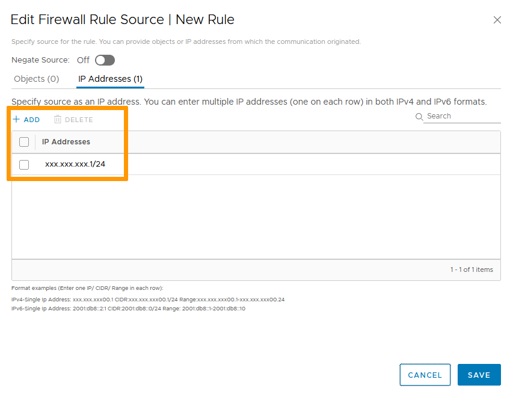
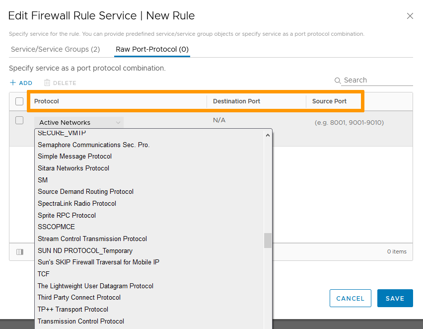
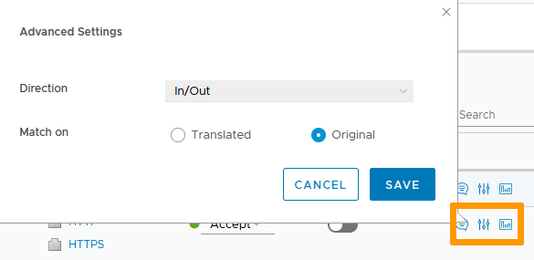

**Dernière mise à jour le 23/11/2021**

## Objectif

Le pare-feu permet d'appliquer des restrictions de communication par le trafic géré par la Edge, via plusieurs paramètres configurables en terme de source ou de destination par exemple.

**Ce guide explique la configuration de ce pare-feu**

## Prérequis

- Être contact administrateur du [Hosted Private Cloud infrastructure](https://www.ovhcloud.com/fr/enterprise/products/hosted-private-cloud/), pour recevoir des identifiants de connexion.
- Avoir un identifiant utilisateur actif avec les droits spécifiques pour NSX (créé dans l'[espace client OVHcloud](https://www.ovh.com/auth/?action=gotomanager&from=https://www.ovh.com/fr/&ovhSubsidiary=fr))
- Avoir déployer une [NSX Edge Services Gateway](https://docs.ovh.com/fr/private-cloud/comment-deployer-une-nsx-edge-gateway/)

## En pratique

### Accès à l'interface

Dans l'interface vSphere, allez dans le Tableau de bord `Mise en réseau et sécurité`{.action}.

{.thumbnail}

Sur la gauche de votre écran, naviguez vers `Dispositifs NSX Edge`{.action} puis cliquez sur le dispositif à paramétrer.

{.thumbnail}

The Firewall tab shows the status with a simple button to stop or start the service.    
*any change made will need to be published to be validated so you will not shut down the service at the single push of a button*     

{.thumbnail}

### Firewall Rule

The basics of a firewall rule is to manage identified service(s) from specified source(s) to specified destination(s).     

Click on `+ Add Rule`{.action}

The new rule shows with:
- Activation slider
- Selection box for specific actions *(order chande, deletion...)*
- Name
- ID
- Type
- Source
- Destination
- Service
- Action
- Log slider
- Advanced settings

{.thumbnail}

Name the rule by clicking the field. ID and Type fields are automatically populated.

### Source

The source field defines the origin of the traffic.    
Hover over the field and click on the `pencil`{.action} icon.     
You can add objects and/or IP addresses as needed.     
*If Negate Source is turned on, the rule is applied to all sources except for the sources selected.*     
Click `Save`{.action} when ready.

{.thumbnail}
{.thumbnail}

### Destination

The destination field defines the target of the traffic.    
Hover over the field and click on the `pencil`{.action} icon.     
You have the same choices for destination as you had for source.    
*If Negate Destination is turned on, the rule is applied to all destinations except for the destinations selected.*
Click `Save`{.action} when ready.

{.thumbnail}
{.thumbnail}

### Service

The service field defines the type of traffic aimed at.    
Hover over the field and click on the `pencil`{.action} icon.     
You have the choice between using existing services and groups or add raw ports/protocols.    
*Clicking on an existing service or group will show you a description with the ports and protocols involved.*
Click `Save`{.action} when ready.

{.thumbnail}
{.thumbnail}
{.thumbnail}

### Action

The action field defines how to handle the traffic.    
You have three possible options:
- Accept. The traffic will go through.
- Deny. The traffic will be blocked with no more communication.
- Reject. The traffic will be blocked and a port unreachable will be sent to the source.     
Select the desired outcome.

{.thumbnail}

### Log

The log slider allows you to keep a journal of events on the rule.

### Advanced Settings

You have three functions in the advanced settings:
- a comment section
- a statistics section
- an advanced section that allows you to define if the target traffic is inbound, outbound or both and in case of NAT traffic, if the rule applies to the original or translated source.

{.thumbnail}

### Rule Order

Once the rule set up, you see it in the list.   
The number of the rule in the list defines its priority.    
Rules are applied from top to bottom, and the first rule that matches the traffic overrides all the other rules below.    
That means that in the case of conflicting rules, the rule with the highest priority (lowest number) will be applied.    
You can modify the rule order by selecting a rule and using the up and down arrows.    

{.thumbnail}

### Publish

No creation/modification of rule will be registered until you click the `Publish`{.action} button.

{.thumbnail}
{.thumbnail}

Congratulations and thank you.

## Aller plus loin

Échangez avec notre communauté d'utilisateurs sur <https://community.ovh.com>.
