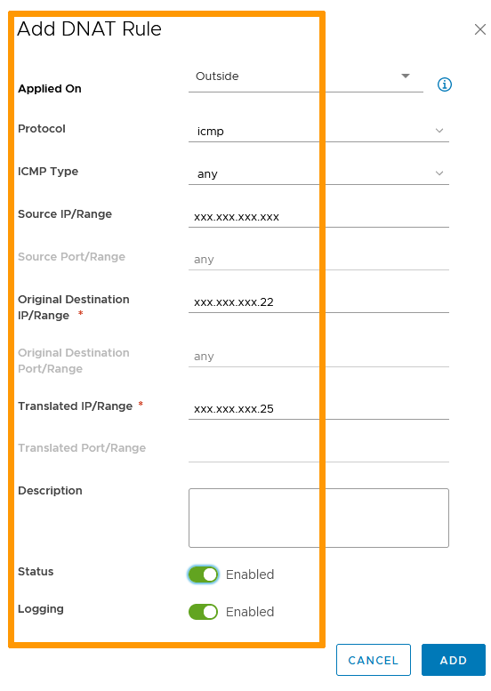
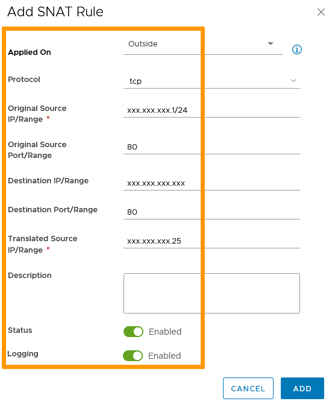

**Dernière mise à jour le 26/11/2021**

## Objectif

NAT veut dire Translation d'address réseau(*Network Address Translation*). Cela permet de rediriger une ou de multiples addresses vers une autre.     
Ily a deux types de NAT:
- DNAT est le NAT de destination. Il modifie l'addresse de destination et s'applique au trafic entrant.
- SNAT est le NAT de source. Il modifie l'addresse source et s'applique au trafic sortant.

**Ce guide explique comment créer des règles NAT**

## Prérequis

- Être contact administrateur du [Hosted Private Cloud infrastructure](https://www.ovhcloud.com/fr/enterprise/products/hosted-private-cloud/), pour recevoir des identifiants de connexion.
- Avoir un identifiant utilisateur actif avec les droits spécifiques pour NSX (créé dans l'[espace client OVHcloud](https://www.ovh.com/auth/?action=gotomanager&from=https://www.ovh.com/fr/&ovhSubsidiary=fr))
- Avoir déployer une [NSX Edge Services Gateway](https://docs.ovh.com/fr/private-cloud/comment-deployer-une-nsx-edge-gateway/)

## En pratique

### Accès à l'interface

Dans l'interface vSphere, allez dans le Tableau de bord `Mise en réseau et sécurité`{.action}.

{.thumbnail}

Sur la gauche de votre écran, naviguez vers `Dispositifs NSX Edge`{.action} puis cliquez sur le dispositif à paramétrer.

{.thumbnail}

Allez dans la section `NAT`{.action}.

### DNAT

Cliquez `+ Ajouter`{.action} puis `Ajouter une règle DNAT`{.action}.

{.thumbnail}

Paramétrez comme suit:
- L'Interface de traffic entrant (pour le DNAT, votre interface publique)
- Le protocole et sous protocoles visés
- L'IP ou plage IP source
- si applicable, le port source
- L'IP de destination originale (généralement, votre IP publique)
- si applicable, le port original
- L'IP ou plage IP traduite
- activez ou désactivez la règle
- activez ou désactivez la journalisation     

Cliquez `Ajouter`{.action}

{.thumbnail}

### SNAT

Cliquez `+ Ajouter`{.action} puis `Ajouter une règle SNAT`{.action}.

{.thumbnail}

Paramétrez comme suit:
- L'Interface de traffic sortant
- Le protocole et sous protocoles visés
- L'IP ou plage IP source
- si applicable, le port source
- L'IP ou plage IP de destination
- si applicable, le port de destination
- L'IP ou plage IP traduite
- activez ou désactivez la règle
- activez ou désactivez la journalisation     

Cliquez `Ajouter`{.action}

{.thumbnail}

### Publier

Les règles crées ou modifiées ne seront enregistrées et actives qu'après un clic sur le boutton `Publier`{.action}.

{.thumbnail}

Les règles sont maintenant fonctionnelles.

{.thumbnail}

Bravo et merci.

## Aller plus loin

Échangez avec notre communauté d'utilisateurs sur <https://community.ovh.com>.
