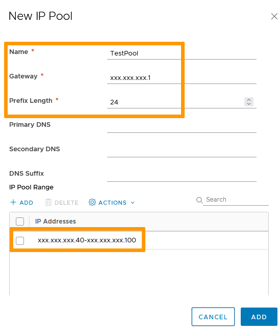

**Last updated 11/24/2021**

## Objective

An object, in the Network Security world, is a singular item that can be assigned rules.    
*Examples: IP address, machine name, service, network port, MAC adress...*     
Leveraging object groups limits the number of rules necessary and simplify management.

**This guide explains how to create/manage groups**

## Requirements

- Be an administrative contact of your [Hosted Private Cloud infrastructure](https://www.ovhcloud.com/en-gb/enterprise/products/hosted-private-cloud/) to receive login credentials
- Have a user account with access to vSphere as well as the specific rights for NSX (created in the [OVHcloud Control Panel](https://www.ovh.com/auth/?action=gotomanager&from=https://www.ovh.co.uk/&ovhSubsidiary=GB))
- Have an [NSX Edge Services Gateway](https://docs.ovh.com/gb/en/private-cloud/how-to-deploy-an-nsx-edge-gateway/) deployed

## Instructions

### Interface access

In the vSphere interface menu, go to the `Networking and Security`{.action} dashboard.

{.thumbnail}

On the left side, navigate to the `Groups and Tags`{.action} section.    
The section shows 7 types of grouping methods:
- Security Tags
- IP Pools
- Service Groups
- Services
- MAC Sets
- IP Sets
- Security Groups

{.thumbnail}

### Security Tags

Tags are metadata added to VMs to flag and sort them easily.    

To create one, in the `Security Tags`{.action} tab, click on `+ Add`{.action}.

{.thumbnail}

The tag itself is just a keyword so you can use any name for it.

{.thumbnail}

Once created, select it in the list and click `+ Assign VM`{.action}

{.thumbnail}

Choose the VM(s) you want to assigne the tag to and use the arrows to put them in the Selected Objects section.     
Click `OK`{.action} when done.

{.thumbnail}

Your Security Tag is done and assigned to VM(s).

{.thumbnail}

### IP Pools

IP Pools are collections of IPs.     

To create one, in the `IP Pools`{.action} tab, click on `+ Add`{.action}.

{.thumbnail}

A pool will need a Name, Gateway and prefix length to be useable.   
The DNS info are optional.     
IPs need to be added as a block (xxx.xxx.xxx.xxx-xxx.xxx.xxx.xxx).     
Click `Add`{.action} when done.

{.thumbnail}

Your IP Pool is now set up and available.

{.thumbnail}

### Service Groups

Service Groups are collections of Services and/or Service Groups.     

To create one, in the `Service Groups`{.action} tab, click on `+ Add`{.action}.

{.thumbnail}

## Go further

Join our community of users on <https://community.ovh.com/en/>.
