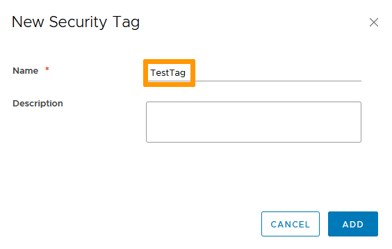
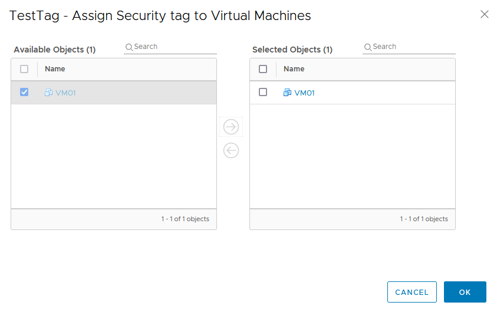
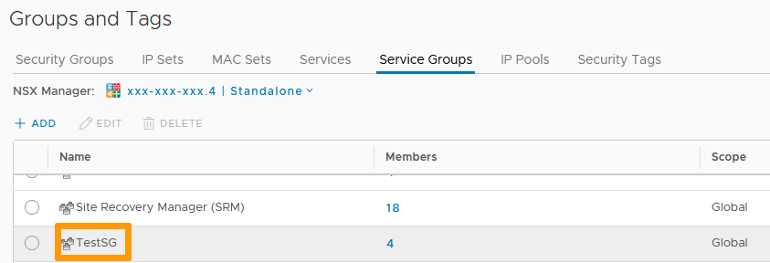
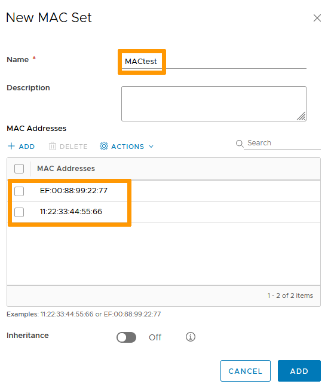
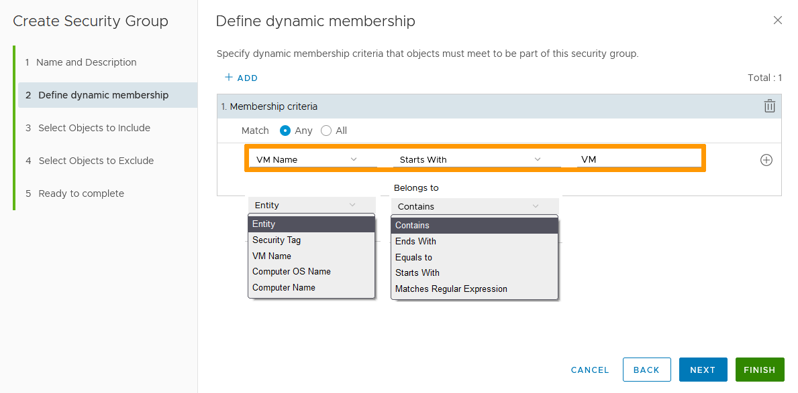

**Dernière mise à jour le 24/11/2021**

## Objectif

Dans le monde de la sécurité réseau, un objet est une entité singulière à laquelle des règles peuvent être appliquées.    
*Exemples: addresse IP, nom de machine, service, port réseau, adresse MAC...*     
Créer des groupes d'objets permet de limiter le nombre de règles et de simplifier leur gestion.

**Ce guide explique la création/gestion des groupes**

## Prérequis

- Être contact administrateur du [Hosted Private Cloud infrastructure](https://www.ovhcloud.com/fr/enterprise/products/hosted-private-cloud/), pour recevoir des identifiants de connexion.
- Avoir un identifiant utilisateur actif avec les droits spécifiques pour NSX (créé dans l'[espace client OVHcloud](https://www.ovh.com/auth/?action=gotomanager&from=https://www.ovh.com/fr/&ovhSubsidiary=fr))
- Avoir déployer une [NSX Edge Services Gateway](https://docs.ovh.com/fr/private-cloud/comment-deployer-une-nsx-edge-gateway/)

## En pratique

### Accès à l'interface

Dans le menu vSphere, allez dans le tableau de bord `Mise en réseau et sécurité`{.action}.

{.thumbnail}

Sur la gauche de l'écran, naviguez jusqu'à la section `Groupes et balises`{.action}.    
La section offre 7 types de groupes:
- Balises de sécurité
- Pools d'adresses IP
- Groupes de services 
- Services
- Ensemble d'addresses MAC
- Ensemble d'addresses IP
- Groupes de sécurité

{.thumbnail}

### Balises de sécurité

Les balises sont des metadonnées ajoutées aux VMs pour facilement les identifier et les classer.    

Pour en créer une, allez dans la section `Balises de sécurité`{.action} et cliquez sur `+ Ajouter`{.action}.

{.thumbnail}

Une balise est simplement un mot clé. Vous pouvez choisir à votre guise.

{.thumbnail}

Une fois créée, selectionnez-la et cliquez sur `Attribuer une VM`{.action}

{.thumbnail}

Choisissez la(les) VM(s) à attribuer puis utilisez la flêche pour les faire glisser dans la partie Objets Sélectionnés.     
Cliquez `OK`{.action}.

{.thumbnail}

Votre Balises de sécurité est prête et attribuée à vos VMs.

{.thumbnail}

### Pools d'adresses IP

Un Pool d'adresses IP est une plage d'addresses IP.     

Pour en créer une, allez dans la section `Balises de sécurité`{.action} et cliquez sur `+ Ajouter`{.action}.

{.thumbnail}

Le pool a besoin d'un nom, d'une passerelle et d'une longueur de préfixe pour être utilisable.   
Les inormations DNS sont optionnelles.     
Les IPs doivent être ajoutées sous forme de plage (xxx.xxx.xxx.xxx-xxx.xxx.xxx.xxx).     
Cliquez sur `Ajouter`{.action}.

{.thumbnail}

Votre Pool d'adresses IP est paramétré et fonctionnel.

{.thumbnail}

### Service Groups

Service Groups are collections of existing Services and/or Service Groups.     

Pour en créer une, allez dans la section `Balises de sécurité`{.action} et cliquez sur `+ Ajouter`{.action}.

{.thumbnail}

Your group will need a name and objects added.     
The available objects will be of two types:
- Service Groups
- Services
You can highlight various items from either types and drop them in the Selected Oblects section.     
Click `Add`{.action} when done.

{.thumbnail}

Votre Pool d'adresses IP est paramétré et fonctionnel.

{.thumbnail}

### Services

Services are applications running at the network layer and above.     
They typically are linked to network ports and protocols for communications.

Pour en créer une, allez dans la section `Balises de sécurité`{.action} et cliquez sur `+ Ajouter`{.action}.

{.thumbnail}

Most of the commonly used services are already listed but you can define new ones to allow to be more granular or create specific ports collections.     
Click `Add`{.action} when done.

{.thumbnail}

Votre Pool d'adresses IP est paramétré et fonctionnel.

{.thumbnail}

### MAC Sets

MAC Sets are collections of MAC adresses (a MAC is a physical address of a network component).     

Pour en créer une, allez dans la section `Balises de sécurité`{.action} et cliquez sur `+ Ajouter`{.action}.

{.thumbnail}

Name your set then add the physical addresses as needed.     
Click `Add`{.action} when done.

{.thumbnail}

Votre Pool d'adresses IP est paramétré et fonctionnel.

{.thumbnail}

### IP Sets

IP sets are collections of IP adresses.     

Pour en créer une, allez dans la section `Balises de sécurité`{.action} et cliquez sur `+ Ajouter`{.action}.

{.thumbnail}

Name your set then add the addresses as needed.     
IPs can be added as single (xxx.xxx.xxx.xxx), range (xxx.xxx.xxx.xxx-xxx.xxx.xxx.xxx) or CIDR (xxx.xxx.xxx.x/xx).     
Click `Add`{.action} when done.

{.thumbnail}

Votre Pool d'adresses IP est paramétré et fonctionnel.

{.thumbnail}

### Security Groups

Security Groups are collections of network objects.     

Pour en créer une, allez dans la section `Balises de sécurité`{.action} et cliquez sur `+ Ajouter`{.action}.

{.thumbnail}  

Name your set then click `Next`{.action}.     

{.thumbnail}

Security Groups allow for dynamic membership. You can define a single or set of variables that will automatically assign/unassign objects.    
*You can leave this part empty if you do not wish to use the functionality*    
Click `Next`{.action}.

{.thumbnail}

You can now add any existing Group/Object to the Selected Object section to include them in the group.     
Click `Next`{.action}

{.thumbnail}

If there is a specific object that needs to be left out (a single member of a whole group you selected previously for example), find it in the Objects to Exclude window.     
Click `Next`{.action}

{.thumbnail}

Review your settings and click `Finish`{.action}

{.thumbnail}

Votre Pool d'adresses IP est paramétré et fonctionnel.

{.thumbnail}

## Aller plus loin

Échangez avec notre communauté d'utilisateurs sur <https://community.ovh.com>.
