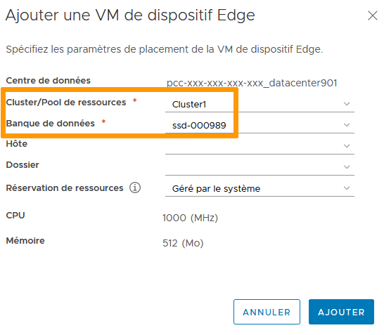
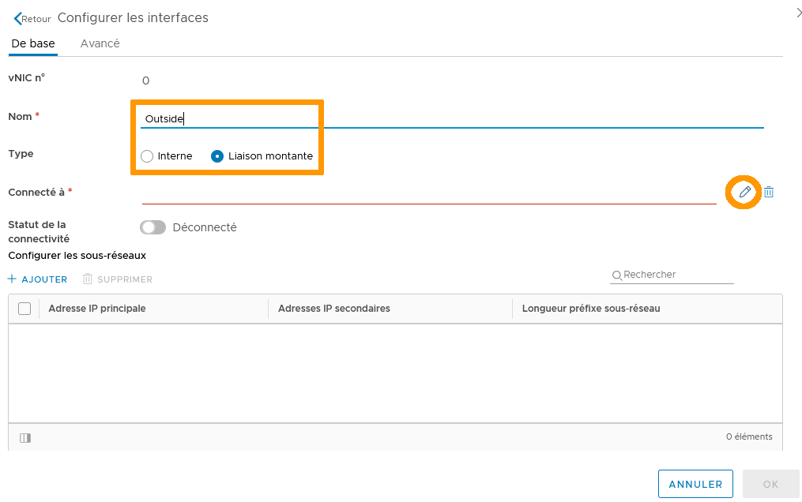
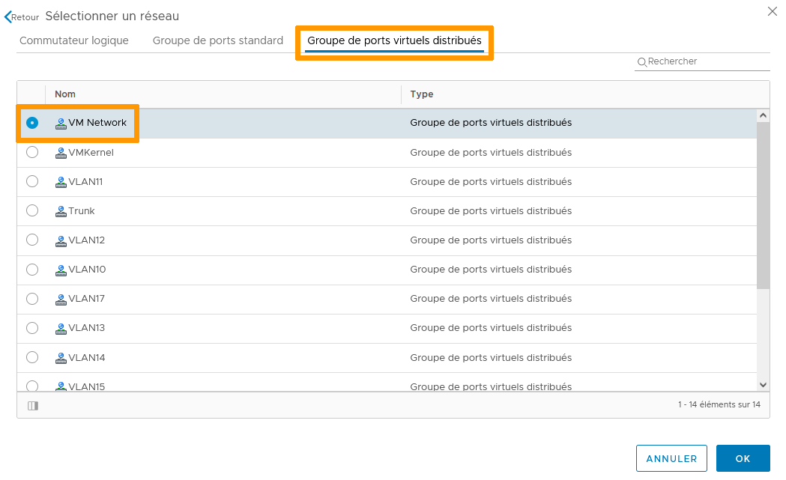
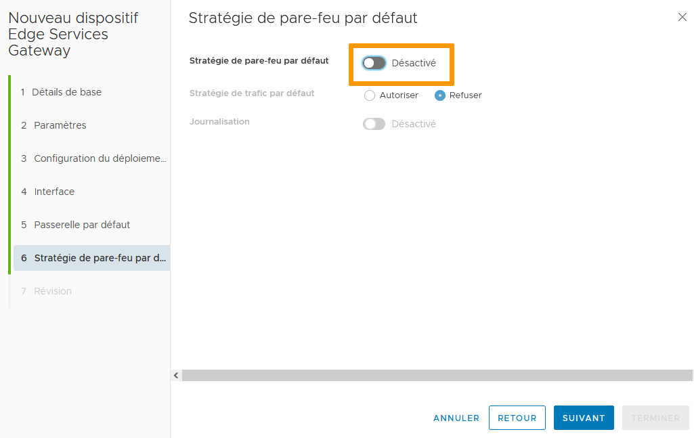

**Dernière mise à jour le 19/11/2021**

## Objectif

La NSX Edge Services Gateway est une appliance VMware offrant des services tels que le pare-feu, NAT, DHCP, VPN, l'équilibrage de charge et la haute disponibilité.

**Ce guide explique comment procéder au déploiement de cette appliance.**

## Prérequis

- Être contact administrateur du [Hosted Private Cloud infrastructure](https://www.ovhcloud.com/fr/enterprise/products/hosted-private-cloud/), pour recevoir des identifiants de connexion.
- Avoir un identifiant utilisateur actif avec les droits spécifiques pour NSX (créé dans l'[espace client OVHcloud](https://www.ovh.com/auth/?action=gotomanager&from=https://www.ovh.com/fr/&ovhSubsidiary=fr))

## En pratique

Vous allez vous embarquer dans l'aventure du déploiement d'une appliance NSX.   
Nous vous guiderons étape par étape dans l'installation d'une Edge Services Gateway avec une connection interne à votre environnement et une autre pour communiquer avec l'extérieur.    

Tout d'abord, dans votre interface vSphere, allez dans le tableau de bord `Mise en réseau et sécurité`{.action}.

{.thumbnail}

Sur la gauche de votre écran, cliquez sur `Dispositifs NSX Edge`{.action}.

{.thumbnail}

Cliquez sur `+ Ajouter`{.action} puis sur `Edge Services Gateway`{.action}.

{.thumbnail}

### Détails de base

L'assistant d'installation apparaît. Remplissez les détails de base. Seul le nom est obligatoire. Les autres champs seront créés automatiquement ou ignorés, en fonction de votre infrastucture.

Quand vous êtes prêt, cliquez sur `Suivant`{.action}.    

Laissez l'option `Déployer une VM de dispositif Edge` cochée. 
Décocher l'option entrainerait la création des règles et paramètres mais l'ensemble serait inactif tant qu'une VM ne serait pas déployée.

Nous laissons la « Haute Disponibilité » de coté pour le moment.

{.thumbnail}

### Paramètres

La fenêtre `Paramètres` s'affiche ensuite.   

- Le compte d'administration par défaut est rempli automatiquement. Vous pouvez le changer à votre convenance.
- Créez et confirmez un mot de passe conforme.    
- `Génération automatique de règles` ajoute les règles de Pare-Feu, NAT, et routage pour la surveillance des services.   
- L'option `Accès SSH` autorise un accès par console sur le port 22. Nous recommandons de la laisser désactivée par défaut et de ne l'activer que de manière temporaire quand c'est nécessaire.     
- `Mode FIPS` impose le chiffrement et un niveau de sécurité conformes aux normes des *Federal Information Processing Standards* du gouvernement des Etats-Unis.     
- Le niveau de journalisation peut être adapté a vos besoins.    

Cliquez ensuite sur `Suivant`{.action}

{.thumbnail}

### Configuration du déploiement

Selectionnez le centre de données cible (si vous n'avez qu'un seul centre de données dans vSphere, il n'y a pas d'autre choix possible), la taille du dispositif (la taille détermine la consommation de ressources et la puissance de calcul) puis cliquez sur le bouton `+`{.action}.

{.thumbnail}

Dans la fenêtre suivante, selectionnez l'emplacement où le dispositif sera installé dans le centre de données.   

Seuls `Cluster/Pool de ressources` et `Banque de données` sont des champs obligatoires. vSphere choisira le reste automatiquement si vous ne rentrez aucune information.

Cliquez sur `Ajouter`{.action}.

{.thumbnail}

Vous êtes de retour dans la fenêtre précédente. Cliquez sur `Suivant`{.action}.

### Interface

Il vous faut à présent configurer les interfaces.

Cliquez sur `+ Ajouter`{.action}.

{.thumbnail}

Il existe 2 sortes d'interfaces :

- `Liaison montante` communique avec l'extérieur de votre réseau.
- `Interne` est confinée à l'intérieur de votre environnement.

Nommez une interface et choisissez `Liaison montante`. 

Cliquez sur le symbole du `crayon`{.action} pour définir comment l'interface communiquera.

{.thumbnail}

Par défaut, dans la table `Groupe de ports virtuels disctribués`{.action}, VM Network est le réseau pour l'accès extérieur (si vous avez personnalisé l'environnement, choisissez en fonction).

Cliquez sur `OK`{.action}.

{.thumbnail}

De retour dans le menu `Configurer les interfaces`, ajoutez une addresse IP et la longueur du préfixe pour la connexion. 

Cliquez sur `OK`{.action}.

{.thumbnail}

Ajoutez une seconde interface, `Interne` cette fois. 
Cliquez de nouveau sur le symbole du `crayon`{.action} et selectionnez le réseau souhaité.  
Ajoutez également l'addresse IP et la longueur du préfixe pour la vNIC.

{.thumbnail}

Vos interfaces sont prêtes. Vérifiez et cliquez sur `Suivant`{.action}.

{.thumbnail}

### Passerelle par défaut

Configurez la passerelle par défaut pour votre accès extérieur. Ce n'est pas obligatoire et peut être effectué ou désactivé ultérieurement.

Cliquez sur `Suivant`{.action}.

{.thumbnail}

### Stratégie de pare-feu par défaut

Activez ou désactivez la stratégie de pare-feu par défaut puis cliquez sur `Suivant`{.action}.

{.thumbnail}

### Révision

Vérifiez la configuration puis cliquez sur `Terminer`{.action}.

{.thumbnail}

Le dispositif est alors en cours de déploiement. Le statut du déploiement est indiqué comme « Occupé » et l'état du déploiement est en « Installation » jusqu'à la finalisation du déploiement.

Si le déploiement échoue, un message d'erreur ainsi qu'un lien vers les logs complets seront disponibles dans la section `Échec`.

{.thumbnail}

Après l'installation, le dispositif est considéré comme « Déployé ».

{.thumbnail}

Bravo et bienvenue dans le monde du NSX !   

## Aller plus loin

Échangez avec notre communauté d'utilisateurs sur <https://community.ovh.com>.
