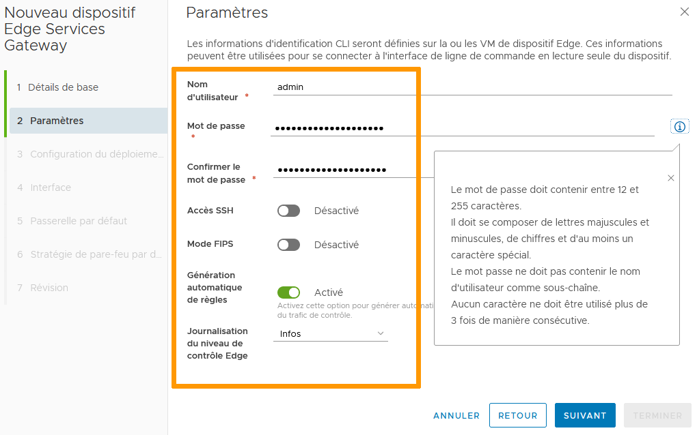
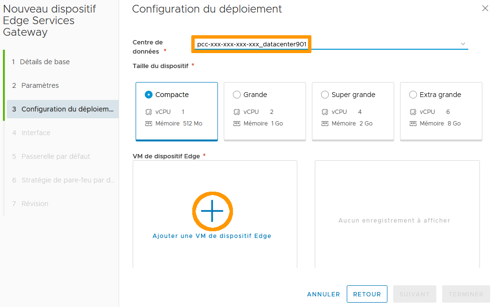

**Dernière mise à jour le 19/11/2021**

## Objectif

La NSX Edge Services Gateway est une appliance VMware offrant des services tels que le pare-feu, NAT, DHCP, VPN, l'équilibrage de charge et la haute disponibilité.

**Ce guide explique comment procéder au déploiement de cette appliance**

## Prérequis

- Être contact administrateur du [Hosted Private Cloud infrastructure](https://www.ovhcloud.com/fr/enterprise/products/hosted-private-cloud/), pour recevoir des identifiants de connexion 
- Avoir un identifiant utilisateur actif avec les droits spécifiques pour NSX (créé dans le [OVHcloud Control Panel](https://www.ovh.com/auth/?action=gotomanager&from=https://www.ovh.co.uk/&ovhSubsidiary=GB))

## En pratique

Vous allez vous embarquer dans l'aventure du déploiement d'une appliance NSX.   
Nous vous guiderons étape par étape dans l'installation d'une Edge Services Gateway avec une connection interne à votre environnement et une autre pour communiquer avec l'extérieur.    

Tout d'abord, dans votre interface vSphere, allez dans the tableau de bord `Mise en réseau et sécurité`{.action}.

Sur la gauche de votre écran, cliquez sur `Dispositifs NSX Edge`{.action}.

Cliquez sur `+ Ajouter`{.action} puis `Edge Services Gateway`{.action}.

La fenêtre d'installation guidée apparait.   
Remplissez les détails de base. Seuls le nom est obligatoire. Les autres champs seront créés automatiquement ou ignorés en fonction de votre infrastucture.   
Quand vous êtes prêt, cliquez sur `Suivant`{.action}.    
*Laissez Déployer une VM de dispositif Edge cochée. Décocher l'option entraine la création des règles et paramètres mais tout sera inactif tant qu'une VM n'est pas déployée. Nous laissons la Haute Disponibilité de coté pour l'instant.*

La fenêtre des Paramètres suit.    
Le compte d'administration par défaut est rempli automatiquement. Vous pouvez le changer à votre convenance.    
Créez et confirmez un mot de passe conforme.    
*Génération automatique de règles ajoute les règles de Pare-Feu, NAT, et routage pour la surveillance des services.*    
L'option Accès SSH autorise un accès par console sur le port 22. Nous recommandons de la laisser désactivée par défaut et de ne l'activer que de manière temporaire quand c'est nécessaire.     
Mode FIPS impose le chiffrement et un niveau de sécurité conforme aux normes des Federal Information Processing Standards du gouvernement américain.     
Le niveau de journalisation peut être adapté a vos besoin.    
Cliquez sur `Suivant`{.action}

Au tour de la Configuration du déploiement.     
Selectionnez le centre de données cible (si vous n'avez qu'un seul centre de données dans vSphere, il n'y a pas d'autre choix possible), la taille du dispositif (la taille détermine la consommation de ressources et la puissance de calcul) puis appuyez sur le bouton `+`{.action}.

Dans la fenêtre suivante, selectionner ou le dispositif sera installé dans le centre de données.    
Seuls Cluster/Pool de ressources et Banque de données sont des champs obligatoires.   
*vSphere choisira le reste automatiquement si vous ne rentrez aucune information.*    
Cliquez sur `Ajouter`{.action}.

Vous êtes de retour dans la fenêtre précédente. Cliquez sur `Suivant`{.action}.

Il est temps de Configurer les interfaces.    
Cliquez sur `+ Ajouter`{.action}

Il existe 2 sortes d'interfaces:
- Liaison montante communique avex l'extérieur de votre réseau
- Interne est confiné à l'intérieur de votre environnement

Nommez une interface et choisissez Liaison montante.   
Cliquez sur le symbole du `crayon`{.action} pour définir comment l'interface communiquera.

Par défaut, dans la table `Groupe de ports virtuels disctribués`{.action}, VM Network est le réseau pour l'accès extérieur.    
*Si vous avez personnalisé l'environneent, choisissez en fonction.*   
Cliquez sur `OK`{.action}.

Revenu dans Configurer les interfaces, ajoutez un addresse IP et la longueur du préfixe pour la connexion.    
Cliquez sur `OK`{.action}.

Ajoutez une seconde interface, Interne cette fois.    
Cliquez de nouveau sur le symbole du `crayon`{.action} et selectionnez le réseau souhaité.    
Ajoutez également l'addresse IP et la longueur du préfixe pour la vNIC.

Vos interfaces sont prêtes. Vérifiez et cliquez sur `Suivant`{.action}.

Configurez la passerelle par défaut pour votre accès extérieur.   
*Ce n'est pas obligatoire et peut être désactivé ou fait plus tard*    
Cliquez sur `Suivant`{.action}

Activez ou désactivez la Stratégie de pare-feu par défaut pui cliquez sur `Suivant`{.action}.

Vérifiez la configuration puis cliquez sur `Terminer`{.action} button.

Le dispositif est en cours de déploiement. Le status indique Occupé et Installation jusqu'à la finalisation.        
*Si le déploiement échoue, un message d'erreur et un lien vers les logs complet seront disponible dans la section Echec.*

Après installation, le dispositif est Déployé.

Bravo et bienvenue dans le monde du NSX!   

## Aller plus loin

Échangez avec notre communauté d'utilisateurs sur <https://community.ovh.com>.
