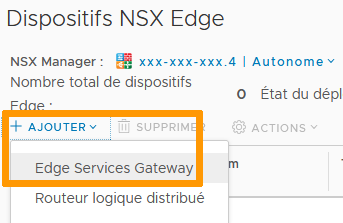
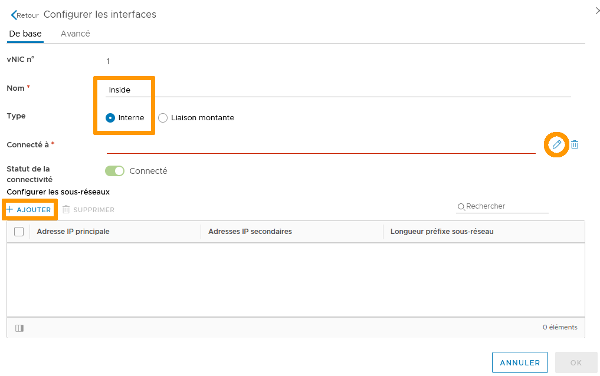
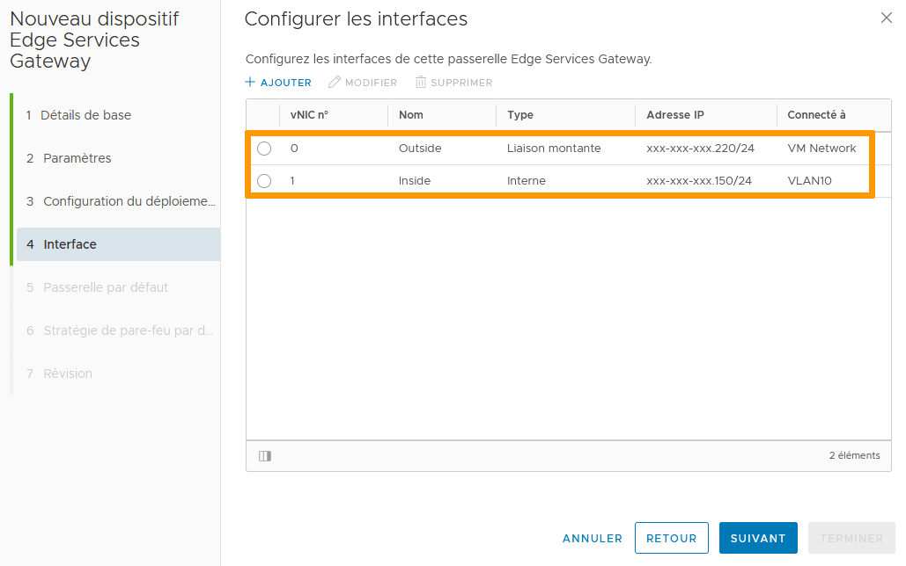

**Dernière mise à jour le 18/11/2021**

## Objectif

La NSX Edge Services Gateway est une appliance VMware offrant des services tels que le pare-feu, NAT, DHCP, VPN, l'équilibrage de charge et la haute disponibilité.

**Ce guide explique comment procéder au déploiement de cette appliance**

## Prérequis

- Être contact administrateur du [Hosted Private Cloud infrastructure](https://www.ovhcloud.com/fr/enterprise/products/hosted-private-cloud/), pour recevoir des identifiants de connexion 
- Avoir un identifiant utilisateur actif avec les droits spécifiques pour NSX (créé dans le [OVHcloud Control Panel](https://www.ovh.com/auth/?action=gotomanager&from=https://www.ovh.co.uk/&ovhSubsidiary=GB))

## En pratique

Vous allez vous embarquer dans l'aventure du déploiement d'une appliance NSX.   
Nous vous guiderons étape par étape dans l'installation d'une Edge Services Gateway avec une connection interne à votre environnement et une autre pour communiquer avec l'extérieur.    

First, go to the `Networking and Security`{.action} dashboard.

On the left side, navigate to the `NSX Edges`{.action} section.

Click on `+Add`{.action} then `Edge Services Gateway`{.action}.

The guided installation  window pops up.   
Fill in the basic information. Only the name is mandatory, the other fields are optional and will either be automatically created or be ignored if non applicable to your case.   
When done, click `Next`{.action}.    
*Leave Deploy Edge Appliance VM checked. unchecking it would create the rules and settings but nothing would be active until a VM is deployed. We are leaving High Availibility out of our scope for now*

Now on the to the settings window.    
The default administrator user name is filled in automatically but you can change it as you need.    
Create and confirm a compliant password.    
*Auto Rule Generation will add firewall, NAT, and routing to enable control traffic to flow for these services.*    
SSH option allows console access on port 22 if needed. We recommend leaving it off by default and only open access as needed.     
FIPS mode enforces encryption and security levels compliant with the United States Federal Information Processing Standards.     
The logging level can be adapted to your needs.    
Click `Next`{.action}

Next is the Deployment Configuration.     
Select the destination datacenter (if you only have one datacenter in vSphere, there is no choice possible), the size of the appliance (Size will determine processing power and resource consumption) and hit the `+`{.action} button.

In the next window, select where the appliance will live within the chosen datacenter.    
Only Cluster/Resource Pool and Datastore are mandatory field.   
*vSphere will select the best suited places for the rest if you do not input data.*    
Click `Add`{.action}.

Back in the Deployment Configuration window, click `Next`{.action}.

Things get more serious with the Configure Interfaces.    
Click on `+Add`{.action}

There are 2 types of interfaces:
- Uplink will communicate with the outside of your netword
- Internal will be confined to your network

Let's name an interface and choose Uplink.   
Click on the `pen symbol`{.action} to select how it will connect out.

Typically, in the `Distributed Virtual Port Group`{.action} tab, the VM Network is the default outside access network.    
*If you customized your environment, select accordingly.*   
Click `OK`{.action}.

Back in the Interface configuration window, add a primary IP and subnet prefix for the interface.    
Click `OK`{.action}.

Add a second interface. This time it will be an Internal one.    
Click on the `pen symbol`{.action} again to select the network the interface will be part of.    
Also, add the primary IP and subnet prefix for the vNIC.

Interfaces are ready. Review and click `Next`{.action}.

Configure the Default Gateway for external access.   
*This is not mandatory and can be disabled to be done later.*    
Click `Next`{.action}

Enable or disable Firewall Default Policy and click `Next`{.action}.

Review the configuration and hit that `Finish`{.action} button.

The Gateway will deploy. It will show a Busy and Installing status until done.    
*If the deployment fails, it will show you basic error message and link to the full logs in the Failed section.*

After some time, your appliance will show as Deployed.

Congratulations and welcome to the world of NSX!   
The journey is only starting.

## Aller plus loin

Échangez avec notre communauté d'utilisateurs sur <https://community.ovh.com>.
