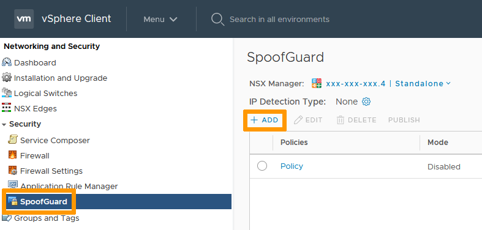

**Dernière mise à jour le 28/02/2019**

## Objectif

SpoofGuard protège contre l'usurpation d'adresse IP en conservant une table de référence des noms et des adresses IP des machines virtuelles. SpoofGuard conserve cette table de référence à l'aide des adresses IP que NSX Manager récupère de VMware Tools lors du démarrage initial d'une machine virtuelle.

**Ce guide explique comment établir une stratégie Spoofguard**

## Prérequis

- Être contact administrateur du [Hosted Private Cloud infrastructure](https://www.ovhcloud.com/fr/enterprise/products/hosted-private-cloud/), pour recevoir des identifiants de connexion.
- Avoir un identifiant utilisateur actif avec les droits spécifiques pour NSX (créé dans l'[espace client OVHcloud](https://www.ovh.com/auth/?action=gotomanager&from=https://www.ovh.com/fr/&ovhSubsidiary=fr))
- Avoir activé le [firewall distribué](https://docs.ovh.com/fr/private-cloud/configurer-le-firewall-distribue-nsx/)

## En pratique

Dans l'interface vSphere, allez dans le Tableau de bord `Mise en réseau et sécurité`{.action}.

{.thumbnail}

Sur la gauche de votre écran, naviguez vers `Spoofguard`{.action} puis cliquez `+ Ajouter`{.action} pour créer une nouvelle stratégie. 
*Vous pouvez à la place editer la statégie par défaut*

{.thumbnail}

Nommez et activez la stratégie. 
Choisissez le mode à utiliser:
- Approuver automatiquement les attributions d'adresses IP lors de leur première utilisation
- Inspecter et approuver manuellement toutes les attributions d'adresses IP avant leur utilisation
> [!warning]
>
> Le mode manuel bloque tout le trafic de vos VMs tant que les couples vNIC/IP ne sont pas validés.
>
Vous pouvez également autoriser l'adresse locale comme adresse valide dans l'espace de noms. 
Cliquez sur `Suivant`{.action}.

{.thumbnail}

Selectionnez les objets réseaux sur lesquels la statégie sera appliquée puis cliquez sur `Terminer`{.action}.

{.thumbnail}

La stratégie est maintenant dans la liste et est active. 
En cas d'alerte et/ou d'actions en attente, vous pouvez cliquez sur le nombre dans les colonnes En attente d'approbation ou Adresses IP en conflit.

{.thumbnail}

Bravo et merci.

## Aller plus loin

Échangez avec notre communauté d'utilisateurs sur <https://community.ovh.com>.
