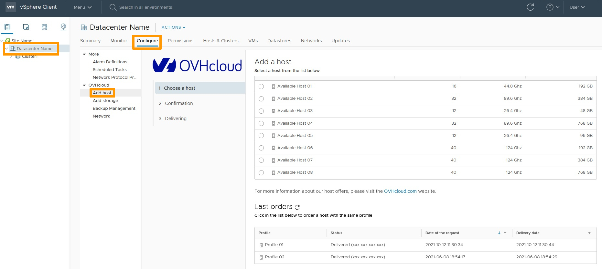

**Ultimo aggiornamento: 15/11/2021**

## Obiettivo

Il plugin OVHcloud permette di aggiungere a un’infrastruttura risorse dedicate, in pochi minuti.

**Questa guida ti mostra come utilizzare questo plugin dal client vSphere.**

## Prerequisiti

- Disporre di una soluzione [Hosted Private Cloud OVHcloud](https://www.ovhcloud.com/it/enterprise/products/hosted-private-cloud/){.external}
- Avere accesso all’interfaccia di gestione vSphere

## Procedura

OVHcloud offre due tipi di risorse dedicate con fatturazione oraria:

- server host
- datastore

Per accedere al menu del plugin OVHcloud dal client vSphere, clicca sulla sezione `Hosts and Clusters`{.action} nella colonna a sinistra e seleziona un elemento dell’infrastruttura,  poi clicca sulla scheda `Configure`{.action} del datacenter o del cluster.

Clicca sulla voce `Add Host`{.action} relativa al server host  per visualizzarne le informazioni tecniche e ordinare nuove macchine.

{.thumbnail}

Per ordinare datastore aggiuntivi, invece, clicca su `Add Storage`{.action}.

{.thumbnail}

L’accesso a questi menu è disponibile anche da un percorso alternativo, cliccando con il tasto destro sul datacenter o cluster dell’infrastruttura e selezionando `OVHcloud`{.action}.

{.thumbnail}

## Per saperne di più

Contatta la nostra Community di utenti all’indirizzo <https://community.ovh.com/en/>.