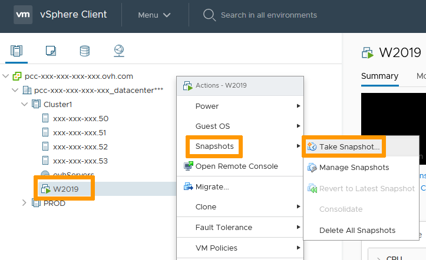
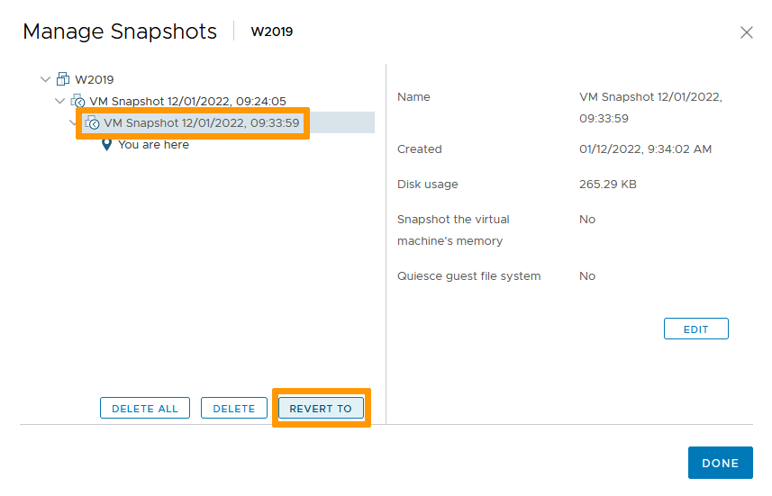
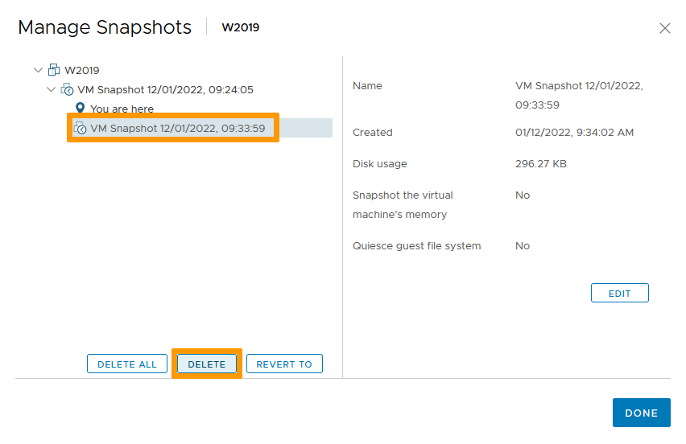
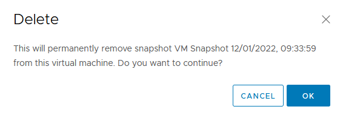
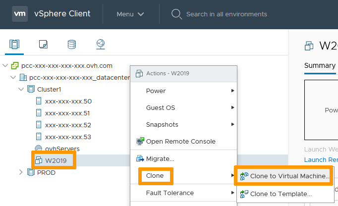
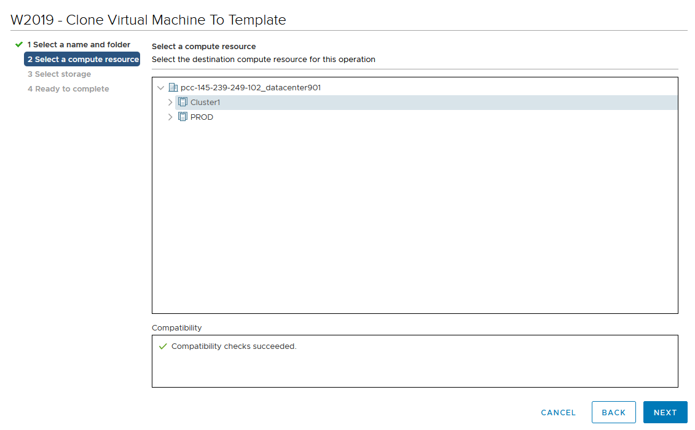

**Dernière mise à jour le 12/01/2022**

## Objectif

VMWare offre la possibilité de créer manuellement des snapshots ou des clones de VM.

**Ce guide explique comment exécuter ces tâches**

## Prérequis

- Être contact administrateur du [Hosted Private Cloud infrastructure](https://www.ovhcloud.com/fr/enterprise/products/hosted-private-cloud/), pour recevoir des identifiants de connexion.
- Avoir un identifiant utilisateur actif (créé dans l'[espace client OVHcloud](https://www.ovh.com/auth/?action=gotomanager&from=https://www.ovh.com/fr/&ovhSubsidiary=fr))

## En pratique

### Prendre un Snapshot

Un snapshot capture l'etat d'une VM. 
Cela ajoute une couche de protection pour votre VM avant de procéder à des changement en permettant de revenir à cet état si besoin.

Dans l'interface vSphere, allez dans le Tableau de bord `Hôtes et clusters`{.action}. 
Naviguez jusqu'à votre VM, effectuez un clic droit et dans le menu `Snapshots`{.action} menu, selectionnez `Prendre un snapshot`{.action}.

{.thumbnail}

Par défaut, le nom du snapshot est la date et l'heure courante. Vous pouvez le changer à votre convenance. 
Vous pouvez également ajouter une description. 
Si la VM est en marche, le processus de snapshot offre deux options:
- Prendre un snapshot de la mémoire de la machine virtuelle. Cela sauvegarde l'état de la RAM sur la VM pour aider les applications qui n'ont pas encore ecrit leurs données sur disque. Cela doit rendre le snapshot résistant au crash et ouvre la possibilité de récupération à chaud.
- Mettre au repos le système fichiers invité (VMware Tools doit être installé). La VM sera paramétrée comme si le sytème allait être sauvegardée : buffers nettoyés, changement enregistés sur disque... 
Si la VM est éteinte, ces options sont grisées. 
*Nous recommendons de prendre des snapshots de VM à froid. Si ce n'est pas possible, préférez la lise au repos à un simple snapshot de mémoire pour plus de sécurité.* 
Cliquez sur `OK`{.action}.

{.thumbnail}

Votre snapshot est pris.

### Gérer les Snapshots

Vous pouvez prendre de multiples snapshots d'une seule VM en répétant le processus vu ci-dessus. 
Cependant, avec le temps, les snapshots consomment beaucoup de resources pour se maintenir et finissent par affecter les performances des VMs. 
Voici comment restaurer ou supprimer les snapshots.

#### Restaurer un Snapshot

Dans l'interface vSphere, allez dans le Tableau de bord `Hôtes et clusters`{.action}. 
Naviguez jusqu'à votre VM, effectuez un clic droit et dans le menu `Snapshots`{.action} menu, selectionnez `Gérer les snapshots`{.action}.

{.thumbnail}

Vérifier l'arborescence des snapshots et selectionnez celui auquel vous souhaitez revenir. 
Cliquez sur `Restaurer`{.action}.

{.thumbnail}

Confirmer en cliquant `OK`{.action}.

{.thumbnail}

Vous pouvez cliquer `Terminé`{.action}, votre VM est revenu à l'état choisi.

> [!primary]
>
> Si vous n'avez qu'un unique snapshot ou souhaitez revenir au dernier snapshot pris, vous pouvez accélérer le processus en choisissant `Restaurer le dernier snapshot`{.action} dans le menu `Snapshots`{.action}.

#### Supprimer un Snapshot

Dans l'interface vSphere, allez dans le Tableau de bord `Hôtes et clusters`{.action}. 
Naviguez jusqu'à votre VM, effectuez un clic droit et dans le menu `Snapshots`{.action} menu, selectionnez `Gérer les snapshots`{.action}.

{.thumbnail}

Vérifier l'arborescence des snapshots et selectionnez celui auquel vous souhaitez revenir. 
Cliquez sur `Supprimer`{.action}. 
*Vous pouvez aussi supprimer tous les snapshots existants en cliquant `Supprimer tout`{.action}.*

{.thumbnail}

Confirmer en cliquant `OK`{.action}.

{.thumbnail}

Vous pouvez cliquer `Terminé`{.action}, le snapshot a été supprimé.

> [!primary]
>
> Pour supprimer tous les snapshots, vous pouvez accélérer le processus en choisissant `Supprimer tous les snapshots`{.action} dans le menu `Snapshots`{.action}.

### Cloner une VM

Cloner permet un déploiement rapide et facile de VMs similaires. 
Vous pouvez cloner une VM vers une autre VM ou vers un modèle. 
Cloner vers une VM est un moyen rapide de dupliquer une VM et ses paramètres. 
Cloner vers un modèle est un meilleur moyen pour créer une copie originale qui servira à déployer de miltiples VMS.

#### Cloner vers une VM

Dans l'interface vSphere, allez dans le Tableau de bord `Hôtes et clusters`{.action}. 
Naviguez jusqu'à votre VM, effectuez un clic droit et dans le menu `Cloner`{.action}, selectionner `Cloner vers une machine virtuelle`{.action}.

{.thumbnail}

Nommez le clone et selectionnez son datacenter. 
Cliquez sur `Suivant`{.action}.

{.thumbnail}

Selectionnez une resource de calcul. 
Cliquez sur `Suivant`{.action}.

{.thumbnail}

Selectionnez le lieu de stockage. 
Cliquez sur `Suivant`{.action}.

{.thumbnail}

Selectionnez les options nécessaire pour le clone.
- Personnaliser le système d'exploitation lancera sysprep lors de la première utilisation de la VM
- Personnaliser le matériel de cette machine virtuelle permet de modifier les charactéristiques techniques de la VM (taille de disque, RAM, éléments réseau...)
- Mettre sous tension la machine virtuelle après la création n'est pas recommandé. Certains changements à froid peuvent être necessaires avant de lancer la VM pour éviter des conflits. 
Cliquez sur `Suivant`{.action}.

{.thumbnail}

Vérifiez puis cliquez sur `Terminer`{.action}.

{.thumbnail}

Le processus de clonage s'enclenche et la nouvelle VM sera disponible une fois terminé.

> [!primary]
>
> Si le clone a été effectué sans personalisation, assurez-vous que vous pouvez démarrer la VM sans danger. Par exemple, si la VM d'origine a une IP fixe, désactivez la carte réseau du clone pour éviter un conflit d'addresse IP.

#### Cloner vers un modèle

Dans l'interface vSphere, allez dans le Tableau de bord `Hôtes et clusters`{.action}. 
Naviguez jusqu'à votre VM, effectuez un clic droit et dans le menu `Cloner`{.action}, selectionner `Cloner vers un modèle`{.action}.

{.thumbnail}

Nommez le modèle et selectionnez son datacenter. 
Cliquez sur `Suivant`{.action}.

{.thumbnail}

Selectionnez une resource de calcul. 
Cliquez sur `Suivant`{.action}.

{.thumbnail}

Selectionnez le lieu de stockage. 
Cliquez sur `Suivant`{.action}.

{.thumbnail}

Vérifiez puis cliquez sur `Terminer`{.action}.

{.thumbnail}

Le processus de clonage va s'exécuter. 
Aucune VM n'est directement visible mais le nouveau modèle est utilisable dans l'option Deployer depuis un modèle.

{.thumbnail}

## Aller plus loin

Échangez avec notre communauté d'utilisateurs sur <https://community.ovh.com>.
