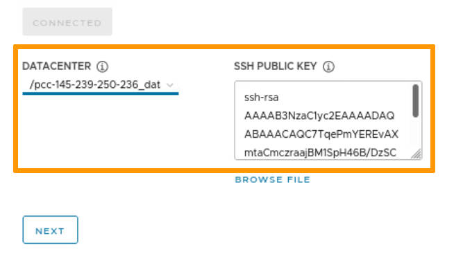

**Last Updated on 01/03/2022**

## Objective

VMware Tanzu Community Edition is a full-featured, easy-to-manage Kubernetes platform.
You can deploy the product on an OVHcloud infrastructure to leverage its functionnality and scalability.

**This guide offers a step by step study case to achieve the objective**

## Requirements

- Be an administrative contact of your [Hosted Private Cloud infrastructure](https://www.ovhcloud.com/en-gb/enterprise/products/hosted-private-cloud/) to receive login credentials
- Have a user account with access the [OVHcloud Control Panel](https://www.ovh.com/auth/?action=gotomanager&from=https://www.ovh.co.uk/&ovhSubsidiary=GB)
- Have a user account with access to vSphere
- Have an [NSX Edge Services Gateway](https://docs.ovh.com/gb/en/private-cloud/how-to-deploy-an-nsx-edge-gateway/) deployed
- Have [dhcp](https://docs.ovh.com/gb/en/private-cloud/setup-dhcp-nsx-edge/) services activated on the NSX Gateway

## Instructions

### Network

As stated in the Requirements (with links to full docs), an NSX Edge Services Gateway is used in our study case for Firewall and DHCP purposes. 
Other Network components can be used as alternative such as pfsense. 

To set up your Network, you will need to define a public IP for external access and an internal network with dhcp service activated for your Tanzu infrastructure. 
Your Datacenter comes with a set of public IPs useable for your different needs. They are visible in the Datacenter `Configure`{.action} tab, in the `Network`{.action} section. You will also see the mask and gateway settings on the page. 
Check out our [Adding an IP block](https://docs.ovh.com/gb/en/private-cloud/add-ip-block/) documentation if you are out of useable public IPs.

{.thumbnail}

> [!warning]
>
> Public IPs marked as "Reserved" are used for Datacenter functions and cannot be used for other services.
>

For our study case, the NSX Edge Services Gateway is set up with two interfaces as follows
- an external interface (Uplink) with a primary and secondary public IPs (xxx.xxx.xxx.225 and xxx.xxx.xxx.226)
- an internal interface (Internal) with private IP 172.16.13.1 on VLAN13 
{.thumbnail}
- dhcp service distributing VLAN13 address scope 172.16.13.10 through 172.16.13.100 
{.thumbnail}
- an SNAT rule to translate adress range 172.16.13.1/24 into secondary public IP xxx.xxx.xxx.226 for external access  
{.thumbnail}

In the [OVHcloud Control Panel](https://www.ovh.com/auth/?action=gotomanager&from=https://www.ovh.co.uk/&ovhSubsidiary=GB), go to the `Security`{.action} tab of your Private Cloud and add the public IPs used to the allowed adresses to connect. 
The adresses should appear as "Authorised and set up". 
{.thumbnail}

### Bootstrap VM

Once the Network is ready, a Bootstrap VM is needed. 
It will hold the necessary software components (Docker and Kubectl) and pilot the installation of Tanzu. 
We'll use an Ubuntu VM but any OS allowing the install of the necessary items would work. 
VM prerequisites for Tanzu CE is 2 CPUs and 6 GB Ram. 
You can deploy a VM [from an ISO](https://docs.ovh.com/gb/en/private-cloud/deploying-a-virtual-machine/) or [from an OVF template](https://docs.ovh.com/gb/en/private-cloud/applying-ovh-template/). 

Make sure the VM is set on the VLAN that will be used for the Tanzu clusters (VLAN13 in our case). 
{.thumbnail}

In a terminal window, start with update commands:
>sudo apt update
and
>sudo apt-get install build-essential

#### [NTP](https://vitux.com/how-to-install-ntp-server-and-client-on-ubuntu/) install

>sudo apt-get install ntp

#### [Homebrew](https://www.how2shout.com/linux/how-to-install-brew-ubuntu-20-04-lts-linux/) install

Start with git
>sudo apt install git -y

Run the Homebrew install script
>/bin/bash -c "$(curl -fsSL https://raw.githubusercontent.com/Homebrew/install/HEAD/install.sh)"

Add Homebrew to your path
>eval "$(/home/linuxbrew/.linuxbrew/bin/brew shellenv)"

Install gcc
>brew install gcc

#### [Docker Engine](https://docs.docker.com/engine/install/) install

Start with getting the necessary packages
>sudo apt-get install \ 
>ca-certificates \ 
>curl \ 
>gnupg \ 
>lsb-release

Add Docker’s official GPG key
>curl -fsSL https://download.docker.com/linux/ubuntu/gpg | sudo gpg --dearmor -o /usr/share/keyrings/docker-archive-keyring.gpg

set up the stable repository
>echo \ 
>"deb [arch=$(dpkg --print-architecture) signed-by=/usr/share/keyrings/docker-archive-keyring.gpg] https://download.docker.com/linux/ubuntu \ 
>$(lsb_release -cs) stable" | sudo tee /etc/apt/sources.list.d/docker.list > /dev/null

Set up the engine
>sudo apt-get install docker-ce docker-ce-cli containerd.io

Post install, add the current user to the docker group to allow it to run it without rights elevation
>sudo usermod -aG docker $USER

#### [Kubectl](https://kubernetes.io/docs/tasks/tools/install-kubectl-linux/) install

Download the lastest package
>curl -LO "https://dl.k8s.io/release/$(curl -L -s https://dl.k8s.io/release/stable.txt)/bin/linux/amd64/kubectl"

Run the installer
>sudo install -o root -g root -m 0755 kubectl /usr/local/bin/kubectl

#### SSH Key Pair

run the creation command
>ssh-keygen -t rsa -b 4096 -C "youremail@yourdomain.com"

Press Enter to save the key in default path (/root/.ssh/id_rsa). 
Enter and confirm a password for the key. 
Add the private key to the SSH agent running on your machine, and enter the password you created in the previous step.
>ssh-add ~/.ssh/id_rsa

Keep the .ssh/id_rsa.pub file handy as it holds the public key you will need to input later for TCE configuration

### Tanzu Management Cluster

The VM is now ready for Tanzu deployment.

#### [Tanzu CLI](https://tanzucommunityedition.io/docs/latest/cli-installation/)

In a terminal window, run the CLI install commmand
>brew install vmware-tanzu/tanzu/tanzu-community-edition

Note the output install folder and run the post install script: {HOMEBREW-INSTALL-LOCATION}/configure-tce.sh
>/home/linuxbrew/.linuxbrew/Cellar/tanzu-community-edition/v0.10.0/libexec/configure-tce.sh

{.thumbnail}

#### [Deployment](https://tanzucommunityedition.io/docs/latest/vsphere-install-mgmt/)

Launch the installer with the command
>tanzu management-cluster create --ui

In the opening browser window, select the vSphere option

{.thumbnail}

enter the Private cloud FQDN and fill in administrative credential before clicking `Connect`{.action}.

{.thumbnail}

Click `Continue`{.action} to verify the SSL footprint.

{.thumbnail}

Select your datacenter and fill in the SSH public key created earlier (.ssh/id_rsa.pub). 
Click `Next`{.action}.

{.thumbnail}

Choose a type of cluster (Development or Production) and a node size.

{.thumbnail}

Fill in the name of your custer, choose a control plane enpoint provider and IP (same subnet but outside of dhcp scope). 
Click `Next`{.action}.

{.thumbnail}

NSX Advanced Load Balancer and Metadata sections are optional and we'll leave them as is. 
Click `Next`{.action} on both of them.

{.thumbnail}

Choose your resource locations. 
Click `Next`{.action}.

{.thumbnail}

