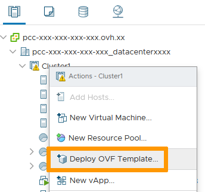
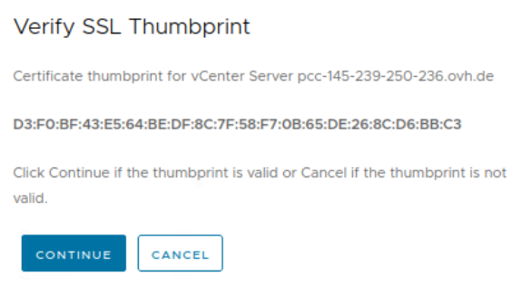
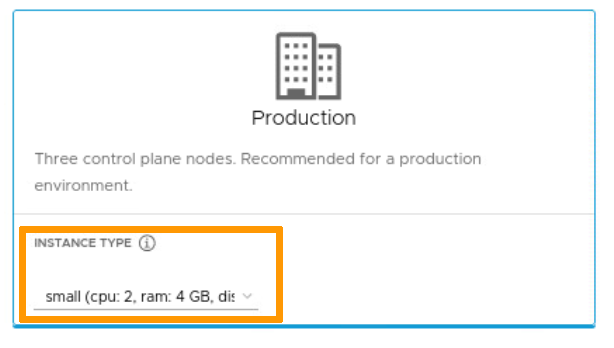
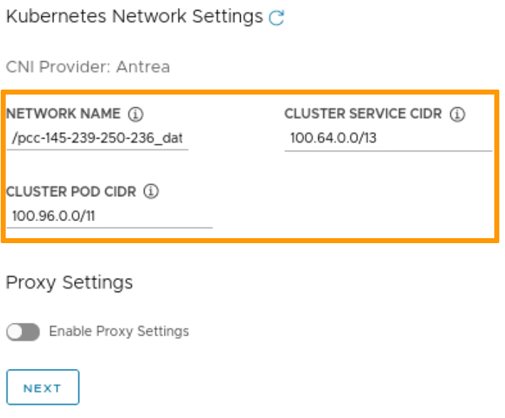
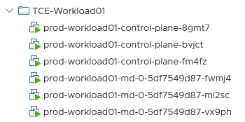

**Dernière mise à jour le 04/03/2022**

## Objectif

VMware Tanzu Community Edition (TCE) est une plate-forme Kubernetes complète et simple à gérer. 
Vous pouvez déployer ce produit sur votre infrastructure OVHcloud pour profiter de ses fonctionnalités et de son évolutivité.

**Ce guide est un exemple avec toutes les étapes de l'installation de TCE**

## Prérequis

- Être contact administrateur du [Hosted Private Cloud infrastructure](https://www.ovhcloud.com/fr/enterprise/products/hosted-private-cloud/), pour recevoir des identifiants de connexion.
- Avoir un identifiant actif dans l'[espace client OVHcloud](https://www.ovh.com/auth/?action=gotomanager&from=https://www.ovh.com/fr/&ovhSubsidiary=fr)
- Avoir un identifiant actif dans vSphere
- Avoir déployé une [NSX Edge Services Gateway](https://docs.ovh.com/fr/private-cloud/comment-deployer-une-nsx-edge-gateway/)
- Configurer le service [dhcp](https://docs.ovh.com/fr/private-cloud/configurer-le-dhcp-sur-une-edge-nsx/) sur la NSX Gateway

## En pratique

### Réseau

Comme indiqué dans les prérequis (avec liens vers les documents liés), nous utilisons une NSX Edge Gateway pour les services de firewall et de DHCP. 
D'autres composants réseau peuvent servir d'alternative, notament pfsense. 

Pour paramétrer votre réseau, définissez une adresse IP publique pour l'accès extérieur et un réseau interne avec le service dhcp activé pour l'infrastructure TCE. 
Votre Datacenter est livré avec un certain nombre d'IPs publiques utilisables pour vos besoins. Elles sont visibles dans l'onglet `Configurer`{.action} du Datacenter, dans la section `Réseau`{.action}. Vous verrez également les paramètres de masque et de passerelle sur la page. 
Consultez notre documentation pour [Ajouter un bloc d'IP](https://docs.ovh.com/fr/private-cloud/ajout-de-bloc-ip/) si vous n'avez plus d'IP publique utilisable.

{.thumbnail}

> [!warning]
>
> Les adresses IP marquées comme "Reserved" sont utilisées pour les services liés au datacenter et ne sont pas disponibles pour autre choses.
>

Pour notre exemple, la NSX Edge Services Gateway est paramétrée comme suit avec deux interfaces
- une interface externe (Uplink) avec une IP publique principale et une secondaire (xxx.xxx.xxx.225 and xxx.xxx.xxx.226)
- une interface interne (Internal) avec une IP privée 172.16.13.1 sur le VLAN13 
{.thumbnail}
- le service dhcp distribue un pool d'adresse de 172.16.13.10 à 172.16.13.100 sur le VLAN13 
{.thumbnail}
- Une règle SNAT traduit le réseau 172.16.13.1/24 par l'adresse publique xxx.xxx.xxx.226 pour l'accès externe 
{.thumbnail}

Dans l'[espace client OVHcloud](https://www.ovh.com/auth/?action=gotomanager&from=https://www.ovh.com/fr/&ovhSubsidiary=fr), dans l'onglet `Sécurité`{.action} de votre Private Cloud, ajoutez les adresses IP publiques utilisées à la liste des adresses autorisées à se connecter. 
Les adresses apparaîtront comme "Autorisé et mis en place". 
{.thumbnail}

### Image de noeud

Les clusters TCE nécessitent l'utilisation d'une image pour créer les nœuds. Cette image peut être téléchargée depuis le site Web [VMware Customer Connect](https://customerconnect.vmware.com/downloads/get-download?downloadGroup=TCE-0100). Si vous ne possédez pas de compte, vous pouvez en créer un gratuitement.

Sélectionnez la dernière version du fichier OVA à utiliser et téléchargez-la localement.

{.thumbnail}

Dans vSphere, faites un clic droit sur un hôte ou un cluster et sélectionnez `Déployer un modèle OVF`{.action}..

{.thumbnail}

Recherchez le fichier OVA téléchargé et déployez-le.

{.thumbnail}

Pour finir, faites un clic droit sur la VM et dans la section `Modèle`{.action}, sélectionnez `Convertir au modèle`{.action}.

{.thumbnail}

### VM de Bootstrap

Once the Network and template are ready, a Bootstrap VM is needed. 
It will hold the necessary software components (Docker and Kubectl) and pilot the installation of Tanzu. 
We'll use an Ubuntu VM but any OS allowing the install of the necessary items would work. 
VM prerequisites for Tanzu CE is 2 CPUs and 6 GB Ram. 
You can deploy a VM [from an ISO](https://docs.ovh.com/gb/en/private-cloud/deploying-a-virtual-machine/) or [from an OVF template](https://docs.ovh.com/gb/en/private-cloud/applying-ovh-template/). 

Make sure the VM is set on the VLAN that will be used for the Tanzu clusters (VLAN13 in our case). 
{.thumbnail}

In a terminal window, start with update commands:
>sudo apt update
and
>sudo apt-get install build-essential

#### [NTP](https://vitux.com/how-to-install-ntp-server-and-client-on-ubuntu/) install

>sudo apt-get install ntp

#### [Homebrew](https://www.how2shout.com/linux/how-to-install-brew-ubuntu-20-04-lts-linux/) install

Start with git
>sudo apt install git -y

Run the Homebrew install script
>/bin/bash -c "$(curl -fsSL https://raw.githubusercontent.com/Homebrew/install/HEAD/install.sh)"

Add Homebrew to your path
>eval "$(/home/linuxbrew/.linuxbrew/bin/brew shellenv)"

Install gcc
>brew install gcc

#### [Docker Engine](https://docs.docker.com/engine/install/) install

Start with getting the necessary packages
>sudo apt-get install \ 
>ca-certificates \ 
>curl \ 
>gnupg \ 
>lsb-release

Add Docker’s official GPG key
>curl -fsSL https://download.docker.com/linux/ubuntu/gpg | sudo gpg --dearmor -o /usr/share/keyrings/docker-archive-keyring.gpg

set up the stable repository
>echo \ 
>"deb [arch=$(dpkg --print-architecture) signed-by=/usr/share/keyrings/docker-archive-keyring.gpg] https://download.docker.com/linux/ubuntu \ 
>$(lsb_release -cs) stable" | sudo tee /etc/apt/sources.list.d/docker.list > /dev/null

Set up the engine
>sudo apt-get install docker-ce docker-ce-cli containerd.io

Post install, add the current user to the docker group to allow it to run it without rights elevation
>sudo usermod -aG docker $USER

#### [Kubectl](https://kubernetes.io/docs/tasks/tools/install-kubectl-linux/) install

Download the lastest package
>curl -LO "https://dl.k8s.io/release/$(curl -L -s https://dl.k8s.io/release/stable.txt)/bin/linux/amd64/kubectl"

Run the installer
>sudo install -o root -g root -m 0755 kubectl /usr/local/bin/kubectl

#### SSH Key Pair

run the creation command
>ssh-keygen -t rsa -b 4096 -C "youremail@yourdomain.com"

Press Enter to save the key in default path (/root/.ssh/id_rsa). 
Enter and confirm a password for the key. 
Add the private key to the SSH agent running on your machine, and enter the password you created in the previous step.
>ssh-add ~/.ssh/id_rsa

Keep the .ssh/id_rsa.pub file handy as it holds the public key you will need to input later for TCE configuration

### Tanzu Management Cluster

The VM is now ready for Tanzu deployment.

#### [Tanzu CLI](https://tanzucommunityedition.io/docs/latest/cli-installation/)

In a terminal window, run the CLI install commmand
>brew install vmware-tanzu/tanzu/tanzu-community-edition

Note the output install folder and run the post install script: {HOMEBREW-INSTALL-LOCATION}/configure-tce.sh
>/home/linuxbrew/.linuxbrew/Cellar/tanzu-community-edition/v0.10.0/libexec/configure-tce.sh

{.thumbnail}

#### [Deployment](https://tanzucommunityedition.io/docs/latest/vsphere-install-mgmt/)

Launch the installer with the command
>tanzu management-cluster create --ui

In the opening browser window, select the vSphere option

{.thumbnail}

enter the Private cloud FQDN and fill in administrative credential before clicking `Connect`{.action}.

{.thumbnail}

Click `Continue`{.action} to verify the SSL footprint.

{.thumbnail}

Select your datacenter and fill in the SSH public key created earlier (.ssh/id_rsa.pub). 
Click `Next`{.action}.

{.thumbnail}

Choose a type of cluster (Development or Production) and a node size.

{.thumbnail}

Fill in the name of your custer, choose a control plane enpoint provider and IP (same subnet but outside of dhcp scope). 
Click `Next`{.action}.

{.thumbnail}

NSX Advanced Load Balancer and Metadata sections are optional and we'll leave them as is. 
Click `Next`{.action} on both of them.

{.thumbnail}

Choose your resource locations. 
Click `Next`{.action}.

{.thumbnail}

Enter the Kubernetes Network settings. 
Click `Next`{.action}.

{.thumbnail}

Disable Identity Management. 
Click `Next`{.action}.

{.thumbnail}

Select the node template to be used. 
Click `Next`{.action}.

{.thumbnail}

Click `Review Configuration`{.action}.

{.thumbnail}

When ready, click `Deploy Management Cluster`{.action}.

{.thumbnail}

Upon completion, verify tou get a creation message and the nodes are visible in vSphere.

{.thumbnail}

{.thumbnail}

Get the cluster admin credentials for future interactions:
>tanzu cluster kubeconfig get "clustername" --admin

### Tanzu Workload Cluster

To deploy a workload cluster, we'll duplicate and modify the configuration file for the management cluster. 
Start a terminal window in the bootstrap VM and go to the config file folder. 
>cd .config/tanzu/tkg/clusterconfigs

Use ls to find the yaml configuration file name and copy it into a new one. 
>cp existing.yaml new.yaml

{.thumbnail}

Use a text editor to modify the key fields:
- CLUSTER_NAME : choose a name for your new cluster
- VSPHERE_CONTROL_PLANE_ENDPOINT : choose an unused IP in the same subnet but not in the dhcp scope
- VSPHERE_FOLDER : this is not mandatory but you can define a different folder for ease of management 
Save and close the file.

Back in the terminal, run the deploy command calling your new yaml file. 
> tanzu cluster create --file .config/tanzu/tkg/clusterconfigs/new.yaml

Upon completion, verify tou get a creation message and the nodes are visible in vSphere.

{.thumbnail}

{.thumbnail}

Get the cluster admin credentials for future interactions:
>tanzu cluster kubeconfig get "clustername" --admin

TCE is now ready for application installs.

## Go further

Join our community of users on <https://community.ovh.com/en/>.
