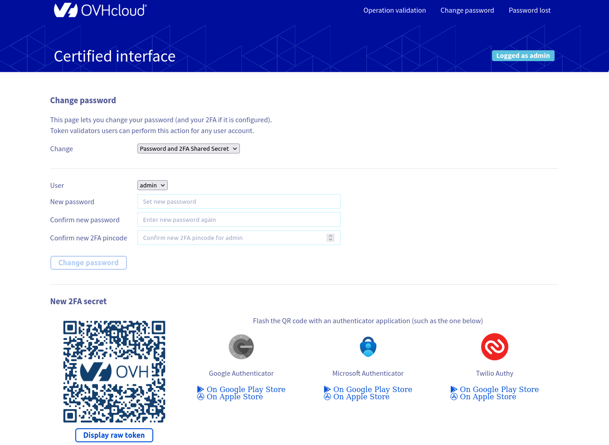

**Última actualización: 10/06/2022**

## Objetivo

La activación de la doble autenticación permite proteger el acceso a su Private Cloud, lo que reduce los riesgos vinculados a, por ejemplo, el robo de contraseñas.

**En esta guía, se explica cómo activar la doble autenticación para proteger su infraestructura Private Cloud.**
 
## Requisitos

- Tener una infraestructura [Private Cloud](https://www.ovhcloud.com/es-es/enterprise/products/hosted-private-cloud/) con la opción de [seguridad avanzada](https://www.ovhcloud.com/es-es/enterprise/products/hosted-private-cloud/safety-compliance/sddc/) (incluida en las soluciones PCI-DSS y HDS).
- Tener un smartphone y una aplicación de autenticación (p. ej.: Google Authenticator, Authy, OTP Auth, etc.).

## Procedimiento

### Activación de la doble autenticación

Para poder activar la doble autenticación en su infraestructura, es necesario conectarse a la interfaz certificada de su Private Cloud.

Puede hacerlo de dos formas distintas:
	
- A través de la pasarela de su Private Cloud (https://pcc-xxx-xxx-xxx-xxx.ovh.com): 

{.thumbnail}

- Directamente a través del URL https://pcc-xxx-xxx-xxx-xxx.ovh.com/secure/ (no olvide la barra inclinada al final de la dirección).

Una vez que se haya conectado a la interfaz de gestión, haga clic en `cambiar contraseña —<i>Change Passwrod</i>—`{.action}

{.thumbnail}

En la interfaz, deberá:
	
* Seleccionar `la contraseña —<i>Password</i>— y el secreto compartido de la doble autenticación —<i>2FA Shared Secret</i>—`{.action}.
* Introducir una nueva contraseña. 
* Escanear el código QR con la aplicación móvil de autenticación de su elección.
* Confirmar el código obtenido.

{.thumbnail}

Se creará una tarea y se le enviará un token.

Acceda a la sección `de validación de la operación —<i>Operation Validation</i>—`{.action}, cargue la operación recibida por SMS y confirme con el token recibido en ese mismo SMS.

> [!primary]
>
> En caso de olvidar una contraseña, es necesario iniciar primeramente el procedimiento de pérdida de contraseña —<i>Password lost</i>—, durante el cual se propondrá la instrumentación de la doble autorización.
>

### Conexión

Conéctese a su cliente *web* mediante el enlace habitual. A continuación, se mostrará la siguiente página:

{.thumbnail}

Introduzca el token generado por la aplicación de autenticación instalada en su teléfono inteligente antes de introducir su contraseña.

> [!warning]
>
> La doble autenticación se activará al cambiar la contraseña de uno de los usuarios. Esto significa que, si un usuario modifica su contraseña, se activará la doble autenticación para todos los usuarios, 
>
> quienes tendrán que renovar su contraseña e instrumentar la doble autenticación de sus usuarios para poder seguir conectándose.
>
> Para los clientes con una infraestructura de la versión 6.0, el acceso al cliente vSphere (disponible únicamente en Windows) ya no será posible. En este caso, el acceso se realizará exclusivamente a través del cliente vSphere web.
>

### Creación de un nuevo usuario

Durante la creación de un nuevo usuario, puede elegir si asignar o no un rol de *validador de tokenes —token validator—*.

En ambos casos, es necesario modificar la contraseña a través de la interfaz certificada siguiendo el procedimiento anterior para la instrumentación de la 2FA.

La única diferencia será el grado de autonomía del usuario para validar el token.

### Autorización de una aplicación

Es posible utilizar varias aplicaciones de terceros que requieren la conexión a la utilidad vCenter.

Es preciso autorizar estas aplicaciones previamente a través de la política de acceso a la utilidad vCenter, lo cual se puede configurar en el [área de cliente](https://docs.ovh.com/gb/en/private-cloud/control-panel-ovh-private-cloud).

Entonces estas aplicaciones podrán acceder a nuestras infraestructuras, pero no necesariamente gestionarán la doble autenticación.

En este caso, será necesario crear una *lista de autorizados* específica para la *omisión* de la doble autenticación.

Esta *lista de autorizados* será complementaria a la lista principal que regula el acceso a la utilidad vCenter.

Para añadir las direcciones IP públicas de sus aplicaciones a esta segunda *lista de autorizados*, deberá utilizar las siguientes llamadas a la API: 

- Comprobar las direcciones IP autorizadas a no utilizar la doble autenticación.

> [!api]
>
> @api {GET} /dedicatedCloud/{serviceName}/twoFAWhitelist
>

- Añadir una dirección IP a la *omisión* de la doble autenticación.

> [!api]
>
> @api {POST} /dedicatedCloud/{serviceName}/twoFAWhitelist
>

- Mostrar la información de una dirección IP autorizada (se necesita un id. recuperado con la primera llamada).

> [!api]
>
> @api {GET} /dedicatedCloud/{serviceName}/twoFAWhitelist/{id}
>

- Eliminar una dirección IP de la lista de autorizados.

> [!api]
>
> @api {DELETE} /dedicatedCloud/{serviceName}/twoFAWhitelist/{id}
>

- Modificar la información de una dirección IP autorizada.

> [!api]
>
> @api {POST} /dedicatedCloud/{serviceName}/twoFAWhitelist/{id}/changeProperties
>

## Más información

Interactúe con nuestra comunidad de usuarios en <https://community.ovh.com/en/>.
