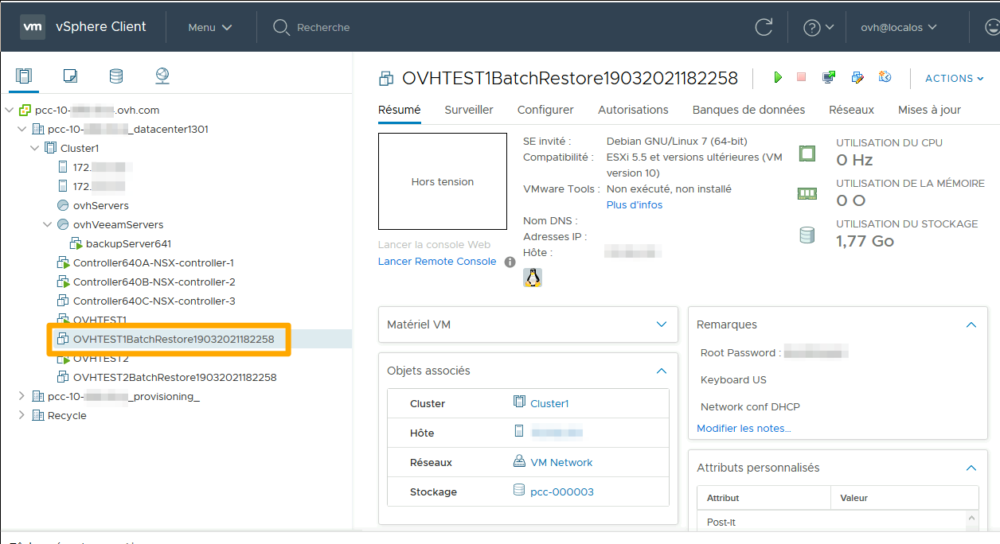

> [!primary]
> Diese Übersetzung wurde durch unseren Partner SYSTRAN automatisch erstellt. In manchen Fällen können ungenaue Formulierungen verwendet worden sein, z.B. bei der Beschriftung von Schaltflächen oder technischen Details. Bitte ziehen Sie beim geringsten Zweifel die englische oder französische Fassung der Anleitung zu Rate. Möchten Sie mithelfen, diese Übersetzung zu verbessern? Dann nutzen Sie dazu bitte den Button «Mitmachen» auf dieser Seite.
>

**Stand 20.03.2021**

## Ziel

**In dieser Anleitung erfahren Sie, wie Sie Backups über die OVHcloud APIs identifizieren und wiederherstellen.**

## Voraussetzungen

- Sie sind mit den [OVHcloud APIs verbunden](https://api.ovh.com/)
- [Veeam Managed Backup](https://docs.ovh.com/gb/en/private-cloud/veeam-backup-as-a-service/) für Ihr Hosted Private Cloud Angebot aktiviert

## In der praktischen Anwendung

Wenn Sie sich nicht an die Funktionsweise der OVHcloud APIs gewöhnt haben, lesen Sie unsere Anleitung [Erste Schritte mit den OVHcloud APIs](https://docs.ovh.com/gb/en/api/first-steps-with-ovh-api/).

### Schritt 1: einen Backup-Bericht erstellen

Zuerst müssen Sie die wiederherzustellen suchen.

Loggen Sie sich auf [https://api.ovh.com/](https://api.ovh.com/) ein und verwenden Sie folgenden Anruf:

> [!api]
>
> @api {POST} /dedicatedCloud/{serviceName}/datacenter/{datacenterId}/backup/generateReport

Geben Sie die Variablen ein:

- serviceName: die Referenz Ihres Dedicated Cloud als `pcc-XX-XX-XX-XX`
- datacenterId: die ID des Datacenters, auf dem Ihre Veeam Managed Backup Lösung aktiviert ist

Dieser Anruf generiert einen Backup-Bericht. Es wird per E-Mail an die auf dem Administratorkonto des Hosted Private Cloud Dienstes angegebene Adresse versandt.
 Die E-Mail enthält folgende Elemente:

- VM-Name
- Backups durchgeführt
- Größe jedes Backups
- **Storage-Ordner (BackupRepository)**
- Letzter Wiederherstellungspunkt

{.thumbnail}

Achten Sie auf den Storage-Ordner (BackupRepository), mit dem Sie die Sicherungen im nächsten Schritt wiederherstellen können.

### Schritt 2: Backups wiederherstellen

> [!warning]
>
> Bevor Sie die Wiederherstellung auf Ihrem Datastore starten, vergewissern Sie sich, dass dieser über eine ausreichende Speicherkapazität verfügt, um alle wiederzuherstellenden Daten aufzunehmen.
>
> Ist das nicht der Fall, werden Sie per E-Mail darüber informiert und die Operation wird abgebrochen.

Der API-Aufruf wird die letzten gültigen Wiederherstellungspunkte jedes im Storage-Ordner enthaltenen Backups wiederherstellen.

Loggen Sie sich auf [https://api.ovh.com/](https://api.ovh.com/) ein und verwenden Sie folgenden Anruf:

> [!api]
>
> @api {POST} /dedicatedCloud/{serviceName}/datacenter/{datacenterId}/backup/batchRestore
>

Geben Sie die Variablen ein:

- serviceName: die Referenz Ihres Dedicated Cloud als `pcc-XX-XX-XX-XX`
- datacenterId: die ID des Datacenters, auf dem Ihre Veeam Managed Backup Lösung aktiviert ist
- backupRepositoryName: Name des in Schritt 1 erhaltenen Backups

Sobald die Wiederherstellung abgeschlossen ist, finden Sie in Ihrem vSphere Interface die VMs, die den wiederhergestellten Sicherungen entsprechen.
 Um sie zu identifizieren, enthalten ihre Namen den *BatchRestore*-Suffix sowie ein Zeitstempel der Wiederherstellung.
 Die VMs werden ausgeschaltet. Sie müssen sie anschalten.

{.thumbnail}

## Weiterführende Informationen

Für den Austausch mit unserer User Community gehen Sie auf <https://community.ovh.com/en/>.
