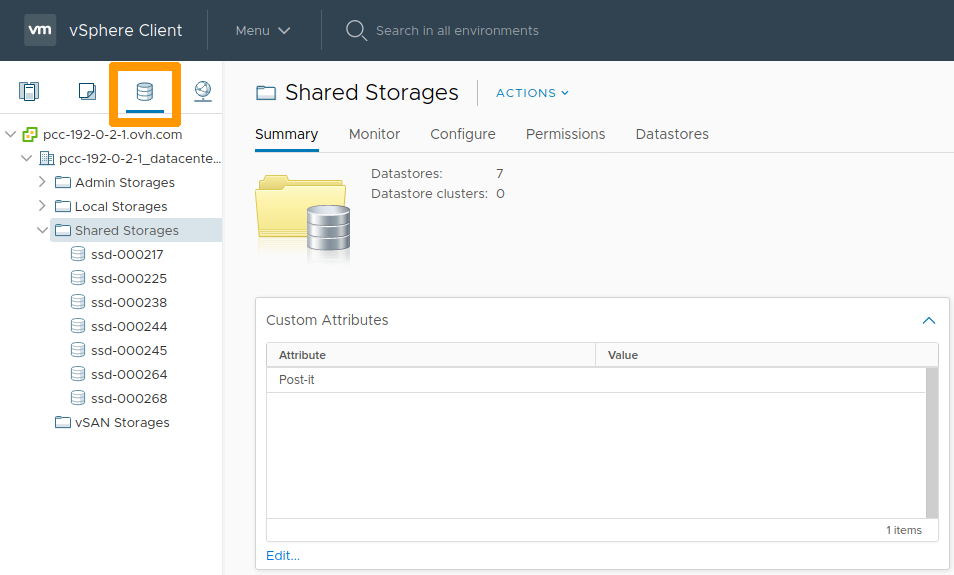
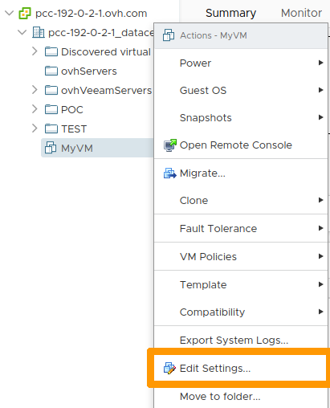

> [!primary]
> Diese Übersetzung wurde durch unseren Partner SYSTRAN automatisch erstellt. In manchen Fällen können ungenaue Formulierungen verwendet worden sein, z.B. bei der Beschriftung von Schaltflächen oder technischen Details. Bitte ziehen Sie beim geringsten Zweifel die englische oder französische Fassung der Anleitung zu Rate. Möchten Sie mithelfen, diese Übersetzung zu verbessern? Dann nutzen Sie dazu bitte den Button «Mitmachen» auf dieser Seite.
>

**Letzte Aktualisierung am 22.03.2021**

## Ziel

Nach einem Dienstausfall erscheinen virtuelle Maschinen nicht mehr in Ihrem vSphere Inventar, aber alle Dateien sind noch auf den Datastores vorhanden.

**Diese Anleitung erklärt, wie Sie VMs eines Datastores in Ihr vSphere Inventar aufnehmen.**

## Voraussetzungen

- Sie sind Administrator-Kontakt für die Infrastruktur [Hosted Private Cloud](https://www.ovhcloud.com/de/enterprise/products/hosted-private-cloud/), um die Login-Daten zu erhalten.
- Sie haben eine aktive Benutzerkennung (erstellt im [OVHcloud Kundencenter](https://www.ovh.com/auth/?action=gotomanager&from=https://www.ovh.de/&ovhSubsidiary=de))

## In der praktischen Anwendung

Gehen Sie im [vSphere Interface](../den_vsphere_client_installieren/) in die Ansicht `Storage`{.action}.

{.thumbnail}

Wählen Sie einen Datastore in der Liste aus.

{.thumbnail}

Wählen Sie in den Ordnern dieses Datastores die `.vmx` Datei aus und klicken Sie auf `Register VM`{.action}.

{.thumbnail}

Füllen Sie die erforderlichen Informationen aus und klicken Sie auf `Finish`{.action}.

{.thumbnail}

Diese Operationen sind auf jedem Datastore und für jede neu zu registrierende VM zu wiederholen.

Überprüfen Sie die Einstellungen Ihrer VMs (Name, [Portgroup](../vxlan-erstellung/) etc.), indem Sie mit der rechten Maustaste auf jede Ihrer VMs klicken und dann auf `Edit Settings`{.action}.

{.thumbnail}

Bei einem Konfigurationsfehler wird Ihnen eine Fehlermeldung angezeigt, wenn Sie die VM wieder einschalten.

Sie können eine VM reaktivieren, indem Sie mit der rechten Maustaste auf diese klicken und dann auf `Power on`{.action}.

{.thumbnail}

### Automatisierung

Wenn Sie mehrere VMs und/oder Datastores verwalten, kann der Prozess automatisiert werden, indem die VMs der Datastores mithilfe von Skripten registriert werden.

#### Mit PowerCLI

VMware bietet VMware Administratoren [PowerCLI für PowerShell](https://docs.vmware.com/fr/VMware-vSphere/6.5/com.vmware.vsphere.install.doc/GUID-F02D0C2D-B226-4908-9E5C-2E783D41FE2D.html){.external}.

Nach der Installation können Sie das folgende PS-Skript verwenden (Quelle: [LucD](https://www.lucd.info/2009/12/02/raiders-of-the-lost-vmx/){.external}):

```powershell
function register-vmxX {
    param($entityName = $null,$dsNames = $null,$template = $false,$ignore = $null,$checkNFS = $true,$whatif=$false)

    function Get-Usage{
        Write-Host "Parameters incorrect" -ForegroundColor red
        Write-Host "register-vmxX -entityName  -dsNames [,...]"
        Write-Host "entityName   : a cluster-, datacenter or ESX hostname (not together with -dsNames)"
        Write-Host "dsNames      : one or more datastorename names (not together with -entityName)"
        Write-Host "ignore       : names of folders that shouldn't be checked"
        Write-Host "template     : register guests ($false)or templates ($true) - default : $false"
        Write-Host "checkNFS     : include NFS datastores - default : $true"
        Write-Host "whatif       : when $true will only list and not execute - default : $false"
    }

    if(($entityName -ne $null -and $dsNames -ne $null) -or ($entityName -eq $null -and $dsNames -eq $null)){
        Get-Usage
        break
    }

    if($dsNames -eq $null){
        switch((Get-Inventory -Name $entityName).GetType().Name.Replace("Wrapper","")){
            "Cluster"{
                $dsNames = Get-Cluster -Name $entityName | Get-VMHost | Get-Datastore | where {$_.Type -eq "VMFS" -or $checkNFS} | % {$_.Name}
            }
            "Datacenter"{
                $dsNames = Get-Datacenter -Name $entityName | Get-Datastore | where {$_.Type -eq "VMFS" -or $checkNFS} | % {$_.Name}
            }
            "VMHost"{
                $dsNames = Get-VMHost -Name $entityName | Get-Datastore | where {$_.Type -eq "VMFS" -or $checkNFS} | % {$_.Name}
            }
            Default{
                Get-Usage
                exit
            }
        }
    }
    else{
        $dsNames = Get-Datastore -Name $dsNames | where {$_.Type -eq "VMFS" -or $checkNFS} | Select -Unique | % {$_.Name}
    }

    $dsNames = $dsNames | Sort-Object
    $pattern = "*.vmx"
    if($template){
        $pattern = "*.vmtx"
    }

    foreach($dsName in $dsNames){
        Write-Host "Checking " -NoNewline; Write-Host -ForegroundColor red -BackgroundColor yellow $dsName
        $ds = Get-Datastore $dsName | Select -Unique | Get-View
        $dsBrowser = Get-View $ds.Browser
        $dc = Get-View $ds.Parent
        while($dc.MoRef.Type -ne "Datacenter"){
            $dc = Get-View $dc.Parent
        }
        $tgtfolder = Get-View $dc.VmFolder
        $esx = Get-View $ds.Host[0].Key
        $pool = Get-View (Get-View $esx.Parent).ResourcePool

        $vms = @()
        foreach($vmImpl in $ds.Vm){
            $vm = Get-View $vmImpl
            $vms += $vm.Config.Files.VmPathName
        }
        $datastorepath = "[" + $ds.Name + "]"

        $searchspec = New-Object VMware.Vim.HostDatastoreBrowserSearchSpec
        $searchspec.MatchPattern = $pattern

        $taskMoRef = $dsBrowser.SearchDatastoreSubFolders_Task($datastorePath, $searchSpec)

        $task = Get-View $taskMoRef
        while ("running","queued" -contains $task.Info.State){
            $task.UpdateViewData("Info.State")
        }
        $task.UpdateViewData("Info.Result")
        foreach ($folder in $task.Info.Result){
            if(!($ignore -and (&{$res = $false; $folder.FolderPath.Split("]")[1].Trim(" /").Split("/") | %{$res = $res -or ($ignore -contains $_)}; $res}))){
                $found = $FALSE
                if($folder.file -ne $null){
                    foreach($vmx in $vms){
                        if(($folder.FolderPath + $folder.File[0].Path) -eq $vmx){
                            $found = $TRUE
                        }
                    }
                    if (-not $found){
                        if($folder.FolderPath[-1] -ne "/"){$folder.FolderPath += "/"}
                        $vmx = $folder.FolderPath + $folder.File[0].Path
                        if($template){
                            $params = @($vmx,$null,$true,$null,$esx.MoRef)
                        }
                        else{
                            $params = @($vmx,$null,$false,$pool.MoRef,$null)
                        }
                        if(!$whatif){
                            $taskMoRef = $tgtfolder.GetType().GetMethod("RegisterVM_Task").Invoke($tgtfolder, $params)
                            Write-Host "`t" $vmx "registered"
                        }
                        else{
                            Write-Host "`t" $vmx "registered" -NoNewline; Write-Host -ForegroundColor blue -BackgroundColor white " ==> What If"
                        }
                    }
                }
            }
        }
        Write-Host "Done"
        }
    }
```

Nachdem Sie das Skript in Ihre Umgebung geladen haben, können Sie es wie folgt verwenden: 

```powershell
register-vmxX -entityName "pcc-192-0-2-1_datacenter1337"
register-vmxX -dsNames "ssd-012345","pcc-012345"
register-vmxX -dsNames "ssd-012345","pcc-012345" -template:$true
register-vmxX -entityName "pcc-192-0-2-1_datacenter1337" -ignore "upload-vpn"
register-vmxX -dsNames "ssd-012345","pcc-012345" -ignore "upload-vpn" -checkNFS:$true
register-vmxX -entityName "pcc-192-0-2-1_datacenter1337" -whatif:$true
```

> [!primary]
>
> Die Code-Beispiele sind an OVHcloud VMware Umgebungen angepasst.
> NFS Datastores sind standardmäßig aktiviert.
>


## Weiterführende Informationen

Für den Austausch mit unserer User Community gehen Sie auf <https://community.ovh.com/en/>.
