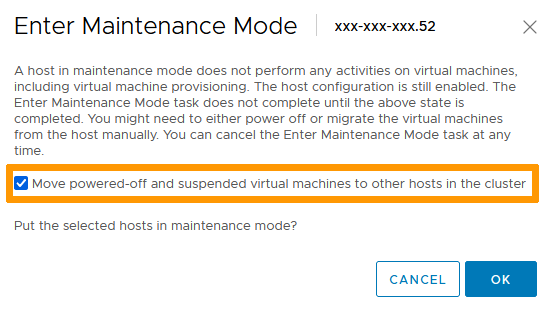
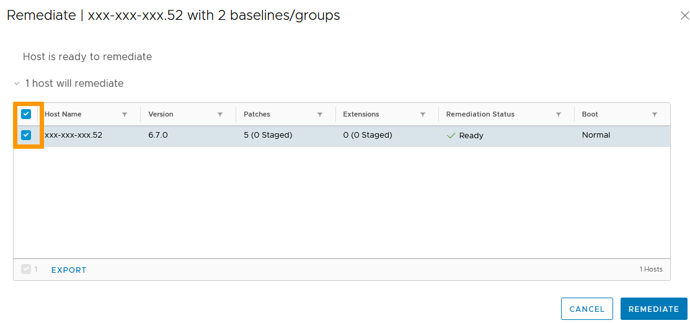

> [!primary]
> Diese Übersetzung wurde durch unseren Partner SYSTRAN automatisch erstellt. In manchen Fällen können ungenaue Formulierungen verwendet worden sein, z.B. bei der Beschriftung von Schaltflächen oder technischen Details. Bitte ziehen Sie beim geringsten Zweifel die englische oder französische Fassung der Anleitung zu Rate. Möchten Sie mithelfen, diese Übersetzung zu verbessern? Dann nutzen Sie dazu bitte den Button “Mitmachen“ auf dieser Seite.
>

**Letzte Aktualisierung am 23.11.2021**

## Ziel

Die VMware Update-Verwaltung erlaubt es Ihnen, Ihre Hosts auf dem neuesten Stand zu halten, indem Sie die *Fixed Bug* und Patches für die Sicherheit installieren, ohne dass unsere Teams eingreifen.     

> [!primary]
> vCenter Updates oder größere Updates erfordern immer unsere Teilnahme.

**In dieser Anleitung wird erläutert, wie das Tool funktioniert**

## Voraussetzungen

- Als Administrator-Kontakt für die [Hosted Private Cloud Infrastruktur](https://www.ovhcloud.com/de/enterprise/products/hosted-private-cloud/) fungieren, um Login-Daten zu erhalten.
- Sie haben eine aktive Benutzerkennung mit spezifischen Rechten für NSX (erstellt im [OVHcloud Kundencenter](https://www.ovh.com/auth/?action=gotomanager&from=https://www.ovh.de/&ovhSubsidiary=de))

## In der praktischen Anwendung

### Maintenance mMde

Bevor Sie an einem Host arbeiten, müssen Sie diesen in den Wartungsmodus versetzen.    
Das Patchen bewirkt in der Regel einen Neustart des Hosts, was die Auswirkungen auf Ihre Produktions-VMs begrenzt. 

Gehen Sie im Menü des vSphere Interface auf das Dashboard `Hosts and Clusters`{.action}.

{.thumbnail}

Klicken Sie links auf Ihren Host. Wählen Sie `Enter Maintenance Mode`{.action} In den `Maintenance Mode`{.action}.

{.thumbnail}

Vergewissern Sie sich, dass im nächsten Schritt ein Haken gesetzt ist, und klicken Sie dann auf `OK`{.action}.

{.thumbnail}

Wenn DRS aktiv ist, werden Ihre Produktions-VMs auf einen anderen Host migriert.

> [!primary]
> Wenn Sie Ihre Umgebung angepasst haben, müssen die Migrationen der VMs möglicherweise manuell durchgeführt werden.
>

Folgende Warnung kann erscheinen:     

{.thumbnail}

Ihr Host befindet sich nun im Wartungsmodus.

{.thumbnail}

### Update Manager

Wählen Sie Ihren Host und gehen Sie in den Bereich `Update`{.action}.
Sie sehen die verschiedenen Basisstatuten und die Konformität des Hosts.     

Sie müssen eine "Basislinie"verwenden, um die Konformität zu überprüfen.

{.thumbnail}

Klicken Sie im `Attached Baselines` auf `Attach`{.action} und `Attach Baseline or Baseline Group`{.action}.

{.thumbnail}

Es gibt vordefinierte Basenlinien für die verschiedenen empfohlenen Korrekturstufen.

> [!primary]
> In unserem Beispiel verwenden wir kritische Patches, aber Sie können die beiden existierenden Leitungen verwenden oder nach Belieben andere erstellen, um die verschiedenen Anforderungen Ihrer Umgebung zu erfüllen.
>

Wählen Sie die gewünschte Basiszeile aus und klicken Sie dann auf `Attach`{.action}.

{.thumbnail}

Die Konformitätserklärung wird anschließend aktualisiert.     

{.thumbnail}

Gehen Sie zurück in den `Attached Baselines`, wählen Sie alle zugewiesenen Basisleitungen aus und klicken Sie auf `Remediate`{.action}.

{.thumbnail}

Wählen Sie den Host aus und klicken Sie erneut auf `Remediate`{.action}.

{.thumbnail}

Das Update wird abhängig von Anzahl und Größe der verwendeten Patches gestartet und durchgeführt. 
Wenn nötig wird Ihr Host automatisch neu gestartet.

{.thumbnail}

Am Ende des Prozesses wird die Konformitätsprüfung wieder aufgenommen (oder durch Klicken auf die Verbindung erzwungen), und es wird erwartet, dass eine grüne Hähne erscheint.

{.thumbnail}

Ihr Host ist jetzt auf dem neuesten Stand.    

Denken Sie daran, ihn aus dem Wartungsmodus zu entfernen, und er wird wieder in der Produktion sein.

## Weiterführende Informationen

Für den Austausch mit unserer User Community gehen Sie auf <https://community.ovh.com/en/>.
