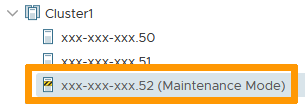

> [!primary]
> Diese Übersetzung wurde durch unseren Partner SYSTRAN automatisch erstellt. In manchen Fällen können ungenaue Formulierungen verwendet worden sein, z.B. bei der Beschriftung von Schaltflächen oder technischen Details. Bitte ziehen Sie beim geringsten Zweifel die englische oder französische Fassung der Anleitung zu Rate. Möchten Sie mithelfen, diese Übersetzung zu verbessern? Dann nutzen Sie dazu bitte den Button “Mitmachen“ auf dieser Seite.
>

**Letzte Aktualisierung am 23.11.2021**

## Ziel

Die VMware Update-Verwaltung erlaubt es Ihnen, Ihre Hosts auf dem neuesten Stand zu halten, indem Sie *Bugfixes* und Sicherheit-Updates installieren, ohne dass unsere Teams eingreifen.     

> [!primary]
> vCenter Updates oder größere Updates sind hiervon nicht betroffen.

**Diese Anleitung erläutert, wie das Update-Tool funktioniert.**

## Voraussetzungen

- Sie haben Zugriff als Administrator-Kontakt auf die [Hosted Private Cloud Infrastruktur](https://www.ovhcloud.com/de/enterprise/products/hosted-private-cloud/) , um Login-Daten zu erhalten.
- Sie haben eine aktive Benutzerkennung mit spezifischen Rechten für NSX (erstellt im [OVHcloud Kundencenter](https://www.ovh.com/auth/?action=gotomanager&from=https://www.ovh.de/&ovhSubsidiary=de)).

## In der praktischen Anwendung

### Maintenance Mode

Bevor Sie an einem Host arbeiten, muss er in den Wartungsmodus versetzt werden.    
Das Patchen bewirkt in der Regel einen Neustart des Hosts, was sich auf Ihre produktiven VMs auswirkt. 

Gehen Sie im Menü des vSphere Interface auf das Dashboard von `Hosts and Clusters`{.action}.

{.thumbnail}

Klicken Sie links auf Ihren Host. Wählen Sie `Maintenance Mode`{.action} und dann `Enter Maintenance Mode`{.action} aus.

{.thumbnail}

Vergewissern Sie sich, dass im nächsten Schritt ein Haken gesetzt ist, und klicken Sie dann auf `OK`{.action}.

{.thumbnail}

Wenn DRS aktiv ist, werden Ihre Live-VMs auf einen anderen Host migriert.

> [!primary]
> Wenn Sie Ihre Umgebung angepasst haben, müssen die Migrationen der VMs möglicherweise manuell durchgeführt werden.
>

Folgende Warnung kann erscheinen:     

{.thumbnail}

Ihr Host befindet sich nun im Wartungsmodus.

{.thumbnail}

### Update Manager

Wählen Sie Ihren Host aus und gehen Sie in den Bereich `Update`{.action}.
Sie sehen hier die Parameter sowie die *Compliance* des Hosts.     

Um die Host-Konformität zu überprüfen, müssen zuerst die Referenzwerte (*Baseline*) gesetzt werden.

{.thumbnail}

Klicken Sie im Bereich `Attached Baselines` auf `Attach`{.action} und dann auf `Attach Baseline or Baseline Group`{.action}.

{.thumbnail}

Es gibt vordefinierte *Baselines* für die verschiedenen Korrekturstufen, abhängig davon wie wichtig die Updates sind.

> [!primary]
> Als Beispiel werden hier *Critical Host Patches* gewählt, aber Sie können auch eigene *Baselines* verwenden sowie mehrere auswählen, um verschiedenen Anforderungen an den Host zugleich gerecht zu werden.
>

Wählen Sie die gewünschte *Baseline* aus und klicken Sie dann auf `Attach`{.action}.

{.thumbnail}

Die Anzeige der Konformitätswerte wird anschließend aktualisiert.

{.thumbnail}

Gehen Sie zurück zu `Attached Baselines`, wählen Sie alle zugewiesenen *Baselines* aus und klicken Sie auf `Remediate`{.action}.

{.thumbnail}

Wählen Sie den Host aus und klicken Sie auf `Remediate`{.action}.

{.thumbnail}

Der Aktualisierungsprozess wird nun durchgeführt und kann einige Zeit dauern, abhängig vom Volumen der Updates. 
Wenn nötig wird Ihr Host automatisch neu gestartet.

{.thumbnail}

Am Ende der Aktualisierung wird die *Compliance*-Prüfung erneut durchgeführt. (Sie können die Konformitätsprüfung auch mit Klick auf "Check compliance" erzwingen.) Anschließend wird ein grüner Haken bei "Compliant" angezeigt.

{.thumbnail}

Ihr Host ist jetzt auf dem neuesten Stand.    

Denken Sie daran, den Host aus dem Wartungsmodus zu entfernen, um ihn wieder in den produktiven Live-Betrieb aufzunehmen.

## Weiterführende Informationen

Für den Austausch mit unserer User Community gehen Sie auf <https://community.ovh.com/en/>.
