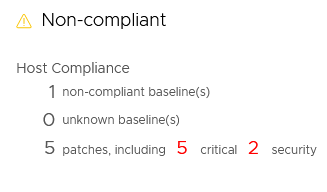

> [!primary]
> Esta traducción ha sido generada de forma automática por nuestro partner SYSTRAN. En algunos casos puede contener términos imprecisos, como en las etiquetas de los botones o los detalles técnicos. En caso de duda, le recomendamos que consulte la versión inglesa o francesa de la guía. Si quiere ayudarnos a mejorar esta traducción, por favor, utilice el botón «Contribuir» de esta página.
>

**Última actualización: 23/11/2021**

## Objetivo

El gestor de actualizaciones de VMware permite mantener los hosts actualizados instalando los *Bug Fixes* y Parches de Seguridad, sin intervención de nuestro equipo.     

> [!primary]
> Las actualizaciones de vCenter o las principales actualizaciones siempre requieren nuestra participación.

**Esta guía explica cómo funciona esta herramienta.**

## Requisitos

- Ser contacto administrador del [Hosted Private Cloud Infrastructure](https://www.ovhcloud.com/es-es/enterprise/products/hosted-private-cloud/) para recibir las claves de conexión.
- Tener un usuario activo con los permisos específicos de NSX (creado en el [área de cliente de OVHcloud](https://www.ovh.com/auth/?action=gotomanager&from=https://www.ovh.es/&ovhSubsidiary=es)).

## Procedimiento

### Maintenance Mode

Antes de trabajar en un host, debe ponerlo en modo de mantenimiento.    
De hecho, patcher conlleva la mayor parte del tiempo un reinicio del host y esto limitará el impacto sobre sus MV de producción. 

En el menú de la interfaz vSphere, acceda al panel de administración de `Hosts y Clusters`{.action}.

{.thumbnail}

Haga clic derecho en el servidor situado a la izquierda de la pantalla. En la sección `Maintenance Mode`{.action}, seleccione `Enter Maintenance Mode`{.action}.

{.thumbnail}

Asegúrese de que la casilla esté marcada en el siguiente paso y haga clic en `OK`{.action}.

{.thumbnail}

Suponiendo que el DRS esté activo, sus MV de producción se migrarán a otro host.

> [!primary]
> Si ha personalizado su entorno, podría necesitar realizar manualmente la migración de las MV.
>

Se mostrará la siguiente advertencia:     

{.thumbnail}

El host está en modo de mantenimiento.

{.thumbnail}

### Update Manager

Seleccione su host y acceda a la sección `Update`{.action}.
Verá los diferentes estados básicos y la conformidad del host.     

Deberá utilizar una "línea de base" para comprobar que se cumple dicha regla.

{.thumbnail}

En la sección `Attached Baselines`, haga clic en `Attach`{.action} y luego `Attach Baseline or Baseline Group`{.action}.

{.thumbnail}

Existen líneas de base predefinidas para los diferentes niveles de parches recomendados.

> [!primary]
> En nuestro ejemplo, utilizamos los parches críticos, pero puede utilizar las dos líneas existentes o crear otras que desee para cubrir las diferentes necesidades de su entorno.
>

Seleccione la línea de base necesaria y haga clic en `Attach`{.action}.

{.thumbnail}

El resumen de conformidad se actualizará a continuación.     

{.thumbnail}

Vuelva a la sección `Attached Baselines`, seleccione todas las líneas de base y haga clic en `Remediate`{.action}.

{.thumbnail}

Seleccione el host y haga clic de nuevo en `Remediate`{.action}.

{.thumbnail}

El proceso de actualización comenzará y durará en función del número y el tamaño de los parches aplicados. 
Si es necesario, el host se reiniciará automáticamente.

{.thumbnail}

Al final del proceso, se reiniciará la verificación de la conformidad (o puede obligarse haciendo clic en el enlace) y aparecerá una marca de verificación verde.

{.thumbnail}

Su host está actualizado.    

No olvide sacarlo del modo de mantenimiento y volverá a estar en producción.

## Más información

Interactúe con nuestra comunidad de usuarios en <https://community.ovh.com/en/>.
