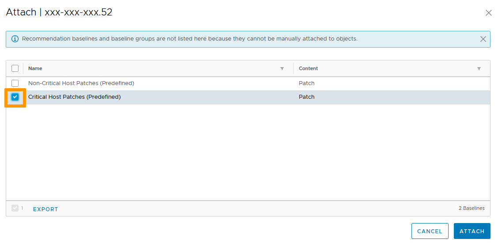
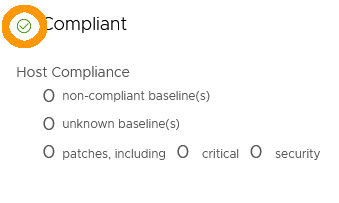

**Dernière mise à jour le 23/11/2021**

## Objectif

VMware Update Manager permet de maintenir vos hôtes à jour en installant les sans intervention de nos équipes. (Une mise à jour du vCenter ou majeure de votre hôte requiert une opération de notre part)

**Ce guide explique le fonctionnement de cet outil**

## En pratique

## Instructions

### Maintenance Mode

Before working on a host, you'll need to put it in maintenance mode.    
Indeed, patching often requires a restart of the host and would impact your live VMs.    
With that in mind, in the vSphere interface menu, go to the `Hosts and Clusters`{.action} dashboard.

{.thumbnail}

On the left side, find your host and right-click on it.    
In the `Maintenance Mode`{.action} section, select `Enter Maintenance Mode`{.action}.

{.thumbnail}

Make sure the box in the following window is checked and click `OK`{.action}.

{.thumbnail}

Assuming DRS is implemented, any live VM will be moved.    
*If you customized your environment, you may have to manually move live VMs from your host before putting it in Maintenance Mode*
You mays see the following warning.     

{.thumbnail}

Your host is now showing in maintenance mode.

{.thumbnail}

### Update Manager

Select your host and go to the `Update`{.action} tab.   
You can see a summary of what is set and its compliance.     
Before trusting what is shown, let's set the baseline against which compliance will be checked.

{.thumbnail}

In the Attached Baselines section, click on `Attach`{.action} then `Attach Baseline or Baseline Group`{.action}.

{.thumbnail}

There are predefined Baselines which are the recommended patching level for your hosts depending on criticality of the updates.    
*We'll be using the Critical Patches in this example but you can use either or create your own baselines. you can also apply several baselines to cover different scopes for a same host*       
Select the required baseline and click `Attach`{.action}

{.thumbnail}

Now, the compliance summary may look very different than it used to.     

{.thumbnail}

Back in the Attached Baselines section, check the box to select all assigned baselines and click on `Remediate`{.action}.

{.thumbnail}

Select the host and click on `Remediate`{.action} again.

{.thumbnail}

The updating process starts and will last for a while. Your host will restart if needed.

{.thumbnail}

Once the process has gone through, the compliance check will happen again (you can force it by click on the check compliance link) and you will see a green checkmark on the Compliance level.

{.thumbnail}

Your host is now fully up-to-date.    
Don't forget to get it out of Maintenance Mode and it will be back in production.

Congratulations and thank you!

## Aller plus loin

Échangez avec notre communauté d’utilisateurs sur <https://community.ovh.com/>.
