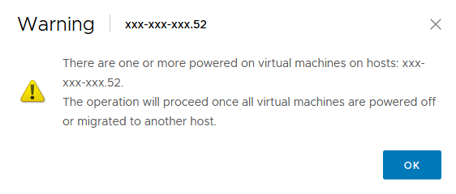
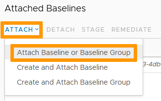

**Dernière mise à jour le 23/11/2021**

## Objectif

Le gestionnaire de mises à jour de VMware permet de maintenir vos hôtes à jour en installant les Bug Fixes et Patch de Sécurité sans intervention de nos équipes.
*Les mises à jours de vCenter ou les mises à jours majeures nécessitent toujours notre présence*

**Ce guide explique le fonctionnement de cet outil**

## Prérequis

- Être contact administrateur du [Hosted Private Cloud infrastructure](https://www.ovhcloud.com/fr/enterprise/products/hosted-private-cloud/), pour recevoir des identifiants de connexion.
- Avoir un identifiant utilisateur actif avec les droits spécifiques pour NSX (créé dans l'[espace client OVHcloud](https://www.ovh.com/auth/?action=gotomanager&from=https://www.ovh.com/fr/&ovhSubsidiary=fr))

## En pratique

### Mode de Maintenance

Avant de travailler sur un hôte, vous devez le mettre en mode de maintenance.    
En effet, patcher entraine un redémarrage de l'hôte la plupart du temps et cela limitera l'impact sur vos VMs de production.    
Donc, dans votre menu de l'interface vSphere, allez dans le tableau de bord `Hôtes et clusters`{.action}.

{.thumbnail}

Sur la gauche de l'écran, trouvez votre hôte et cliquez dessus avec le bouton droit.    
Dans la section `Mode de maintenance`{.action}, selectionnez `Passer en mode de maintenance`{.action}.

{.thumbnail}

Assurer vous que la case est cochée dans l'écran suivant puis cliquez sur `OK`{.action}.

{.thumbnail}

En supposant que DRS est actif, vos VMs de production seront migrée vers un autre hôte.    
*Si vous avez personnalisé votre environnement, vous pourriez devoir effectuer manuellement les migrations des VMs*
L'avertissement suivant peut apparaitre.     

{.thumbnail}

Votre hôte est désormais en mode de maintenance.

{.thumbnail}

### Mises à jour

Selectionnez votre hôte et allez dans la section `Mises à jour`{.action}.   
Vous voyez les différent status de base et la conformité de l'hôte.     
Avant de se réjouir, vous allez devoir appliquer un ligne de base pour vérifier la conformité.

{.thumbnail}

Dans la section Lignes de base attachées, cliquez sur `Attacher`{.action} then `Attacher une ligne de base ou un groupe de...`{.action}.

{.thumbnail}

Il existe des lignes de bases prédéfinies pour les différents niveau de patching recommandés.    
*Nous utilisons les correctifs critiques dans notre exemple mais vous pouvez utiliser les deux lignes existantes ou en créer d'autres à votre convenance pour couvrir différents besoins de votre environement*       
Selectionnez la ligne de base requise puis cliquez sur `Attacher`{.action}

{.thumbnail}

Maintenant, le résumé de conformité nous raconte une nouvelle histoire.     

{.thumbnail}

Retournez dans la section Lignes de base attachées, sélectionnez toutes les lignes de bases assignées et cliquez sur `Corriger`{.action}.

{.thumbnail}

Selectionnez l'hôte et cliquer encore sur `Corriger`{.action} again.

{.thumbnail}

Le processus de mise à jour démarre et durera en fonction du nombre et de la taille des correctifs appliqués. Votre hôte ser redémarré automatiquement si nécessaire.

{.thumbnail}

A la fin du processus, la vérification de conformité sera relancée (ou elle peut etre forcée en cliquant sur le lien) et une coche vrte devrait apparaitre.

{.thumbnail}

Votre hôte est maintenant à jour.    
N'oubliez pas de le sortir du mode de maintenance et il sera de retour en production.

Bravo et merci!

## Aller plus loin

Échangez avec notre communauté d’utilisateurs sur <https://community.ovh.com/>.
