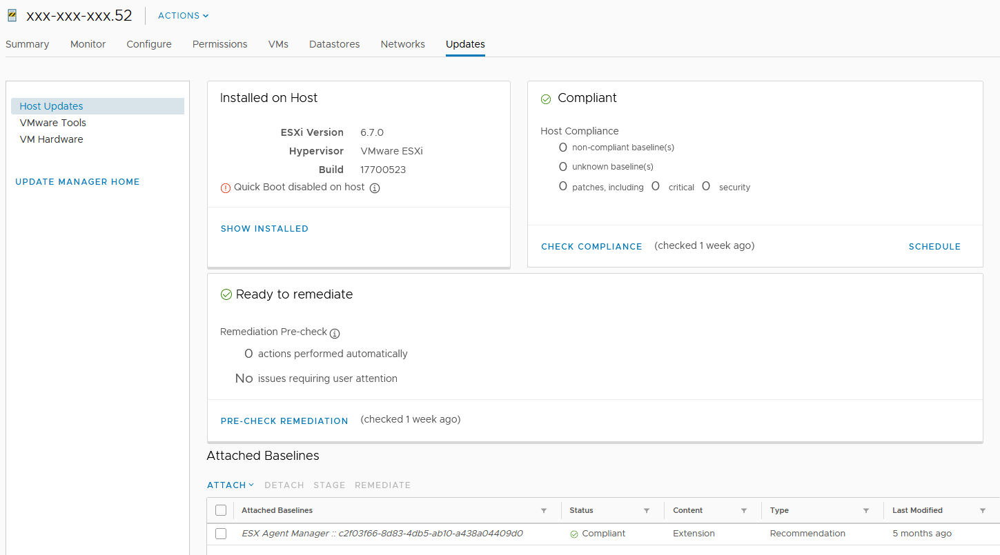

> [!primary]
> Tłumaczenie zostało wygenerowane automatycznie przez system naszego partnera SYSTRAN. W niektórych przypadkach mogą wystąpić nieprecyzyjne sformułowania, na przykład w tłumaczeniu nazw przycisków lub szczegółów technicznych. W przypadku jakichkolwiek wątpliwości zalecamy zapoznanie się z angielską/francuską wersją przewodnika. Jeśli chcesz przyczynić się do ulepszenia tłumaczenia, kliknij przycisk „Zaproponuj zmianę” na tej stronie.
>

**Ostatnia aktualizacja z dnia 09-12-2021**

## Wprowadzenie

Menedżer aktualizacji oprogramowania VMware pozwala na aktualizację hostów poprzez instalację *Bug Fixes* i Patchs bezpieczeństwa bez interwencji naszych zespołów.     

> [!primary]
> Aktualizacje vCenter lub ważne aktualizacje wymagają zawsze naszego zaangażowania.

**Niniejszy przewodnik wyjaśnia, jak narzędzie działa**

## Wymagania początkowe

- Posiadanie kontaktu administratora [Hosted Private Cloud Infrastructure](https://www.ovhcloud.com/pl/enterprise/products/hosted-private-cloud/), aby otrzymywać dane do logowania.
- Posiadanie aktywnego identyfikatora użytkownika z uprawnieniami dla NSX (utworzonego w [Panelu klienta OVHcloud](https://www.ovh.com/auth/?action=gotomanager&from=https://www.ovh.pl/&ovhSubsidiary=pl))

## W praktyce

### Maintenance Mode

Przed rozpoczęciem pracy na hoście należy uruchomić go w trybie konserwacji.    
Załadowanie patchera powoduje w większości przypadków restartowanie hosta, co ogranicza wpływ na VM produkcyjne. 

W menu interfejsu vSphere przejdź do dashboardu `Hosts and Clusters`{.action}.

{.thumbnail}

Po lewej stronie ekranu kliknij prawym przyciskiem myszy na hosta. W sekcji `Maintenance Mode`{.action} wybierz `Enter Maintenance Mode`{.action}.

{.thumbnail}

Upewnij się, że kratka jest zaznaczona na kolejnym etapie, po czym kliknij `OK`{.action}.

{.thumbnail}

Zakładając, że DRS jest aktywny, maszyny produkcyjne zostaną przeniesione na inny host.

> [!primary]
> Jeśli masz ustawiony spersonalizowane środowisko, możesz ręcznie wykonać migrację wirtualnych maszyn.
>

Może pojawić się następujące ostrzeżenie:     

{.thumbnail}

Twój host znajduje się wówczas w trybie konserwacji.

{.thumbnail}

### Update Manager

Wybierz host i przejdź do sekcji `Update`{.action}.
Widzicie różne podstawowe statusy i zgodność hosta.     

Będziesz musiał zastosować "linię podstawową", aby sprawdzić zgodność.

{.thumbnail}

W sekcji `Attached Baselines` kliknij `Attach`{.action}, a następnie `Attach Baseline or Baseline Group`{.action}.

{.thumbnail}

Istnieją wstępnie zdefiniowane linie bazowe dla poszczególnych zalecanych poziomów poprawek.

> [!primary]
> W naszym przykładzie używamy krytycznych poprawek, ale możesz użyć dwóch istniejących linii lub utworzyć inne, aby zaspokoić różne potrzeby środowiska.
>

Wybierz wymaganą linię podstawową i kliknij `Attach`{.action}.

{.thumbnail}

Streszczenie zgodności zostaje zaktualizowane.     

{.thumbnail}

Wróć do sekcji `Attached Baselines`, wybierz wszystkie przydzielone linie bazowe i kliknij `Stage`{.action} pośrednie.

{.thumbnail}

Wybierz host i kliknij ponownie `Stage`{.action}.

{.thumbnail}

Proces transferu rozpoczyna się i będzie trwał w zależności od liczby i rozmiaru poprawek.

{.thumbnail}

Zawsze w sekcji `Attached Baselines`, wybierz wszystkie przydzielone linie bazowe i kliknij `Remediate`{.action}.

{.thumbnail}

Wybierz host i kliknij ponownie `Remediate`{.action}.

{.thumbnail}

Proces aktualizacji rozpoczyna się i będzie trwał w zależności od liczby i rozmiaru zastosowanych poprawek. 
W razie potrzeby host zostanie automatycznie zrestartowany.

{.thumbnail}

Po zakończeniu procesu weryfikacja zgodności zostanie wznowiona (lub może zostać wymuszona przez kliknięcie linku) i pojawi się zielony zaznaczyć.

{.thumbnail}

Twój host jest teraz zaktualizowany.    

Pamiętaj, aby wyłączyć go z trybu konserwacji i wróci do produkcji.

## Sprawdź również

Dołącz do społeczności naszych użytkowników na stronie <https://community.ovh.com/en/>.
