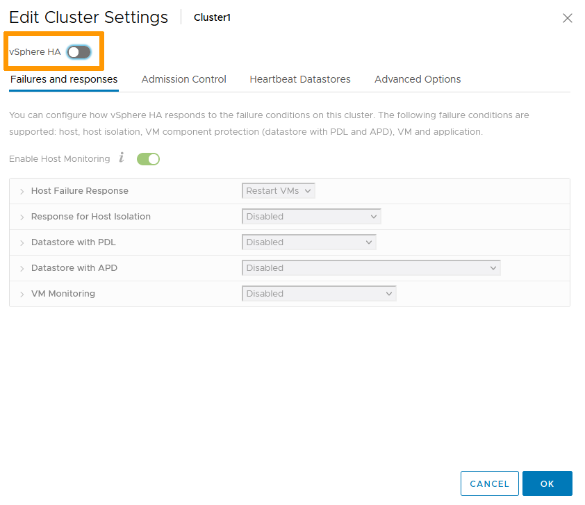
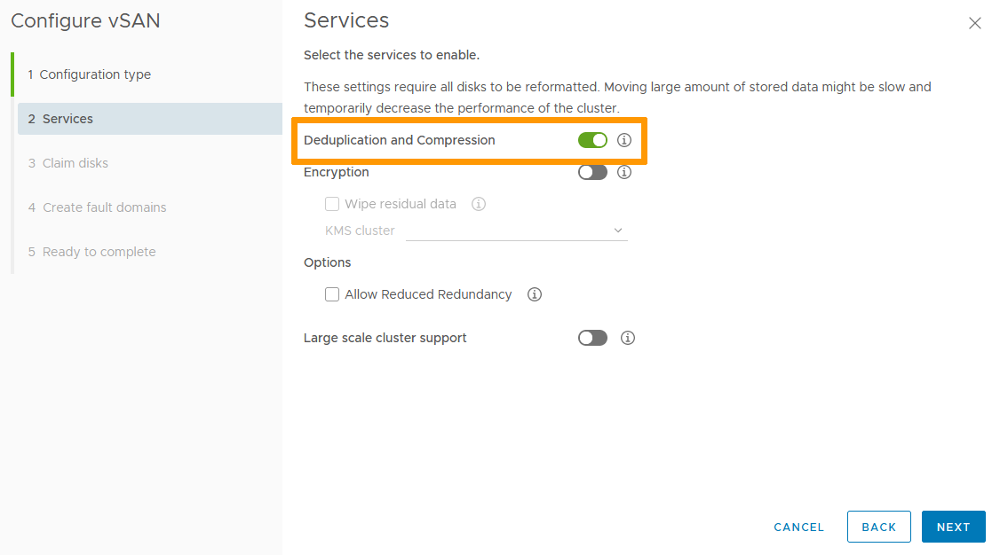
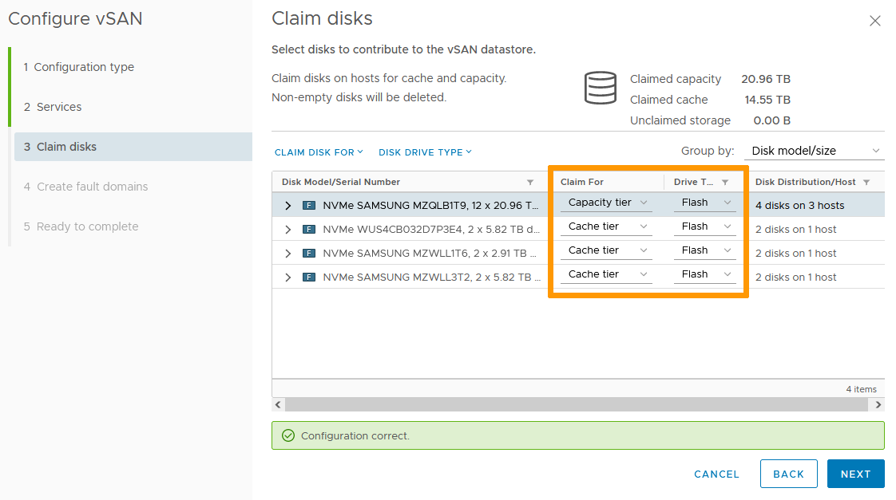
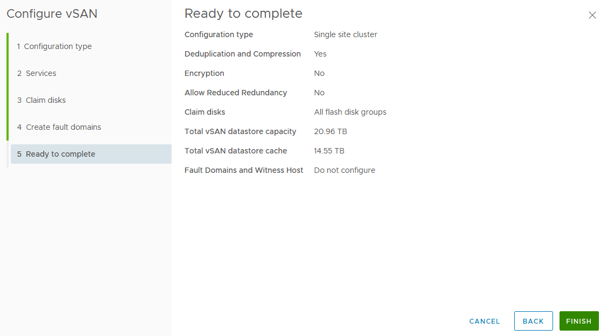

**Last updated 17th September 2019**

## Objective

Find out how to use the power of Hyperconvergence for your virtual machines with vSAN.

**This guide explains how to set up VMware vSAN on the OVH Private Cloud.**

## Requirements

- Be an administrative contact of your [Hosted Private Cloud infrastructure](https://www.ovhcloud.com/en-gb/enterprise/products/hosted-private-cloud/) to receive login credentials
- Have a user account with access to vSphere as well as the specific rights for NSX (created in the [OVHcloud Control Panel](https://www.ovh.com/auth/?action=gotomanager&from=https://www.ovh.co.uk/&ovhSubsidiary=GB))
- Have at least three vSAN hosts

## Instructions

### What is vSAN?

vSAN is an object storage solution offered by VMware. It gathers a set of disks situated directly on your VMware hosts, and presents them as a single datastore. This is known as Software-Defined Storage, or SDS. One of the advantages of vSAN is that it is fully integrated into vSphere, and can be managed directly from vCenter.

For full concept review and technical specifications, check out the [Official VMware VSAN page](https://docs.vmware.com/en/VMware-vSphere/6.7/com.vmware.vsphere.vsan-planning.doc/GUID-18F531E9-FF08-49F5-9879-8E46583D4C70.html){.external}

> [!warning]
>
> For performance and resilience reasons, VMware recommends not using more than 70% of the volume of a vSAN datastore.
>

### Setting up vSAN

#### Turn off vSphere HA

vSAN relies on the cluster’s high-availability features. But before you start any operation, you have to ensure that you have it turned off.

In the vSphere interface menu, go to the `Hosts and Clusters`{.action} dashboard.

{.thumbnail}

On the left side, select your cluster, go in the `Configure`{.action} tab then `vSphere Availability`{.action}. 
Click the `Edit`{.action} button.

{.thumbnail}

Turn off vSphere HA and click `OK`{.action}.

{.thumbnail}

#### Turn on vSAN Service

In the Cluster configuration menu, go down to `vSAN`{.action} then `Services`{.action}- and click on `Configure`{.action}.

{.thumbnail}

This guide is based on vSAN’s essential features so we will be using the default options. 
All of our hosts are on the same site. We'll select Single site cluster and click `Next`{.action}.

{.thumbnail}

We recommend using Deduplication and Compression to optimize storage. 
Click `Next`{.action}.

{.thumbnail}

The Claim disks window assigns avalaible disks to cache or capacity (see [Official VMware VSAN page](https://docs.vmware.com/en/VMware-vSphere/6.7/com.vmware.vsphere.vsan-planning.doc/GUID-18F531E9-FF08-49F5-9879-8E46583D4C70.html){.external} for explanation) depending on types and sizes. You can customize it to your need. 
Click `Next`{.action}.

{.thumbnail}

With three hosts, fault domain is set up automatically and a single failure will be tolerated. 
Click `Next`{.action}.

{.thumbnail}

Verify the settings in the summary window then click `Finish`{.action}.

{.thumbnail}

Your datastore is visible in the storage section and available to use.

{.thumbnail}

The only options we will enable are deduplication and compression. These will help you optimise data storage, by only storing duplicated data once.

This process works by using high-performance flash drives, rather than standard mechanical disks.

{.thumbnail}

The network adapters for vSAN traffic are offered automatically.

Then click `Next`{.action} to select the disks you want to use for vSAN storage. As soon as you turn vSAN on, the disks are detected automatically.

{.thumbnail}

> [!primary]
>
> If you have deployed vSAN before and the desks are already set, they do not need to be selected again. The selection screen is empty, but you can still proceed to the next step.
>
> {.thumbnail}
>

In this new screen, you can check that the settings are all correct before you launch the process.

{.thumbnail}

It can take a few minutes to turn vSAN on. Once it has been turned on, you can view the configuration details by clicking on the ‘vSAN’ tab.

{.thumbnail}

> [!warning]
>
> It is important to turn on your cluster’s high-availability feature again.
>

### Turn off vSAN.

> [!warning]
>
> In vSphere 6.5, operations involving vSAN are only available in the vSphere Web Client in Flash (Flex), not in the HTML 5 interface.
>

#### Evacuate the datastore.

With vMotion Storage, you can evacuate all of the virtual machines hosted on the vSAN datastore, or delete the machines you are no longer using.

Click on the ‘Datastore’ tab, and check that there are no virtual machines set up on the vSAN datastore.

{.thumbnail}

#### Delete disk groups.

If you would like to delete all of the vSAN configuration details for your disks, you can delete the group of disks create by vSAN when you turned it on.

To do this, click on the ‘vSAN’ tab in the cluster properties, and go to the ‘Disk Management’ section.

{.thumbnail}

For each of your hosts, select the disk group concerned, and click on the delete icon just above it.

You will then be asked to confirm:

{.thumbnail}

The first two options are useful if you want to remove a host from a cluster, but keep your vSAN datastore working.

Since you are about to delete the entire datastore, you do not need to migrate your data. You can select the final option — ‘Do not evacuate data’.

The host deletion will take a few minutes.

Repeat this action for each of the nodes in the cluster, until the entire disk group has been deleted:

{.thumbnail}

You can ignore any error messages that appear regarding the health of the disk group.

#### Turn off high-availability.

The same way you turned on the high-availability feature, you will need to turn it off for the cluster before you stop vSAN. To do this, go to the cluster properties, in the ‘vSphere Availability’ section, then untick the "Turn ON vSphere HA" box.

{.thumbnail}

#### Turn off vSAN.

Once high-availability has been turned off, you can stop vSAN.

In the cluster’s properties, click ‘Modify’.

{.thumbnail}

Then untick the ‘Turn ON vSAN’ box.

{.thumbnail}

Then click confirm for the request that appears:

{.thumbnail}

> [!primary]
>
> If high-availability has not been turned off correctly, you will receive the following error message:
>
> {.thumbnail}
>

Once the operation is complete, you will receive the following confirmation message:

{.thumbnail}

> [!warning]
>
> If required, you will need to turn the high-availability features back on after this change, if the cluster continues to host virtual machines stored on external datastores.
>

## Go further

Join our community of users on <https://community.ovh.com/en/>.
