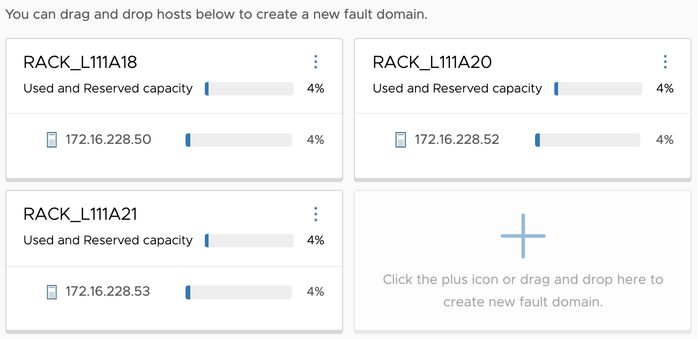

> [!primary]
> Diese Übersetzung wurde durch unseren Partner SYSTRAN automatisch erstellt. In manchen Fällen können ungenaue Formulierungen verwendet worden sein, z.B. bei der Beschriftung von Schaltflächen oder technischen Details. Bitte ziehen Sie beim geringsten Zweifel die englische oder französische Fassung der Anleitung zu Rate. Möchten Sie mithelfen, diese Übersetzung zu verbessern? Dann nutzen Sie dazu bitte den Button «Mitmachen» auf dieser Seite.
>

**Letzte Aktualisierung am 18.01.2021**

## Ziel

Zweck dieser Anleitung ist es, die Funktionsweise und Umsetzung von vSAN-Fehlerbereichen zu erklären.

## Voraussetzungen

- Sie verfügen über ein [Hosted Private Cloud Angebot](https://www.ovhcloud.com/de/enterprise/products/hosted-private-cloud/)
- Sie sind mit Ihrem vSphere [HTML Client verbunden](../den_vsphere_client_installieren/)
- Sie verfügen über einen vSAN-Cluster mit mindestens 3 Hosts

## In der praktischen Anwendung

### Funktionsweise

Ein Fehlerbereich (fault domain) bezieht sich auf eine Reihe von Servern, Speichergeräten oder Netzwerkkomponenten, die innerhalb eines physischen Standorts des Rechenzentrums zusammengefasst sind und bei einem Ausfall kollektiv zugeordnet werden können.

Bei vSAN können die Server unter Berücksichtigung ihres physischen Standorts in vSAN-Fehlerdomains zusammengefasst werden.
Es lohnt sich daher, über mehrere Fehlerdomains zu verfügen, um von der Resilienz von vSAN zu profitieren, indem die Objekte der VMs über diese Servergruppen repliziert werden. Weitere Informationen finden Sie in [dieser Anleitung](https://core.vmware.com/resource/vmware-vsan-design-guide#sec8-sub3).

Die Ihnen zur Verfügung gestellten OVHcloud Server werden in verschiedenen Racks verteilt. So können abhängig von diesen Racks vSAN-Fehlerdomains erstellt werden.

So erfordert die vSAN-Default-Strategie (Toleranzniveau FTT=1 bei RAID1 (Mirorring)) mindestens 3 Fehlerbereiche (bei 2 Replicas + 1 Objekt mit Witness).

### Inbetriebnahme

Es wird empfohlen, dieses Verfahren anzuwenden, wenn sich mehrere Server auf demselben Rack befinden. Bevorzugen Sie auch die gleiche Anzahl an Servern pro vSAN-Pannendomain.
Dadurch werden die Daten besser verteilt und im Falle einer Störung eines Fehlerbereichs besser geschützt.

Jeder OVHcloud Server verfügt über die Informationen des Racks, in dem er gehostet ist.

Gehen Sie in das Menü `Hosts and Clusters`{.action}, klicken Sie auf den betreffenden Server und dann auf den Tab `Summary`{.action}. Die Informationen finden sich auf der Ebene "Custom Attributes": attribute **Rack**.

{.thumbnail}

Wählen Sie im Menü `Hosts and Clusters`{.action} den betreffenden Cluster aus und klicken Sie dann auf den Tab `Configure`{.action} und wählen Sie das Menü `vSAN`{.action} und dann `Fault Domains`{.action} aus.

Geben Sie dann einfach den Server in das Feld **+** "Fault Domains".

{.thumbnail}

Benennen Sie die Fehlerdomain (Sie können zum Beispiel den Namen der Bucht verwenden) im Feld "Fault domain name"und bestätigen Sie diese mit einem Klick auf `CREATE`{.action}.

Sie können den Fortschritt der Erstellung der Fehlerdomain im Fenster Recent `Tasks nachverfolgen`{.action}.

{.thumbnail}

Wiederholen Sie die Operation in so vielen Fehlerbereichen, wie es unterschiedliche Racks gibt.

{.thumbnail}

Fügen Sie bei Bedarf einen Server in einer bestehenden Fehlerdomain hinzu, indem Sie diesen darauf verschieben, und bestätigen Sie mit einem Klick auf `MOVE`{.action}.

Die verwendeten, verfügbaren und vollständigen Speicherplatzinformationen werden über der Fehlerdomain angezeigt.

Der vSAN-Cluster verfügt nun über Fehlerdomains über die Datenresilienz.

## Weiterführende Informationen

Für den Austausch mit unserer User Community gehen Sie auf <https://community.ovh.com/en/>.
