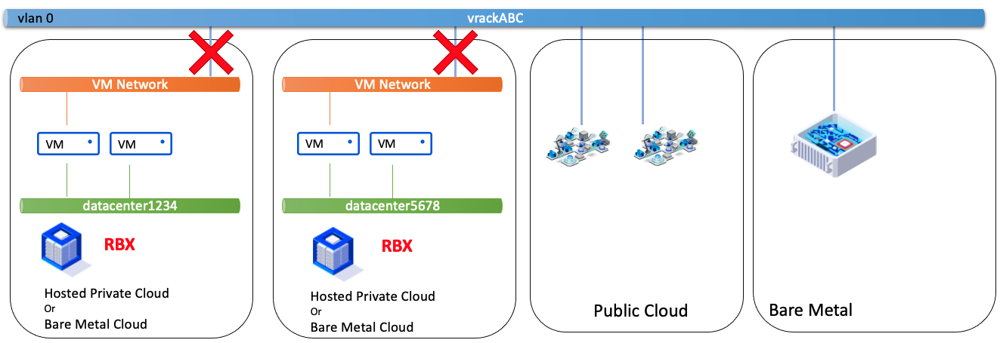

> [!primary]
> Diese Übersetzung wurde durch unseren Partner SYSTRAN automatisch erstellt. In manchen Fällen können ungenaue Formulierungen verwendet worden sein, z.B. bei der Beschriftung von Schaltflächen oder technischen Details. Bitte ziehen Sie beim geringsten Zweifel die englische oder französische Fassung der Anleitung zu Rate. Möchten Sie mithelfen, diese Übersetzung zu verbessern? Dann nutzen Sie dazu bitte den Button «Mitmachen» auf dieser Seite.
>

**Stand 06.01.2021**

## Ziel

Mit dem [vRack](https://www.ovh.de/loesungen/vrack/){.external} Produkt können mehrere OVHcloud Produkte miteinander verbunden und über 1 oder mehr VLANs miteinander kommuniziert werden. Einige Konfigurationen sind nicht mit der Hosted Private Cloud kompatibel.

**In dieser Anleitung wird erläutert, wie Hosted Private Cloud mit dem vRack Produkt kompatibel ist.**

## Kontext

Im Hosted Private Cloud Produkt gibt es 2 vRack Typen:

- "VM Network" ist ein vRack auf einem einzigen VLAN, dem nativen VLAN des öffentlichen Hosted Private Cloud VLAN. Dieses VLAN wird in der Hosted Private Cloud zum Routen öffentlicher IPs verwendet. Es wird im Inventar des vSphere als PortGroup in der Kategorie "Netzwerk", "VM Network", aufgeführt. Dieses vRack ist daher an den vollständig von OVHcloud verwalteten virtuellen Switch gebunden.

- "vRack Datacenter", "vRack vDC", "dvs-vRack", ist das vRack, mit dem 4000 VLANs bereitgestellt werden können. Dieses vRack ist an den vom Kunden verwalteten virtuellen Switch mit seinen eigenen dedizierten Netzwerkkarten gebunden.

Es sei darauf hingewiesen, dass einige kommerzielle Angebote, wie die Hosts AMD Angebote, keinen vom Kunden verwalteten virtuellen Switch haben. Es ist also nur vRack vom Typ "VM Network"verfügbar.

Um den Kontext zu veranschaulichen:

{.thumbnail}

## In der praktischen Anwendung

### Was wir tun können

**2 vRack VM Network untereinander in verschiedenen geographischen Zonen in verschiedenen Hosted Private Cloud verbinden.**

{.thumbnail}

**1 vRack VM Network und 1 vRack vDC in verschiedenen geographischen Zonen in verschiedenen Hosted Private Cloud verbinden.**

{.thumbnail}

> [!primary]
>
> Damit die VMs des vRack VM Network und die VMs des vDC miteinander kommunizieren können, müssen sich die VMs des vDC vRacks im nativen VLAN befinden.
> 

**1 vRack vDC und 1 vRack vDC in verschiedenen geographischen Zonen in verschiedenen Hosted Private Cloud verbinden.**

{.thumbnail}

**1 vRack vDC und 1 vRack vDC in einer einzigen Hosted Private Cloud verbinden.**

{.thumbnail}

**Alle vDC einer Hosted Private Cloud teilen das gleiche vRack VM Network.**

{.thumbnail}

**1 vRack vDC und 1 vRack vDC in einer einzigen geografischen Zone in verschiedenen Hosted Private Cloud verbinden.**

{.thumbnail}

### Was man nicht tun kann

**1 vRack VM Network und 1 vRack VM Network in einer einzigen geografischen Zone in verschiedenen Hosted Private Cloud verbinden.**

{.thumbnail}

**1 vRack VM Network und 1 vRack vDC in einer einzigen geografischen Zone in verschiedenen Hosted Private Cloud verbinden.**

{.thumbnail}

**1 vRack VM Network und 1 vRack vDC in derselben geografischen Zone in derselben Hosted Private Cloud verbinden.**

{.thumbnail}

## Weiterführende Informationen

Für den Austausch mit unserer User Community gehen Sie auf <https://community.ovh.com/en/>.
