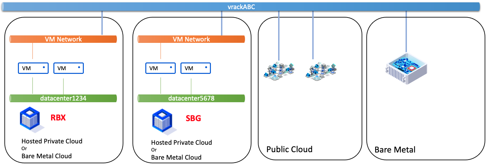
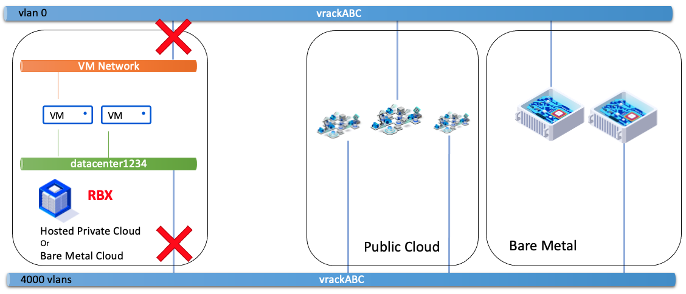

**Last updated 31st December 2021**

## Objective

With our [vRack](https://www.ovh.com.au/solutions/vrack/){.external} solution, you can connect multiple OVHcloud products to one another, and connect them via one or more VLANs. Some configurations however are not compatible with the Hosted Private Cloud solution.

**This guide explains Hosted Private Cloud compatibility with the OVHcloud vRack.**

## Requirements

- Being an administrative contact of your [Hosted Private Cloud infrastructure](https://www.ovhcloud.com/en-au/enterprise/products/hosted-private-cloud/) to receive login credentials
- A user account with access to vSphere (created in the [OVHcloud Control Panel](https://ca.ovh.com/auth/?action=gotomanager&from=https://www.ovh.com.au/&ovhSubsidiary=au))

## Technical background

In the Hosted Private Cloud product, there are two types of vRack:

- "VM Network" is a vRack on a **single VLAN**, which is the native VLAN of the Hosted Private Cloud public VLAN. This VLAN is used in Hosted Private Cloud to route Public IPs. It is listed in the vSphere inventory as a *PortGroup*, in the "Network" category, called "VM Network". This vRack is then attached to the virtual switch, which is fully managed by OVHcloud.

- "Datacenter vRack", or "vRack vDC", or "dvs-vrack", is the vRack that allows you to have **4000 VLANs**. This vRack is attached to the virtual switch managed by the customer, with its own dedicated network cards.

It is important to note that some commercial ranges, such as AMD host-based ranges, do not have a virtual switch managed by the customer. Only the vRack type "VM Network" is available.

Here is the context:

{.thumbnail}

## Instructions

### Possible configurations

**Interlinking 2 VM Network vRacks, in different geographical zones, in different Hosted Private Cloud services.**

{.thumbnail}

**Connecting 1 VM Network vRack and 1 vRack vDC, in different geographical zones, in different Hosted Private Cloud services.**

{.thumbnail}

> [!primary]
>
> For the VM Network vRack VMs and vRack vDC VMs to communicate with each other, the vRack VMs must be on the native VLAN.
> 

**Connecting 1 vRack vDC and 1 vRack vDC, in different geographical zones, in different Hosted Private Cloud services.**

{.thumbnail}

**Connecting 1 vRack vDC and 1 vRack vDC, in the same Hosted Private Cloud service.**

{.thumbnail}

**All vDCs in the same Hosted Private Cloud service sharing the same VM Network vRack.**

{.thumbnail}

**Connecting 1 vRack vDC and 1 vRack vDC, in the same geographical zone, in different Hosted Private Cloud services.**

{.thumbnail}

### Configurations which are not possible

**Connecting 1 VM Network vRack and 1 VM Network vRack, in the same geographical zone, in different Hosted Private Cloud services.**

{.thumbnail}

**Connecting 1 VM Network vRack and 1 vRack vDC, in the same geographical zone, in different Hosted Private Cloud services.**

{.thumbnail}

**Connecting 1 VM Network vRack  and 1 vRack vDC, in the same geographical zone, in the same Hosted Private Cloud service.**

{.thumbnail}

## Go further

Join our community of users on <https://community.ovh.com/en/>.
