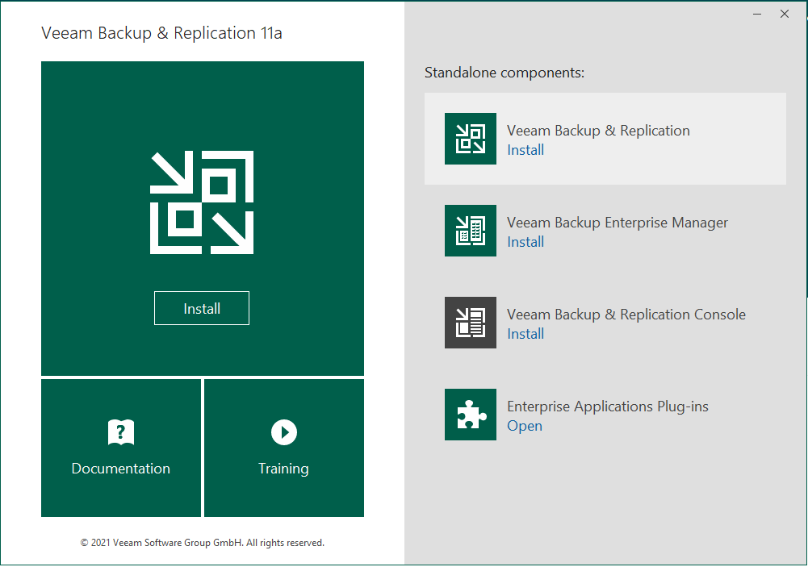
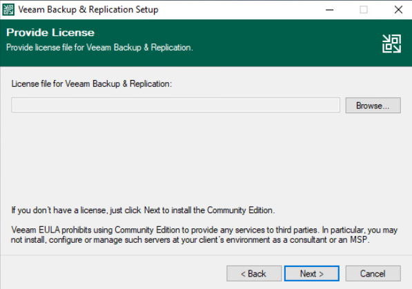
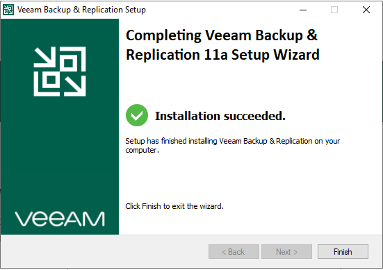
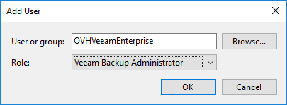
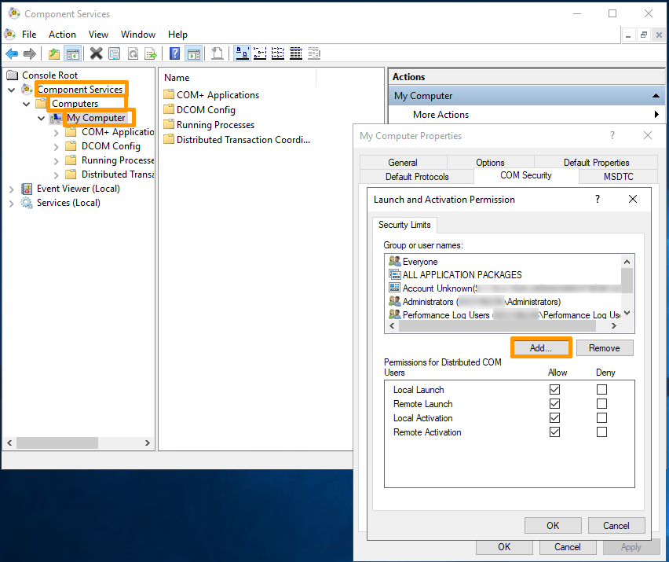

> [!primary]
> Esta tradução foi automaticamente gerada pelo nosso parceiro SYSTRAN. Em certos casos, poderão ocorrer formulações imprecisas, como por exemplo nomes de botões ou detalhes técnicos. Recomendamos que consulte a versão inglesa ou francesa do manual, caso tenha alguma dúvida. Se nos quiser ajudar a melhorar esta tradução, clique em "Contribuir" nesta página.
>

**Última atualização: 28/04/2023**

## Sumário

O Veeam Backup & Replication é um programa de proteção de dados, que oferece várias possibilidades de backup, replicação e restauro.

**Aprenda a instalar um servidor Veeam Backup & Replication e a registá-lo no nosso servidor de licenças Veeam Enterprise.**


## Requisitos

* Dispor de um [serviço Veeam Enterprise](https://www.ovhcloud.com/pt/storage-solutions/veeam-enterprise/){.external}.
* Dispor de máquina Windows Server 2012 ou uma versão mais recente.

## Instruções

### Instalar o Veeam Backup & Replication

> [!primary]
> A versão mais recente do Veeam Backup & Replication (versão 12) não é ainda suportada pela OVHcloud, mas sê-lo-á em [breve](https://github.com/ovh/private-cloud-provider/projects/4).
> Sugerimos que transfira a versão 11.0.1.1261 (P20230227). Encontre as versões anteriores do Veeam em [esta página](https://www.veeam.com/br/download-version.html?ad=downloads&tab=previous).
>

Descarregue o programa **Veeam Backup & Replication** a partir do [site da Veeam](https://www.veeam.com/downloads.html?ad=top-sub-menu){.external}. Se não possui contas, será necessário criar uma (esta é gratuita).

O ficheiro apresenta-se sob a forma de uma imagem de disco no formato ISO. Depois de o ter transferido para o servidor, selecione o leitor CD da máquina e escolha a imagem.

Agora já pode executar o instalador na máquina. Selecione a opção `Veeam Backup & Replication Install`{.action}.

{.thumbnail}

Leia e aceite o contrato de licença e clique em `Next`{.action}.

{.thumbnail}

Ignore a introdução do ficheiro de licença clicando em `Next`{.action}.

{.thumbnail}

Na etapa de seleção dos componentes a instalar, não faça qualquer modificação. No entanto, se precisar, pode alterar o destino da instalação. A seguir, valide clicando em `Next`{.action}.

{.thumbnail}

O instalador realizará uma análise dos requisitos. Se partir de uma instalação bruta de Windows, alguns componentes estarão em falta, mas não se preocupe: o instalador vai descarregar e instalar estes últimos de forma automática. A seguir, valide clicando em `Next`{.action}.

{.thumbnail}

Aguarde enquanto os requisitos são instalados.

{.thumbnail}

Após esta etapa, valide a instalação do **Veeam Backup & Replication** clicando em `Next`{.action}.

{.thumbnail}

Na etapa de personalização da instalação, aceite a configuração predefinida selecionando a opção `Install`{.action}.

{.thumbnail}

Aguarde que a instalação seja finalizada.

{.thumbnail}

Quando esta for concluída, saia do instalador clicando em `Finish`{.action}.

{.thumbnail}

Será redirecionado para o assistente de instalação. Basta fechar a janela.

### Criar uma conta de serviço Veeam Enterprise

#### Criar a conta de serviço

Em primeiro lugar, é necessário gerar uma palavra-passe **complexa**. Para isso, pode utilizar um gerador de palavras-passe.

Comece por lançar o Windows Powershell como administrador.

A seguir, crie uma conta de serviço introduzindo o seguinte comando a partir de um acesso de administrador:

```powershell
New-LocalUser "OVHVeeamEnterprise" -Password (ConvertTo-SecureString -AsPlainText "P@ssword01" -Force) -Description "OVH Service Account for Veeam Enterprise" -PasswordNeverExpires:$true -UserMayNotChangePassword:$true -AccountNeverExpires:$true
```

Tenha em atenção que o nome da conta e a palavra-passe correspondem a um exemplo, pelo que devem ser substituídos:
 * Nome da conta: OVHVeeamEnterprise
 * Palavra-passe: P@ssword01

#### Definir as autorizações da conta de serviço

Abra a consola Veeam e conecte-se.

{.thumbnail}

Verifique se está em modo **Community Edition** no canto inferior direito.

{.thumbnail}

No menu, clique em `Users and Roles`{.action}.

{.thumbnail}

Na janela `Security`{.action}, selecione a opção `Add...`{.action}.

{.thumbnail}

Na janela `Add User`{.action}, introduza a conta de serviço criada anteriormente. Selecione o papel **Veeam Backup Administrator** e valide clicando em `OK`{.action}.

{.thumbnail}

Ao voltar à janela **Security**, pode verificar se a conta aparece.

{.thumbnail}

#### Autorizações de execução e de ativação

O utilizador OVHVeeamEnterprise só está acessível localmente. É necessário adicionar autorizações na interface gráfica Windows para ativar a ligação à distância.

Através da interface gráfica de utilizador:

1. Na sua barra de pesquisa Windows, introduza `Component Services`{.action} e lance o serviço.
2. No menu à esquerda e seguindo a arborescência, clique em `Component Services`{.action}, depois em `Computers`{.action} e depois em `My Computer`{.action}.
3. À direita, no separador `Actions`{.action}, clique em `More Actions`{.action} e, a seguir, em `Properties`{.action}.
4. Aceda à `COM Security`{.action} e, sob a segunda opção `Launch and Activation Permissions`{.action}, clique em `Edit Limits`{.action}. A seguir, clique em `Add...`{.action}.

{.thumbnail}


<ol start="5">
 <li>Clique em <code class="action">Advanced...</code> para localizar a conta de serviço adicionada anteriormente. A seguir, clique em <code class="action">Find Now</code> e selecione o utilizador <code class="action">OVHVeeamEnterprise</code> na lista de utilizadores.</li>
</ol>

{.thumbnail}


<ol start="6">
 <li>Clique em <code class="action">OK</code> para confirmar a seleção e em <code class="action">OK</code> para validar. De seguida, ative todas as permissões no utilizador <code class="action">OVHVeeamEnterprise</code>.</li>
</ol>

{.thumbnail}

<ol start="7">
 <li>Clique em <code class="action">OK</code> para confirmar e <code class="action">Apply</code> para validar as alterações.</li>
</ol>

O seu utilizador OVHVeeamEnterprise está agora acessível local e à distância.

### Registar o servidor Veeam Backup & Replication

## Através da Área de Cliente OVHcloud


Ligue-se ao seu [Área de Cliente OVHcloud](https://www.ovh.com/auth/?action=gotomanager&from=https://www.ovh.pt/&ovhSubsidiary=pt){.external}, aceda à secção Hosted Private Cloud {.ação} e selecione `Plataformas e serviços` {.ação}. De seguida, selecione o seu serviço **backupserverenterprise** e clique em `Ativar a licença`{.action} na secção `Atalho`.

{.thumbnail}

Na nova janela, introduza as seguintes informações:
 * o endereço de IP público através do qual pode comunicar com o servidor **Veeam Backup & Replication**;
 * a porta do servidor **Veeam Backup & Replication** (normalmente, **9392/TCP**);
 * o nome de utilizador da conta criada anteriormente;
 * a palavra-passe da conta.

Em seguida, confirme clicando em `OK`{.action}.

{.thumbnail}

Quando a ativação estiver concluída, poderá encontrar as informações principais na página do serviço.

{.thumbnail}

## Com a API da OVHcloud

Para começar, obtenha o serviceName:

> [!api]
>
> @api {GET} /veeam/veeamEnterprise
>

De seguida, faça o registo:

> [!api]
>
> @api {POST} /veeam/veeamEnterprise/{serviceName}/register
>

Necessitará das seguintes informações:

 * o endereço de IP público através do qual pode comunicar com o servidor **Veeam Backup & Replication**;
 * a porta do servidor **Veeam Backup & Replication** (normalmente, **9392/TCP**);
 * o nome de utilizador da conta criada anteriormente;
 * a palavra-passe da conta.

Pode obter da seguinte forma o endereço de IP público utilizado pelo Veeam Enterprise para comunicar com o servidor **Veeam Backup & Replication**:

> [!api]
>
> @api {GET} /veeam/veeamEnterprise/{serviceName}
>

#### Verificar o registo

Abra a consola Veeam e conecte-se.

{.thumbnail}

No menu, clique em `License`{.action}.

{.thumbnail}

Verifique que a informação apresentada corresponde à sua licença da OVHcloud.

{.thumbnail}

## Quer saber mais?

Fale com a nossa comunidade de utilizadores no Discord: <https://discord.gg/ovhcloud>

Fale com a nossa comunidade de utilizadores: <https://community.ovh.com/en/>.
