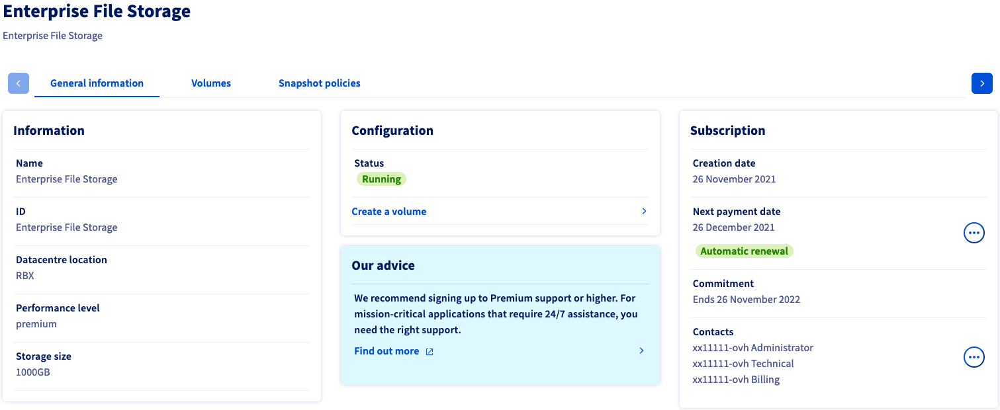
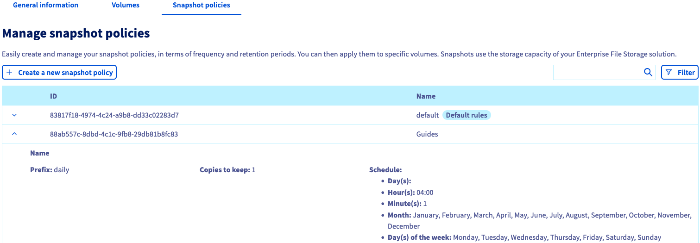

> [!primary]
> Diese Übersetzung wurde durch unseren Partner SYSTRAN automatisch erstellt. In manchen Fällen können ungenaue Formulierungen verwendet worden sein, z.B. bei der Beschriftung von Schaltflächen oder technischen Details. Bitte ziehen Sie im Zweifelsfall die englische oder französische Fassung der Anleitung zu Rate. Möchten Sie mithelfen, diese Übersetzung zu verbessern? Dann nutzen Sie dazu bitte den Button "Beitragen" auf dieser Seite.
>

**Letzte Aktualisierung am 14.04.2022**

## Ziel

Enterprise File Storage Dienste können über die [OVHcloud API](https://docs.ovh.com/de/storage/file-storage/netapp/quick-start/) oder in Ihrem OVHcloud Kundencenter verwaltet werden.

**In dieser Anleitung erfahren Sie, wie Sie Enterprise File Storage Volumes und Snapshots in Ihrem Kundencenter verwalten.**

## Voraussetzungen

- Sie haben einen Enterprise File Storage Dienst in Ihrem Kunden-Account.
- Sie haben Zugriff auf Ihr [OVHcloud Kundencenter](https://www.ovh.com/auth/?action=gotomanager&from=https://www.ovh.de/&ovhSubsidiary=de).

## In der praktischen Anwendung 

Loggen Sie sich in Ihr [OVHcloud Kundencenter](https://www.ovh.com/auth/?action=gotomanager&from=https://www.ovh.de/&ovhSubsidiary=de) ein und wählen Sie `Bare Metal Cloud`{.action} in der oberen Navigationsleiste aus. Öffnen Sie `Storage und Backup`{.action}, dann `Enterprise File Storage`{.action} im linken Menü und wählen Sie Ihre Dienstleistung in der Liste aus.

{.thumbnail}

Im Tab `Allgemeine Informationen`{.action} werden technische Informationen zu Ihrem Dienst, allgemeine Details zum Abonnement sowie ein Shortcut zur [Erstellung eines Volumes](#create_volume) angezeigt.

> [!primary]
> Detaillierte Informationen zu den technischen Eigenschaften der Enterprise File Storage Lösung finden Sie auf der Seite [Enterprise File Storage - Konzepte](https://docs.ovh.com/de/storage/file-storage/netapp/concepts/).
>

### Verwaltung der Volumes 

Klicken Sie auf den Tab `Volumes`{.action}. Die Tabelle listet alle für den ausgewählten Dienst erstellten Volumes auf. Klicken Sie auf eine Volume-Kennung, um dessen[Verwaltungsseite](#modify_volume) zu öffnen.

{.thumbnail}

Sie können diverse Aktionen durchführen, indem Sie auf den Button `...`{.action} in der entsprechenden Zeile der Tabelle klicken.

- **Volume bearbeiten**: öffnet den Bereich "[Allgemeine Informationen](#modify_volume)" des Volumes.
- **Snapshot erstellen**: öffnet den Bereich "[Snapshots](#snapshots)", um eine manuelle Volume-Sicherung durchzuführen.
- **Die Snapshots verwalten**: öffnet den Bereich "[Snapshots](#snapshots)" des Volumes.
- **IP-Zugang verwalten (ACL)**: öffnet den Bereich "[Zugriffskontrolle](#access_control)", um den Zugriff auf das Volume zu verwalten.
- **Volume löschen**: löscht dieses Volume, nachdem die Aktion im Popup-Fenster bestätigt wurde.

#### Erstellung eines Volumes 

Klicken Sie auf den Button `Volume erstellen`{.action}. Geben Sie im neuen Fenster den Namen und die Beschreibung des Volumes ein. Legen Sie die Größe in GB fest und klicken Sie auf `Volume erstellen`{.action} um die Aktion zu bestätigen.

{.thumbnail}

Sie können ein Volume löschen, indem Sie auf den Button `...`{.action} in der Tabelle und dann auf `Volume löschen`{.action} klicken.

#### Volume bearbeiten 

Klicken Sie in der Tabelle auf eine Volume-ID, um die Verwaltungsseite dieses Volumes zu öffnen.

{.thumbnail}

Im Tab `Allgemeine Informationen`{.action} werden die Details Ihres Volumes sowie detaillierte Anweisungen zur Verbindung mit dem Volume angezeigt, einschließlich der individuellen Verbindungsparameter.

#### Erstellung und Verwaltung von Volume Snapshots 

Im Tab `Snapshots`{.action} finden Sie alle für das ausgewählte Volume erstellten Snapshots.

{.thumbnail}

Um manuell einen neuen Snapshot des Volumes im aktuellen Zustand hinzuzufügen, klicken Sie auf den Button `Aktionen`{.action} und dann auf `Snapshot erstellen`{.action}.

Geben Sie im neu geöffneten Fenster einen Namen und eine Beschreibung ein. Klicken Sie auf den Button `Snapshot erstellen`{.action}, um die Erstellung zu starten.

Im gleichen Tab können Sie auch alle für den Dienst erstellten [Snapshot-Policys](#snapshot_policy) einsehen und auf dieses Volume anwenden.

{.thumbnail}

Klicken Sie auf die Zeile der betreffenden Regel, um die Details der Snapshot-Planung einzusehen. Wählen Sie eine Policy über den entsprechenden Auswahlbutton aus und klicken Sie unter der Tabelle auf `Regel anwenden`{.action}.

Um Ihre [Snapshot-Regeln](#snapshot_policy) zu konfigurieren, gehen Sie zurück zum [Volume-Verwaltungsbereich](#instructions) des Dienstes und öffnen Sie den Tab `Regeln für Snapshots`{.action}.

#### Auflisten und Wiederherstellen von Snapshots 

Im Kundencenter können Sie erstellte Snapshots nicht einsehen oder wiederherstellen.

Um von Ihrem Mountpunkt aus auf Snapshots zuzugreifen, können Sie die in der [NetApp Dokumentation](https://library.netapp.com/ecmdocs/ECMP1196991/html/GUID-36DC110C-C0FE-4313-BF53-1C12838F7BBD.html){.external} aufgeführten Befehle verwenden.

#### Verwaltung der Volume-Zugriffe (ACL) 

Die Zugriffskontrolle auf Volumes funktioniert über IP-Adressbeschränkungen. Da keine vorkonfiguriert sind, besteht der erste Schritt bei der Erstellung von Volumes in der Definition von IP-Adressen oder IP-Bereichen, denen Zugriff erlaubt werden soll.

Klicken Sie im Tab `Zugriffskontrolle (ACL)`{.action} auf den Button `+ Einen neuen Zugang hinzufügen`{.action}.

{.thumbnail}

Diese Aktion erzeugt eine neue Zeile in der Tabelle, in die Sie eine IP-Adresse oder einen Adressblock (CIDR) eingeben können. Wählen Sie `Lesen und schreiben` oder `Nur Lesen` als Zugriffstyp im Drop-down-Menü aus und klicken Sie dann auf den Haken bei diesem Eintrag, um ihn zur ACL hinzuzufügen.

Um einen Zugang zu löschen, klicken Sie in der Tabelle auf das entsprechende Abfalltonnensymbol.

### Verwaltung der Snapshot-Policys 

Mit dem Hinzufügen von Regeln können Sie die Erstellung von Snapshots für alle Ihre Volumes planen.

Klicken Sie auf den Tab `Regeln für Snapshots`{.action}. Die Tabelle listet alle für den ausgewählten Dienst erstellten Regeln auf.

Eine Standardregel existiert bereits; diese kann nicht geändert werden. Um Ihre eigenen hinzuzufügen, klicken Sie auf den Button `Eine neue Regel für Snapshots erstellen`{.action}.

{.thumbnail}

Geben Sie in der neuen Ansicht einen Namen und eine Beschreibung für die Policy ein. Verwenden Sie anschließend den Button `Eine neue Regel erstellen`{.action}, um eine oder mehrere Regeln zur Policy hinzuzufügen.

{.thumbnail}

Füllen Sie die Felder aus, um die Kriterien für die Erstellung des Snapshots festzulegen. Sie müssen auch einen Präfix für die Snapshots eingeben, der für deren Benennung benötigt wird.

Weitere Informationen zu jedem Wert erhalten Sie, indem Sie jeweils auf das `?`{.action} klicken. Wenn Sie den Bereich `Beispiel`{.action} erweitern, werden exemplarisch zwei Policy-Regelsätze mit Erläuterung ihrer Ergebnisse angezeigt.

Klicken Sie rechts auf den Haken, um die Regel hinzuzufügen. Wenn Sie alle Regeln hinzugefügt haben, klicken Sie unten auf `Eine neue Regel für Snapshots erstellen`{.action}.

[Wählen Sie ein Volume aus](#manage_volume) und gehen Sie zum Tab `Snapshots`{.action}, um [Ihre Policys anzuwenden](#snapshots).

Um eine Policy zu löschen, klicken Sie in der Tabelle auf das entsprechende Abfalltonnensymbol.

> [!primary]
>
> Snapshots nutzen die Speicherkapazität Ihrer Enterprise File Storage Lösung. 5% eines Volumes sind immer für Snapshots reserviert.
>

### Erste Schritte 

Wenn Sie mit der Enterprise File Storage Lösung nicht noch nicht vertraut sind, können Sie diesen Schritten folgen:

- [Volume erstellen](#create_volume)
- [Zugangskontrolle konfigurieren](#access_control)
- [Snapshot-Policy konfigurieren](#snapshot_policy) (optional)
- [Snapshot-Policy auf das Volume anwenden](#snapshots) (optional)
- [Auf Snaphots zugreifen](#access_snapshots) (optional)
- [Sich anhand der Anweisungen in "Allgemeine Informationen" mit dem Volume verbinden](#modify_volume)
- [Sich mit der Nutzung von Enterprise File Storage über die API vertraut machen](#gofurther) (optional)

## Weiterführende Informationen 

[Enterprise File Storage - Quickstart API](https://docs.ovh.com/de/storage/file-storage/netapp/quick-start/)

[Enterprise File Storage - Verwaltung der Volumes](https://docs.ovh.com/de/storage/file-storage/netapp/volumes/)

[Enterprise File Storage - Verwaltung der Volume ACL](https://docs.ovh.com/de/storage/file-storage/netapp/volume-acl/)

[Enterprise File Storage - Verwaltung der Volume Snapshots](https://docs.ovh.com/de/storage/file-storage/netapp/volume-snapshots/)

Für den Austausch mit unserer Community gehen Sie auf <https://community.ovh.com/en/>.
