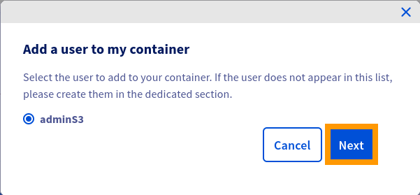
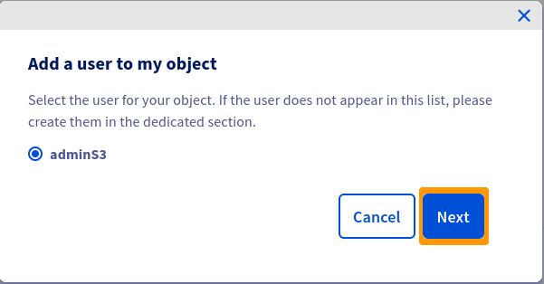
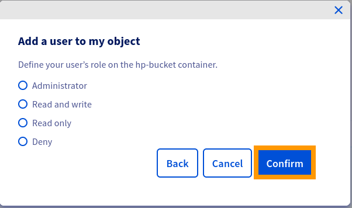

**Last updated 8th December 2021**

## Objective

Learn how to manage your identity and access to your High Performance resources.

## Requirements

- access to the [OVHcloud Control Panel](https://www.ovh.com/auth/?action=gotomanager&from=https://www.ovh.pt/&ovhSubsidiary=pt)
- a [S3 user](https://docs.ovh.com/pt/storage/s3/getting-started-with-s3/)

## Instructions

### Possible actions via the OVHcloud Control Panel

Log in to the [OVHcloud Control Panel](https://www.ovh.com/auth/?action=gotomanager&from=https://www.ovh.pt/&ovhSubsidiary=pt), go to the `Public Cloud`{.action} section and select the Public Cloud project concerned. Select `Object Storage`{.action} in the left-hand menu.

#### Managing access to a bucket via a profile

You can define access to your buckets via predefined profiles.

Click on the `...`{.action} at the end of your bucket line and then `Add a user to a container`{.action}.


Select the user to add to your bucket and click `Next`{.action}.



Set the accesses to your bucket for this user and click `Confirm`{.action}.


#### Managing access to an object via a profile

You can also define access to your objects via predefined profiles.

Click on the `...`{.action} at the end of the line of your object and then on `Add a user to my object`{.action}.


Select the user and click `Next`{.action}.



Select the access profile for this user and click `Confirm`{.action}.



#### Advanced resource access management

You can however refine the rights by importing a JSON configuration file. To do this, go to the `S3 Users` tab.


Click on the `...`{.action} at the end of the line of your user and then click `Import JSON file`{.action}.

> [!primary]
>
> If you want to change the rights of a user, you may want to download the JSON configuration file first by clicking on `Download JSON file`{.action}.
>

Find below some examples of JSON configuration files:

**Read/write access to a bucket and its objects**

```json
{
  "Statement":[{
    "Sid": "RWContainer",
    "Effect": "Allow",
    "Action":["s3:GetObject", "s3:PutObject", "s3:DeleteObject", "s3:ListBucket", "s3:ListMultipartUploadParts", "s3:ListBucketMultipartUploads", "s3:AbortMultipartUpload", "s3:GetBucketLocation"],
    "Resource":["arn:aws:s3:::hp-bucket", "arn:aws:s3:::hp-bucket/*"]
  }]
}
```

**Read-only access to a bucket and its objects**

```json
{
  "Statement":[{
    "Sid": "ROContainer",
    "Effect": "Allow",
    "Action":["s3:GetObject", "s3:ListBucket", "s3:ListMultipartUploadParts", "s3:ListBucketMultipartUploads"],
    "Resource":["arn:aws:s3:::hp-bucket", "arn:aws:s3:::hp-bucket/*"]
  }]
}
```

**Allow all operations on all resources in a project**

```json
{
  "Statement":[{
    "Sid": "FullAccess",
    "Effect": "Allow",
    "Action":["s3:*"],
    "Resource":["*"]
  }]
}
```

**Read/write access to all objects in a specific folder ("/home/user2") in a specific bucket ("companybucket")**

```json
{
  "Statement":[{
    "Sid": "RWContainer",
    "Effect": "Allow",
    "Action":["s3:GetObject", "s3:PutObject", "s3:DeleteObject", "s3:ListBucket", "s3:ListMultipartUploadParts", "s3:ListBucketMultipartUploads", "s3:AbortMultipartUpload", "s3:GetBucketLocation"],
    "Resource":["arn:aws:s3:::companybucket", "arn:aws:s3:::companybucket/home/user2/*"]
  }]
}
```

### List of supported actions

| Action  | Scope  |
|:--|:--|
| s3:AbortMultipartUpload | Object |
| s3:CreateBucket | Bucket |
| s3:DeleteBucket | Bucket |
| s3:DeleteObject | Object |
| s3:GetBucketLocation | Bucket |
| s3:GetObject | Object |
| s3:ListBucket | Bucket |
| s3:ListBucketMultipartUploads | Bucket |
| s3:ListMultipartUploadParts | Object |
| s3:PutObject | Object |

## Go further

Join our community of users on <https://community.ovh.com/en/>.
