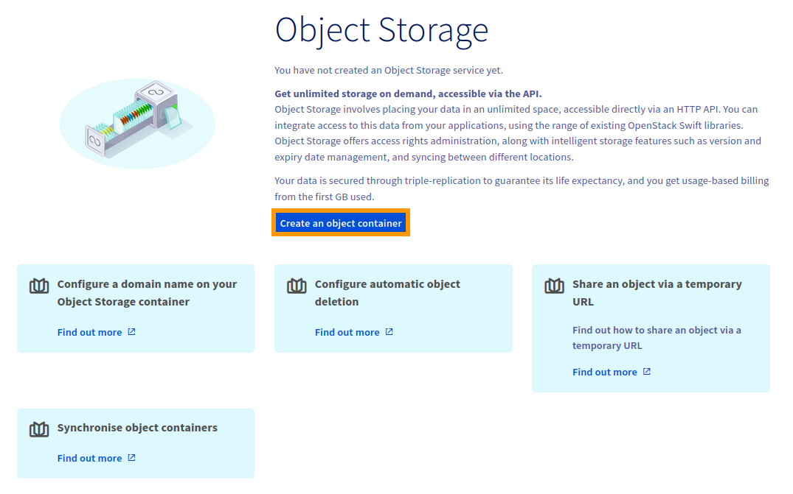
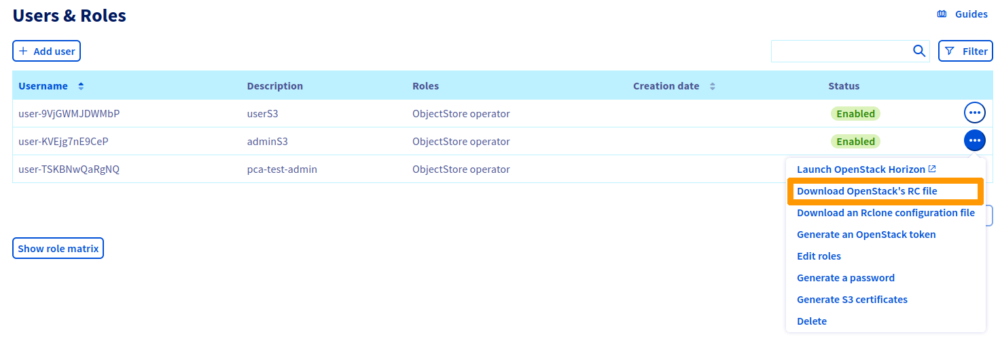

**Dernière mise à jour le**

## Objectif

Ce guide à pour objectif de vous familiariser avec la gestion de vos conteneurs / objets High Performance

## Prérequis

- Être connecté à votre [espace client](https://www.ovh.com/manager/#/){.external}
- Avoir créé un [utilisateur OpenStack](https://docs.ovh.com/fr/public-cloud/creation-et-suppression-dun-utilisateur-openstack/){.external}.

## En pratique

### Gestion des utilisateurs

Une fois votre utilisateur créé vous devez générer ses certificats S3


### Gestion des buckets

#### Création d'un bucket depuis l'espace client

> [!primary]
>
> Il n'est pas possible de créer de bucket Public Cloud Archive
>

Connectez-vous à votre [espace client](https://www.ovh.com/manager/#/){.external} :

1. Cliquez sur l'onglet `Public Cloud`{.action}
1. Cliquez sur `Object Storage`{.action} dans le menu à gauche
1. Cliquez sur  `Create an object container`{.action}

Si il s'agit de votre premier bucket :



Si il ne s'agit pas de votre premier bucket :


Sélectionnez la solution High Performance et cliquez sur `Next`{.action} :


Sélectionnez la région de votre bucket et cliquez sur `Next`{.action} :


Nommez votre bucket et cliquez sur `Create the container`{.action} :  

  

> [!warning]
>
> - Les noms de bucket peuvent comporter entre 3 et 63 caractères.  
> - Les noms de bucket peuvent être composés uniquement de lettres minuscules, de chiffres, de points (.) et de traits d'union (-).  
> - Les noms de bucket doivent commencer et se terminer par une lettre ou un chiffre.  
> - Les noms de buckets ne doivent pas utiliser le même format que les adresses IP (par ex., 192.168.5.4).  
> - Les noms de bucket doivent être uniques au sein d'une même région.  
>

#### Liaison d'un utilisateur à un bucket

À ce stade, vous ne pouvez pas intéragir avec votre bucket car aucun utilisateur S3 n'y est associé.

Cliquez sur les `...`{.action} à la fin de la ligne de votre bucket puis sur `Add a user to a container`{.action}


Sélectionnez l'utilisateur à ajouter à votre bucket et cliquez sur `Next`{.action} :


Définissez les accès à votre bucket pour cet utilisateur et cliquez sur `Next`{.action} :


### Gestion des objets

Cliquez sur les `...`{.action} à la fin de la ligne de votre bucket puis sur `Display objects`{.action}


Cliquez sur `+ Add objects`{.action}


Si besoin, définissez un préfixe, cliquez sur `Select files`{.action} puis sur `Import`{.action}


Vous pouvez maintenant intérargir avec votre objet :


### Utilisation de AWS CLI

#### Installation

```bash
user@host:~$ pip3 install python-openstackclient awscli awscli-plugin-endpoint
```

> [!primary]
>
> Installez le package `groff` si vous souhaitez utiliser l'aide en ligne de commande
>
#### Configuration

Les jetons S3 sont différents, vous avez besoin de 2 paramètres (accès et secret) pour générer un jeton S3. Ces informations d'identification seront stockées en toute sécurité dans Keystone. Pour le générer :

Définissez les variables d'environnement d'OpenStack :

> [!primary]
>
> Si besoin, téléchargez le fichier OpenRC de votre utilisateur
>
> 
>

puis

```bash
user@host:~$ source openrc.sh
```

Enfin, avec le client python-openstack :

```bash
user@host:~$ openstack ec2 credentials create
+------------+--------------------------------------------------------------------------------------------------------------------------------------------+
| Field      | Value                                                                                                                                      |
+------------+--------------------------------------------------------------------------------------------------------------------------------------------+
| access     | 86cfae29192b4cedb49bbc0f067a9df8                                                                                                           |
| links      | {'self': 'https://auth.cloud.ovh.net:35357/v3/users/a1a8da433b04476593ce9656caf85d66/credentials/OS-EC2/86cfae29192b4cedb49bbc0f067a9df8'} |
| project_id | 702de32b692c4842b0bb751dc5085daf                                                                                                           |
| secret     | 3b3e625d867d4ddb9e748426daf5aa6a                                                                                                           |
| trust_id   | None                                                                                                                                       |
| user_id    | a1a8da433b04476593ce9656caf85d66                                                                                                           |
+------------+--------------------------------------------------------------------------------------------------------------------------------------------+
```

Configurez le client aws comme suit :

```bash
user@host:~$ cat ~/.aws/credentials

[default]
aws_access_key_id = <access_key>
aws_secret_access_key = <secret_key>

user@host:~$ cat ~/.aws/config

[profile default]
region = <region>
s3 =
  endpoint_url = https://s3.<region>.perf.cloud.ovh.net
  signature_version = s3v4
s3api =
  endpoint_url = https://s3.<region>.perf.cloud.ovh.net
```

> [!primary]
>
> Vous pouvez aussi utiliser la configuration interactive en exécutant la commande suivante :
> `aws --configure`
>

Voici les valeurs de configuration que vous pouvez définir spécifiquement  :

| Variable  | Type | Valeur | Définition  |
|:--|:--|:--|:--|
| max_concurrent_requests | Integer | **Défaut :** 10 | Le nombre maximum de requêtes simultanées. |
| max_queue_size | Integer | **Défaut :** 1000 | Le nombre maximal de tâches dans la file d'attente des tâches. |
| multipart_threshold | Integer<br>String | **Défaut :** 8MB |  Le seuil de taille que l'interface CLI utilise pour les transferts multipart de fichiers individuels. |
| multipart_chunksize | Integer<br>String | **Défaut :** 8MB<br>**Minimum for uploads:** 5MB |  Lors de l'utilisation de transferts multipart, il s'agit de la taille de morceau que l'interface CLI utilise pour les transferts multipart de fichiers individuels. |
| max_bandwidth | Integer | **Défaut :** None | La bande passante maximale qui sera consommée pour le chargement et le téléchargement de données vers et depuis vos buckets. |
|  verify_ssl  | Boolean | **Défaut :** true | Active / Désactive la vérification des certificats SSL |

#### Utilisation

> [!primary]
>
> Si vous n'avez pas installé `awscli-plugin-endpoint`, vous devez ajouter `--endpoint-url https://s3.<region>.perf.cloud.ovh.net` à la ligne de commande
>

> [!primary]
>
> Si vous avez défini plusieurs profils, ajoutez `--profile <profil>` à la ligne de commande
>

**Créer un bucket**
```bash
aws s3 mb s3://<bucket_name>
aws --endpoint-url https://s3.<region>.perf.cloud.ovh.net --profile default s3 mb s3://<bucket_name>
```

**Lister vos buckets**
```bash
aws s3 ls
```

**Uploader vos fichiers en tant qu'objets dans votre bucket**
```bash
aws s3 cp /datas/test1 s3://<bucket_name>
```

**Par défaut, les objets prennent le nom des fichiers mais ils peuvent être renommés**
```bash
aws s3 cp /datas/test1 s3://<bucket_name>/other-filename
```

**Télécharger un objet depuis un bucket**
```bash
aws s3 cp s3://<bucket_name>/test1 .
```

**Télécharger un objet d'un bucket vers un autre bucket**
```bash
aws s3 cp s3://<bucket_name>/test1 s3://<bucket_name_2>
```

**Télécharger ou téléverser un bucket entier vers l'hôte/bucket**
```bash
aws s3 cp s3://<bucket_name> . --recursive
aws s3 cp s3://<bucket_name> s3://<bucket_name_2> --recursive
```

**Synchronisation des buckets**
```bash
aws s3 sync . s3://<bucket_name>
aws s3 sync s3://<bucket_name> s3://<bucket_name_2>
```

**Supprimer des objets et des buckets**
```bash
# Suppression d'un objet
aws s3 rm s3://<bucket_name>/test1
# Suppression de tous les objets d'un bucket
aws s3 rm s3://<bucket_name> --recursive
# Suppression d'une zone de stockage. Pour supprimer un bucket, il doit être vide.
aws s3 rb s3://<bucket_name>
# Si le compartiment n'est pas supprimé, vous pouvez utiliser la même commande avec l'option --force.
# Cette commande supprime tous les objets du bucket, puis supprime le bucket.
aws s3 rb s3://<bucket_name> --force
```

**Définir des tags sur un bucket**
```bash
aws s3api put-bucket-tagging --bucket <bucket_name> --tagging 'TagSet=[{Key=myKey,Value=myKeyValue}]'
aws s3api get-bucket-tagging --bucket <bucket_name>
```
```json
{
  "TagSet": [
    {
    "Value": "myKeyValue",
    "Key": "myKey"
    }
  ]
}
```

**Supprimer les tags sur un bucket**
```bash
aws s3api s3api delete-bucket-tagging --bucket <bucket_name>
```

**Définir des tags sur un objet**
```bash
aws s3api put-object-tagging --bucket <bucket_name> --key test1 --tagging 'TagSet=[{Key=myKey,Value=myKeyValue}]'
aws s3api get-bucket-tagging --bucket <bucket_name>
```
```json
{
  "TagSet": [
    {
    "Value": "myKeyValue",
    "Key": "myKey"
    }
  ]
}
```

**Supprimer les tags sur un objet**
```bash
aws s3api s3api delete-object-tagging --bucket <bucket_name> --key test1
```

## Aller plus loin

Échangez avec notre communauté d'utilisateurs sur [https://community.ovh.com](https://community.ovh.com){.external}.
