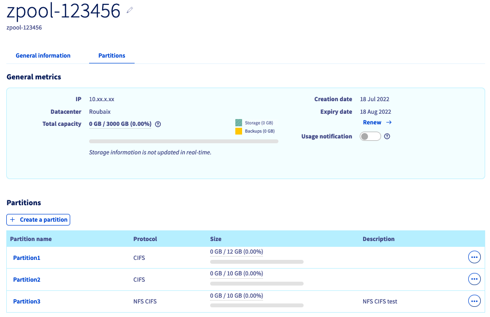
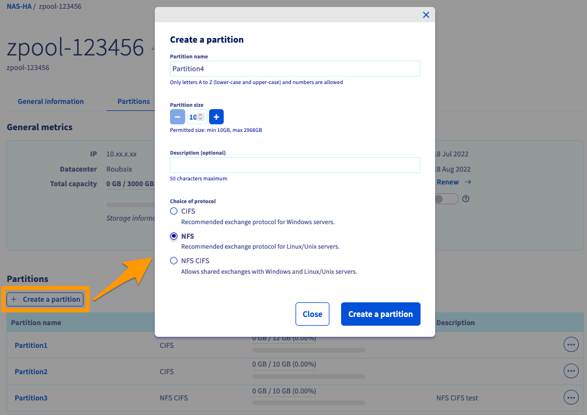

**Dernière mise à jour le 22/08/2022**

## Objectif

Le Network Attached Storage (NAS) est un serveur de fichiers connecté à un réseau dont la fonction principale est le stockage de données dans un volume centralisé pour des clients réseau hétérogènes.
Vous pouvez gérer votre service NAS-HA via l'[API OVHcloud](https://docs.ovh.com/ca/fr/storage/nas/nas-quickapi/) ou depuis votre espace client.

**Ce guide explique comment gérer les partitions et les snapshots NAS-HA dans l'espace client OVHcloud.**

## Prérequis

- Posséder une offre [NAS-HA OVHcloud](https://www.ovh.com/ca/fr/nas/)
- Posséder un service OVHcloud auquel est associée une adresse IP publique (Hosted Private Cloud, Serveur Dédié, VPS, instance Public Cloud, etc.).
- Être connecté à votre [espace client OVHcloud](https://ca.ovh.com/auth/?action=gotomanager&from=https://www.ovh.com/ca/fr/&ovhSubsidiary=qc)

## En pratique

Connectez-vous à votre [espace client OVHcloud](https://ca.ovh.com/auth/?action=gotomanager&from=https://www.ovh.com/ca/fr/&ovhSubsidiary=qc), rendez-vous dans la section `Bare Metal Cloud`{.action} et ouvrez `NAS et CDN`{.action}.<br>
Cliquez sur votre service pour accéder à l'onglet `Informations générales`{.action}.

{.thumbnail}

L'onglet `Informations générales`{.action} affiche des informations techniques, le `Quota` du service, les détails de l'abonnement et un raccourci pour [créer une partition](#create_partition).

> [!primary]
> Rendez-vous sur la page [FAQ](https://docs.ovh.com/ca/fr/storage/faq-nas/) pour découvrir les propriétés techniques du service NAS-HA.
>

### Gestion des partitions <a name="manage_partition"></a>

Passez à l'onglet `Partitions`{.action}. Le tableau répertorie toutes les partitions que vous avez créées pour le service sélectionné. Vous pouvez cliquer sur le nom d'une partition pour ouvrir sa page de gestion. 

{.thumbnail}

La section **Métriques générales** indique la quantité d'espace disque disponible utilisée par les données et les snapshots (`Quota`). Le pourcentage d'espace occupé actuellement par les snapshots est indiqué en jaune. Par défaut, un snapshot a lieu toutes les heures.

Votre service NAS-HA bénéficie de suffisamment d'espace pour stocker les snapshots. Cet espace correspond à 20 % de la taille initiale du volume. Si vous dépassez cette limite, les snapshots suivants utiliseront votre espace de stockage principal.

Vous pouvez activer l'option `Avis d'utilisation`{.action} pour recevoir des avertissements par e-mail lorsqu'un quota d'utilisation de 90 % est atteint.

Vous pouvez effectuer quelques actions en cliquant sur le bouton `...`{.action} dans chaque ligne du tableau.

- **Editer / Voir** : Ouvre la section "Informations générales" de la partition.
- **Gérer les snapshots** : Ouvre la section « [Snapshot policies](#snapshots) » de la partition.
- **Gérer les accès** : Ouvre la section « [Contrôle d'accès (ACL)](#access_control) » dans laquelle vous pouvez gérer les droits d'accès des adresses IP pour la partition.
- **Modifier la taille** : Ouvre une fenêtre pour [modifier la taille](#modify_partition) de la partition.
- **Paramètres Z File System (ZFS)** : Ouvre une fenêtre qui permet de [modifier les paramètres du système ZFS](#zfs).
- **Supprimer** : Ouvre une fenêtre pour [supprimer cette partition](#deletion).


#### Création d'une partition <a name="create_partition"></a>

Pour ajouter une nouvelle partition, cliquez sur le bouton `+ Créer une partition`{.action} au dessus du tableau.

{.thumbnail}

Entrez un **nom** pour la partition, déterminez sa **taille** en GB et sélectionnez les **protocoles** d'accès (NFS, CIFS ou les deux) à autoriser.

Donnez une description si besoin, puis cliquez sur `Créer la partition`{.action}.

#### Modifier la taille d’une partition <a name="modify_partition"></a>

Pour modifier la taille d'une partition, cliquez sur le bouton `...`{.action} à droite de la partition concernée, puis sélectionnez `Modifier la taille`{.action}.

{.thumbnail}

Renseignez la nouvelle taille, puis cliquez sur `Modifier la taille`{.action}.

#### Création et gestion de snapshots <a name="snapshots"></a>

Cliquez sur le bouton `...`{.action} à droite de la partition concernée, puis sélectionnez `Gérer les snapshots`{.action}.

Par défaut, un snapshot de vos données a lieu toutes les heures et est sauvegardé sur votre NAS-HA. Cette règle s'affiche dans le tableau de l'onglet `Snapshot policies`{.action}.

{.thumbnail}

Vous pouvez activer d'autres règles de snapshots qui créeront des snapshots à des fréquences prédéfinies en cliquant sur le bouton déroulant sous `Options`. Sélectionnez les fréquences et cliquez sur le bouton `Cocher`{.action} à droite.

{.thumbnail}

Dans la fenêtre qui apparaît, patientez jusqu'à ce que le processus soit terminé, puis cliquez sur `Fermer`{.action}. Les snapshots supplémentaires seront également conservés sur votre NAS-HA.

##### **Créer un snapshot manuel**

En dehors des snapshots effectués automatiquement, il est possible de créer à tout moment un snapshot manuel d'une partition. Cliquez sur le bouton `Créer un Snapshot manuel`{.action} au dessus du tableau.

{.thumbnail}

Le snapshot va être ajouté dans la table. Indiquez un nom de snapshot après le préfixe, puis cliquez sur le bouton `Cocher`{.action} à droite.

##### **Listing et restauration de snapshots**

L'espace client n'inclut pas les fonctionnalités d'accès et de restauration de vos snapshots. Elles sont stockées en lecture seule sur la partition.

Pour accéder aux snapshots à partir de votre point de montage, vous devez accéder au répertoire `.zfs/snapshot` de votre partition.

Par exemple, sur votre service portant l'ID `zpool-123456`, il existe une partition nommée `partition1` dont vous avez créé un snapshot nommé `snap-snapshot01`. Vous pouvez retrouver le snapshot avec cette commande :

```bash
ls -al /zpool-123456/partition1/.zfs/snapshot/snap-snapshot01/
```

Pour restaurer votre snapshot, copiez-le depuis le chemin d'accès du fichier `.zfs` vers le nouveau répertoire où vous souhaitez restaurer le snapshot. Vous pouvez utiliser un outil tel que *rsync* qui vous permet d'effectuer des restaurations.

Retrouvez plus d’informations dans la section [Aller plus loin](#gofurther) de ce guide.

#### Gestion des ACL de partition <a name="access_control"></a>

Le contrôle d'accès aux partitions fonctionne via des restrictions d'adresses IP. Comme aucune restriction n'est configurée par défaut, la première étape de configuration pour chaque partition est de définir des adresses IP ou des plages à partir desquelles l'accès sera autorisé.

> [!primary]
>
> Seules les adresses IP attachées aux services OVHcloud peuvent accéder à votre NAS-HA (ex : Serveur Dédié, VPS, instance Public Cloud, etc.).
>

##### **Ajout d'accès**

Cliquez sur le bouton `+ Ajouter un nouvel accès`{.action}.

{.thumbnail}

Cela crée une nouvelle ligne dans le tableau dans laquelle vous pouvez sélectionner une adresse IP ou un bloc d'adresse (CIDR). Choisissez `Lecture` (RO) ou `Lecture écriture` (RW) comme type d'accès dans le menu déroulant et cliquez sur le bouton `Cocher`{.action} pour ajouter cette entrée à l'ACL.

Dans la fenêtre qui apparaît, patientez jusqu'à ce que le processus soit terminé, puis cliquez sur `Fermer`{.action}.

##### **Suppression d'un accès**

Pour supprimer un accès à une partition, cliquez sur l'icône de `corbeille`{.action} correspondante dans le tableau.

{.thumbnail}

Dans la fenêtre qui s'affiche, validez en cliquant sur `Supprimer l'accès`{.action} puis patientez jusqu'à ce que le processus arrive à son terme. Cliquez sur `Fermer`{.action}.

### Paramètres ZFS <a name="zfs"></a>

> [!warning]
>
> Tous les paramètres par défaut du système de fichiers Z sont optimisés. Bien que nous déconseillons la modification de ces paramètres, ce menu vous permet d'ajuster le ZFS utilisé par le NAS-HA.
>

Pour modifier les paramètres ZFS d'une partition, cliquez sur le bouton `...`{.action} à droite de la partition concernée puis sélectionnez `Paramètres Z File System (ZFS)`{.action}. 

{.thumbnail}

- **Désactiver la mise à jour des temps d'accès (*atime*)** : La désactivation du *atime* signifie que le noyau ne mettra plus à jour l'horodatage du système de fichiers à chaque accès à un fichier. Cela peut être utile pour accélérer les opérations de lecture fréquentes, par exemple sur des pages web statiques. Cependant, cette désactivation n'est pas conseillée pour les applications critiques en terme de cohérence, telles que les bases de données.
- **ZFS recordsize** : Cette propriété modifie la taille de bloc maximale sur le système de fichiers ZFS. Notez que ZFS utilisera toujours une taille de bloc inférieure si le fichier est inférieur à la taille maximale. Par exemple, un fichier de 16 KB utilisera un bloc de 16 KB (plus les métadonnées) pour ne pas gaspiller d'espace de stockage. De manière générale, nous vous déconseillons donc de modifier le ZFS *recordsize*.
- **Sync** : Ce paramètre modifie le comportement des transactions du système de fichiers ZFS en ce qui concerne la mise en mémoire tampon des données RAM et l’écriture des données sur le disque. Sauf raison spécifique, nous vous déconseillons de modifier cette propriété.

### Suppression d'une partition <a name="deletion"></a>

> [!warning]
>
> La suppression d'une partition entraîne l'effacement définitif de toutes les données qu'elle contient.
>

Pour supprimer une partition, cliquez sur le bouton `...`{.action} à droite de la partition concernée et choisissez `Supprimer`{.action}.

{.thumbnail}

Confirmez l'action dans la fenêtre qui apparaît en cliquant sur `Supprimer la partition`{.action}. Patientez le temps que le processus se termine, puis cliquez sur `Fermer`{.action}.

## Aller plus loin <a name="gofurther"></a>

[Gestion des partitions par API](https://docs.ovh.com/ca/fr/storage/nas/nas-partitions-api/)

[Gestion des ACL de partition via API](https://docs.ovh.com/ca/fr/storage/nas/nas-manage-acls/)

[Gestion des snapshots via API](https://docs.ovh.com/ca/fr/storage/nas/nas-snapshots-api)

[Monter votre NAS via un partage NFS](https://docs.ovh.com/ca/fr/storage/nas/nas-nfs/)

[Monter votre NAS sur Windows Server via CIFS](../nas-cifs/)

Échangez avec notre communauté d'utilisateurs sur <https://community.ovh.com/>.
