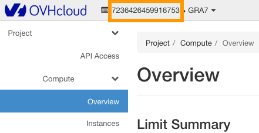
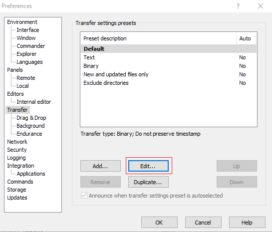

> [!primary]
> Diese Übersetzung wurde durch unseren Partner SYSTRAN automatisch erstellt. In manchen Fällen können ungenaue Formulierungen verwendet worden sein, z.B. bei der Beschriftung von Schaltflächen oder technischen Details. Bitte ziehen Sie im Zweifelsfall die englische oder französische Fassung der Anleitung zu Rate. Möchten Sie mithelfen, diese Übersetzung zu verbessern? Dann nutzen Sie dazu bitte den Button "Beitragen" auf dieser Seite.
>

**Letzte Aktualisierung am 13.05.2022**

## Ziel

Public Cloud Archive ist eine Speicherlösung, die mit OpenStack-APIs verwendet werden kann. Es ist jedoch möglich, dass Sie mit der Verwaltung eines Speicherplatzes nicht vertraut sind. Wir haben also ein Gateway entwickelt, mit dem Sie über einen SFTP-Client auf Ihr PCA zugreifen können.

## Voraussetzungen

- Ein SFTP Client: [WinSCP](https://winscp.net/eng/download.php){.external}
- Login & Password OpenStack
- TenantName des Projekts

## In der praktischen Anwendung

### SFTP Client

In diesem Beispiel verwenden wir WinSCP als SFTP-Client. Es gibt auch andere Lösungen, deren Konfiguration der entspricht, die wir Ihnen vorstellen werden.

### OpenStack-Kennung

Sie können OpenStack Login und Passwort anhand [dieser Anleitung](https://docs.ovh.com/de/public-cloud/openstack-user-erstellen-loeschen/) generieren.

### TenantName

Der TenantName entspricht dem Namen Ihres Projekts auf Horizon. Um den TenantName abzurufen, loggen Sie sich mit dem OpenStack-Manager über die zuvor erstellten Zugänge ein: [https://horizon.cloud.ovh.net/](https://horizon.cloud.ovh.net/){.external}. Wenn Sie eingeloggt sind, wird der TenantName oben angezeigt.

{.thumbnail}

### Verbindung

- Host Name: gateways.storage.{region}.cloud.ovh.net
- User Name: pca
- Password: {TenantName}.{Username_Openstack}.{Password_Openstack}
- Port: 22

{.thumbnail}

### Beispiel

Wenn Sie einen PCA Container auf SBG erstellt haben:

- Host Name: gateways.storage.sbg.cloud.ovh.net
- User Name: pca
- Password: 971891XXXX1214.f6nBXXXXXAmcv.SfPeASYfuWeqBZgXXXXX2XhF3DY12RkD

{.thumbnail}

### WinSCP Einstellungen
In diesem Teil deaktivieren wir zwei WinSCP Optionen:

**Transfer Resume / Transfer to Temporary Filename:** Diese Option muss deaktiviert werden, da eine Wiederaufnahme bei PCA nicht möglich ist, und WinSCP kann Ihnen dann einen Fehler zurückgeben. Bitte beachten Sie den unten stehenden Screenshot.

- Wählen Sie unter `Endurance`{.action} den Eintrag `Disable`{.action} aus.

{.thumbnail}

**Preserve Timestamp:** Die TimeStamp entspricht dem Datum der Dateiänderung. Wir deaktivieren die Datei, da wir bei PCA diese Daten durch das Datum des Upload der Datei ersetzen. Bitte beachten Sie die unten aufgeführten Bildschirmeinträge.

- In der Kategorie `Transfer`{.action} klicken Sie auf `Edit...`{.action}.

{.thumbnail}

- Entfernen Sie `Preserve timestamp`{.action}.

{.thumbnail}

### Datenwiederherstellung
Das Abrufen von Daten unterliegt der vorherigen Freigabe des Objekts. Für das betreffende Objekt ist ein GET-Aufruf erforderlich. Wird dieser Vorgang nicht durchgeführt, wird Ihr SFTP-Client bei einem Downloadversuch eine Fehlermeldung zurückgeben. Hier finden Sie unsere Anleitung zum [Entsperren Ihrer Objekte](https://docs.ovh.com/de/storage/pca/unlock/).

## Weiterführende Informationen

Für den Austausch mit unserer Community gehen Sie auf <https://community.ovh.com/en/>.
