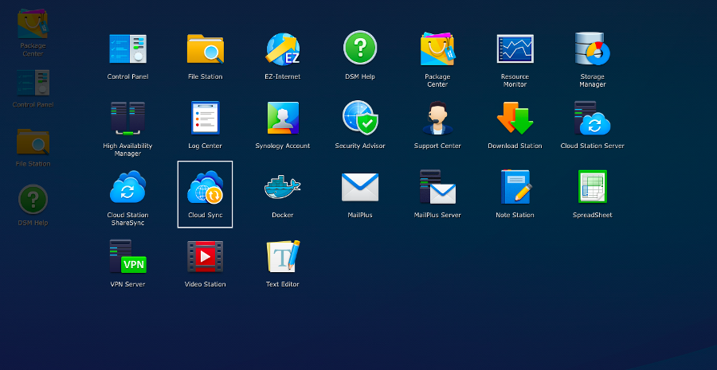
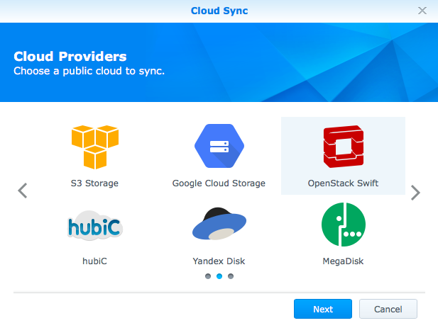

> [!primary]
> Diese Übersetzung wurde durch unseren Partner SYSTRAN automatisch erstellt. In manchen Fällen können ungenaue Formulierungen verwendet worden sein, z.B. bei der Beschriftung von Schaltflächen oder technischen Details. Bitte ziehen Sie im Zweifelsfall die englische oder französische Fassung der Anleitung zu Rate. Möchten Sie mithelfen, diese Übersetzung zu verbessern? Dann nutzen Sie dazu bitte den Button "Beitragen" auf dieser Seite.
>

**Letzte Aktualisierung am 27.10.2021**

## Ziel

[DiskStation Manager 6.00](https://www.synology.com/en-global/dsm/6.0beta){.external} von Synology bietet ein Synchronisierungswerkzeug für verschiedene Cloud Lösungen an.

Dieser ist mit dem Object Storage der OVHcloud Public Cloud kompatibel und erlaubt es Ihnen so, ein Backup Ihrer Daten durchzuführen und diese von überall aus verfügbar zu machen.

**Diese Anleitung erklärt, wie Sie DiskStation Manager 6.0 konfigurieren, um die Dateien auf Ihrem NAS mit Ihrem Object Storage zu synchronisieren.**

## Voraussetzungen

- [Erstellung von Object Storage Containern](https://docs.ovh.com/de/storage/object-storage/pcs/create-container/)
- [Einen Zugang zu Horizon erstellen](https://docs.ovh.com/de/public-cloud/openstack-user-erstellen-loeschen/#erstellung-eines-openstack-benutzers)

## In der praktischen Anwendung

### Konfiguration von DiskStation Manager 6.0

> [!warning]
>
> Synology-Lösungen wie DiskStation oder Hyperbackup sind mit Public Cloud Archive nicht kompatibel.
>

#### Zugangsdaten für OpenStack abrufen

Um die Synchronisierung Ihres Synology NAS zu konfigurieren müssen Sie über die Zugangsdaten Ihres OpenStack Benutzers verfügen.

Diese können Sie anhand der folgenden Anleitung im Kundencenter herunterladen:

- [OpenStack Umgebungsvariablen einrichten](https://docs.ovh.com/de/public-cloud/set-openstack-environment-variables/)

#### Konfiguration des Synchronisationspunkts mit Cloud Sync

Sobald Sie Ihre Zugangsdaten haben, können Sie sich mit Ihrem NAS verbinden und die folgenden Aktionen ausführen:

- Cloud Sync Anwendung starten:

{.thumbnail}

- OpenStack Swift als Cloud Provider auswählen:

{.thumbnail}

- Die Informationen Ihres OpenStack-Benutzers eingeben:

{.thumbnail}

Alle diese Informationen finden Sie in der OpenRC-Datei, die Sie im vorherigen Schritt abgerufen haben.

- Ihren Ordner synchronisieren:

{.thumbnail}

> [!alert]
>
> Diese Anleitung basiert auf der Beta-Version von DiskStation Manager 6.0. Der Konfigurationsvorgang kann sich deshalb ändern.
>

## Weiterführende Informationen

Für den Austausch mit unserer User Community gehen Sie auf <https://community.ovh.com/en/>.
