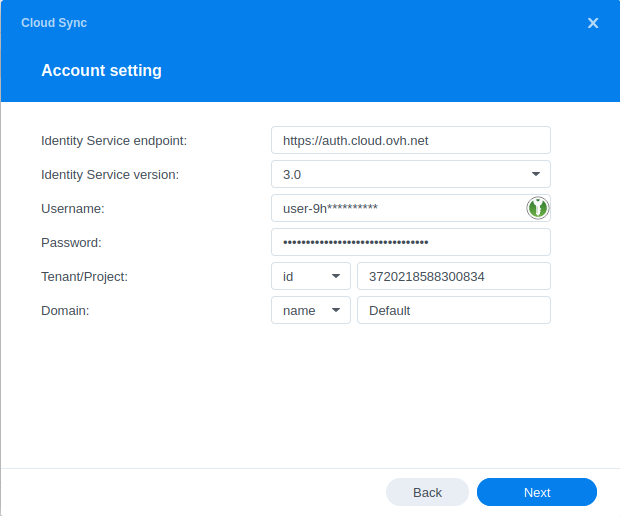

**Last updated 22nd May 2023**

## Objective

Synology DiskStation Manager 7.0 provides a tool for synchronisation with different cloud solutions.

It is compatible with the OVHcloud Public Cloud Object Storage and lets you back up your data and access it from any location. This guide explains how to configure DiskStation Manager 7.0 so that you can synchronise your NAS files and your Object Storage.

> [!primary]
>
> DiskStation Manager 6 is not compatible with OVHcloud Public Cloud Object Storage.
>

## Requirements

- [Create an Object Storage container](https://docs.ovh.com/au/en/storage/object-storage/pcs/create-container/)
- [Configure an Openstack user](https://docs.ovh.com/au/en/public-cloud/creation-and-deletion-of-openstack-user/#creating-an-openstack-user)

## Instructions

### DiskStation Manager 7.0 configuration

> [!warning]
> 
> Synology solutions such as DiskStation or Hyperbackup are not compatible with the Public Cloud Archive solution.
>

#### Retrieve your OpenStack credentials

To sync your NAS Synology, you need your OpenStack credentials.

You can retrieve them by downloading the OpenRC file using the first part of the following guide:

[Setting OpenStack environment variables](https://docs.ovh.com/au/en/public-cloud/set-openstack-environment-variables/#step-1-retrieve-the-variables)

#### Configuring the synchronisation point with Cloud Sync

Once you have your credentials, you can log in to your NAS and take the following steps:

- Launch the Cloud Sync application

- Select OpenStack Swift as a Cloud Provider

{.thumbnail}

- Enter your OpenStack credentials:

{.thumbnail}

You can find this information in the OpenRC file which you downloaded in the previous step.

- Select the container's location and name:

{.thumbnail}

- Configure the folder to synchronise:

{.thumbnail}

## Go further

Join our community of users on <https://community.ovh.com/en/>.
