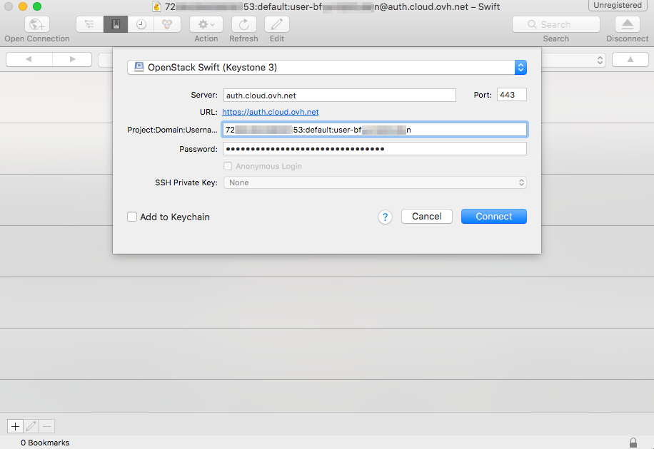

> [!primary]
> Esta traducción ha sido generada de forma automática por nuestro partner SYSTRAN. En algunos casos puede contener términos imprecisos, como en las etiquetas de los botones o los detalles técnicos. En caso de duda, le recomendamos que consulte la versión inglesa o francesa de la guía. Si quiere ayudarnos a mejorar esta traducción, por favor, utilice el botón «Contribuir» de esta página.
>

**Última actualización: 18/06/2021**

## Objetivo

Public Cloud Archive es una solución de almacenamiento que puede utilizarse con las API de OpenStack. Sin embargo, es posible que no esté familiarizado con esta forma de gestionar un espacio de almacenamiento.

Existen soluciones gráficas que utilizan de forma invisible API de OpenStack para usted. CyberDuck forma parte de estas soluciones y es fácilmente configurable.

También hay disponibles otras interfaces, cuya configuración es similar a la que vamos a presentarles.

**Esta guía explica cómo configurar Cyberduck para gestionar su Public Cloud Archive utilizando una interfaz gráfica basada en las API OpenStack.**

> [!warning]
>
> La configuración, la gestión y la responsabilidad de los servicios que OVHcloud pone a su disposición recaen sobre usted. Por lo tanto, usted deberá asegurarse de que estos funcionen correctamente.
>
> Esta guía le ayudará a realizar las tareas más habituales. No obstante, si tiene alguna duda le recomendamos que contacte con un proveedor de servicios especializado o con el editor del servicio. Nosotros no podremos asistirle. Para más información, consulte el apartado «Más información» de esta guía.
>

## Requisitos

- Descargar e instalar [Cyberduck](https://cyberduck.io/).
- Disponer de las claves de usuario (*OS_USERNAME*) y del proyecto (*OS_PROJECT_NAME* o *OS_TENANT_NAME*), que puede obtener descargando el archivo OpenRC en el menú [Users and Roles](https://docs.ovh.com/us/es/public-cloud/cargar-las-variables-de-entorno-openstack/#paso-1-obtener-las-variables) de su [área de cliente Public Cloud de OVHcloud](https://ca.ovh.com/auth/?action=gotomanager&from=https://www.ovh.com/world/&ovhSubsidiary=ws).
- Disponer de su contraseña de usuario de OpenStack.

Si ya no conoce la contraseña de usuario de OpenStack, puede cambiarla siguiendo [esta guía](https://docs.ovh.com/us/es/public-cloud/cambiar-la-contrasena-de-usuario-openstack/).

## Procedimiento

**Esta guía se ha actualizado sobre la base de la versión 7.9.2 de Cyberduck para MacOS.**

> [!primary]
>
> Según la fuente de descarga de su archivo OpenRC (desde Horizon o desde el área de cliente de OVHcloud), el identificador del proyecto puede llamarse *OS_PROJECT_NAME* o *OS_TENANT_NAME*.
>

En Cyberduck, abra una conexión "OpenStack Swift (Keystone 3)".

{.thumbnail}

Introduzca la siguiente información:

- Servidor: auth.cloud.ovh.net
- Project:Dominio:Username: OS_PROJECT_NAME:default:OS_USERNAME
- Contraseña: la contraseña de su usuario OpenStack.

Haga clic en `Conectar`{.action}. Una vez que se haya conectado, podrá acceder al árbol de carpetas y archivos.

{.thumbnail}

> [!primary]
>
> Si tiene problemas de conexión, puede descargar el perfil de conexión Cyberduck para OpenStack Swift (Keystone 3) y abrirlo con Cyberduck.
>   Haga clic derecho <a href="https://trac.cyberduck.io/browser/shelves/02.2020/profiles/default/Openstack%20Swift%20(Keystone%203).cyberduckprofile?rev=48724&order=name" download>aquí y haga clic en "Guardar el destino del enlace como"</a> para descargar el perfil.
>

## Más información

[Documentación de Cyberduck](https://trac.cyberduck.io/wiki/help/en){.external}

[Empezar con la API Swift](https://docs.ovh.com/us/es/public-cloud/empezar_con_la_api_swift/)

Interactúe con nuestra comunidad de usuarios en <https://community.ovh.com/en/>.
