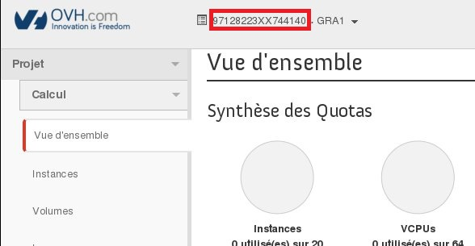

> [!primary]
> Diese Übersetzung wurde durch unseren Partner SYSTRAN automatisch erstellt. In manchen Fällen können ungenaue Formulierungen verwendet worden sein, z.B. bei der Beschriftung von Schaltflächen oder technischen Details. Bitte ziehen Sie beim geringsten Zweifel die englische oder französische Fassung der Anleitung zu Rate. Möchten Sie mithelfen, diese Übersetzung zu verbessern? Dann nutzen Sie dazu bitte den Button «Mitmachen» auf dieser Seite.
>

**Letzte Aktualisierung am 08.12.2020**

## Ziel

OVHcloud Public Cloud Archive ist eine Speicherlösung, die hauptsächlich über die OpenStack-API verwaltet wird. Wir haben jedoch ein Gateway entwickelt, mit dem Sie sich mit Rsync mit Ihrem PCA Container verbinden können.

**Diese Anleitung enthält die notwendigen Informationen, um die Verbindung zu Ihren gesicherten Daten mithilfe von Rsync herzustellen.**

## Voraussetzungen

### Rsync

[Rsync](https://rsync.samba.org/) ist ein Open Source Tool, das schnellen und inkrementellen Datentransfer ermöglicht.<br>
Vorkompilierte Binärdateien sind für die meisten Betriebssystemdistributionen verfügbar. Überprüfen Sie deshalb zunächst, ob Sie ein Rsync-Paket mit Ihren Installationstools für Standard-Pakete auf Ihrem Betriebssystem installieren können.

### OpenStack ID

Mithilfe dieser [Anleitung](../../../public-cloud/erstellung_eines_zugangs_zu_horizon/) können Sie Ihre OpenStack-Kennung und Ihr Passwort erstellen.

### TenantName

Der TenantName entspricht dem Namen Ihres Horizon-Projekts. Um den TenantName zu erhalten, loggen Sie sich im OpenStack Webinterface ein: [https://horizon.cloud.ovh.net/](https://horizon.cloud.ovh.net/){.external}.

Nach dem Login ist der TenantName oben auf der Seite sichtbar.

{.thumbnail}

## In der praktischen Anwendung

### Verbindungsdetails

- Host Name: gateways.storage.{region}.cloud.ovh.net
- User Name: pca
- Password: {TenantName}.{Username_Openstack}.{Password_Openstack}
- Port: 22

### Datenübertragung

Beispiel einer Kommandozeile, wenn Sie einen PCA Container in der GRA Region erstellt haben:

```bash
user@host:~$ rsync -a /path/to/my/dir pca@gateways.storage.gra.cloud.ovh.net:/container
pca@gateways.storage.gra.cloud.ovh.net's password:
user@host:~$
```

### Download der Daten

OVHcloud Public Cloud Archive bietet kostengünstige Datenspeicherung, im Austausch gegen höhere Latenzzeiten beim Abruf. Um auf Ihr Archiv zugreifen zu können, muss eine Anfrage zur Extraktion mit den zugehörigen Container- und Archivnamen eingehen.

Sobald Ihr Archiv freigegeben wurde, können Sie es 24 Stunden lang mit unbegrenzter Bandbreite und unbegrenzter Zugriffsfrequenz herunterladen. Nach diesem Abruf wird das Archiv erneut versiegelt.

```bash
user@host:~$ rsync -a pca@gateways.storage.gra.cloud.ovh.net:/container
pca@gateways.storage.gra.cloud.ovh.net's password:
user@host:~$
```

### Weitere Informationen: Rsync Optionen

Da Rsync Server gepatcht wurde, um mit der Swift-API zu funktionieren, werden die folgenden Optionen serverseitig forciert, um dem Verhalten des Object Storage Bsckends zu entsprechen:

> —inplace: Anstelle der Standardmethode, eine neue Kopie der Datei zu erstellen und nach Abschluss des Vorgangs zu verschieben, schreibt Rsync die aktualisierten Daten direkt in die Zieldatei.
>

Darüber hinaus ist auf Clientseite nur ein Teil der Optionen erlaubt:

> -a, --archive: Archivierungsmodus aktivieren.
>
> -r, --recursive: Ordner rekursiv kopieren.
>
> -v, --verbose: Erhöht die Menge an Informationen, die Ihnen beim Transfer ausgegeben werden.
>
> --del, --delete: Löscht unnötige Dateien aus dem Zielverzeichnis.
>
> -P, --progress: Zeigt Angaben zum Fortschritt des Transfers an.


## Weiterführende Informationen

[Cloud Archive API Dokumentation](https://docs.ovh.com/gb/en/storage/pca/api/)

[Rsync-Referenz](https://linux.die.net/man/1/rsync)

Für den Austausch mit unserer Community gehen Sie auf <https://community.ovh.com/en/>.
