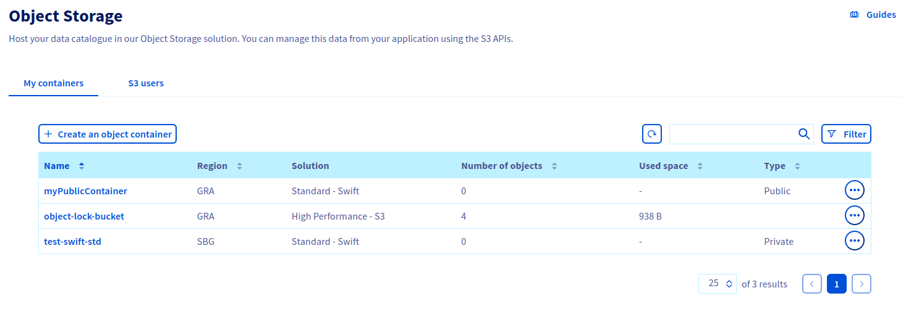

**Dernière mise à jour le 27/10/2021**

## Objectif

Public Cloud est une solution de stockage illimité avec une facturation simple et adaptée à vos besoins. Il existe de nombreux types de conteneurs d'objets :

- Pour de l'hébergement statique (site web statique).
- Pour de l'hébergement privé (Exemple : stockage de données personnelles)
- Pour de l'hébergement public (pour stocker tout ce qui est accessible au public)
- Pour du stockage à froid (archivage)

La première étape est la création d’un conteneur qui regroupera vos fichiers. Ce guide explique comment le créer depuis l'espace client et depuis l’interface Horizon d’Openstack

## Prérequis

- Être connecter à votre espace client

Si vous utilisez Horizon :

- Avoir créé un [utilisateur OpenStack](https://docs.ovh.com/fr/public-cloud/creation-et-suppression-dun-utilisateur-openstack/){.external}.

## En pratique

### Création d'un conteneur Object Storage depuis l'espace client

Connectez-vous à votre [espace client](https://www.ovh.com/manager/#/){.external} :

1. Cliquez sur l'onglet `Public Cloud`{.action}
1. Cliquez sur `Object Storage`{.action} dans le menu à gauche
1. Cliquez sur  `Create an object container`{.action}

Si il s'agit de votre premier conteneur :

Si il ne s'agit pas de votre premier conteneur :

Sélectionnez votre solution  puis cliquez sur `Next`{.action} :

Sélectionnez la région de votre conteneur, puis cliquez sur `Next`{.action} :

Sélectionnez le type de conteneur, puis cliquez sur `Next`{.action} :

Nommez votre conteneur, puis cliquez sur `Create the container`{.action} :

> [!warning]
>
> Si vous souhaitez lier votre conteneur à un nom de domaine, le nom de votre conteneur de doit pas contenir les caractères suivants : - [ . ] - [ _ ] et vous ne devez pas utiliser de majuscules.
> cf : [Lier un conteneur a un nom de domaine](https://docs.ovh.com/fr/storage/pcs/link-domain/)
>

Votre conteneur est créé :

### Création d'un conteneur Object Storage depuis Horizon

> [!primary]
>
> Il n'est pas possible de créer un conteneur Public Cloud Archive depuis Horizon
>

Connectez-vous à votre [espace Horizon](https://horizon.cloud.ovh.net){.external} :

1. Développez le menu `Object Store`{.action}
1. Cliquez sur `Containers`{.action}
3. Cliquez sur `+ Container`{.action}

1. Nommez votre conteneur
  > [!warning]
  >
  > Si vous souhaitez lier votre conteneur à un nom de domaine, le nom de votre   conteneur de doit pas contenir les caractères suivants :
  > - [ . ]
  > - [ _ ]
  > - Et vous ne devez pas utiliser de majuscules.
  > cf : [Lier un conteneur a un nom de domaine](https://docs.ovh.com/fr/storage/pcs/link-domain/)
  >

2. Sélectionnez la politique d'accès de votre conteneur
3. Cliquez sur `Suivant`{.action}

Votre conteneur est créé

Vous pouvez également le voir dans votre espace client

## Aller plus loin

Échangez avec notre communauté d’utilisateurs sur [https://community.ovh.com](https://community.ovh.com).
