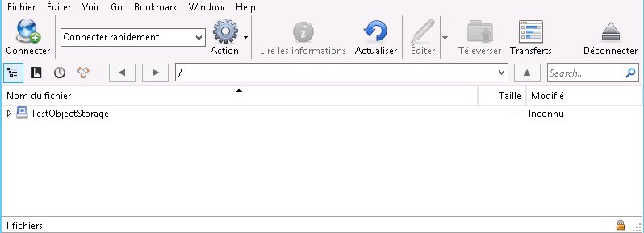

**Ostatnia aktualizacja dnia 2021-03-30**

## Wprowadzenie

Object Storage to usługa przestrzeni dyskowej zarządzana z poziomu API OpenStack.

Jeśli nie posiadasz wiedzy na temat tego typu zarządzania przestrzenią dyskową, możesz skorzystać z rozwiązań graficznych, które w sposób niewidoczny używają API OpenStack.
Jednym z tego typu rozwiązań jest CyberDuck.

Inne interfejsy można odnaleźć w Internecie. Ich konfiguracja przebiega podobnie do tej, którą przedstawimy. 

Przewodnik ten wyjaśnia, jak skonfigurować oprogramowanie Cyberduck, aby móc zarządzać usługą Object Storage za pomocą graficznego interfejsu opartego na API Openstack.

## Wymagania początkowe

- Skonfigurowany użytkownik Horizon: [Dostęp do panelu Horizon](../../public-cloud/tworzenie_dostepu_do_interfejsu_horizon/)
- Identyfikator projektu i użytkownika, do uzyskania w menu [Dostęp i bezpieczeństwo w Horizon](https://docs.ovh.com/gb/en/public-cloud/access_and_security_in_horizon/) pobierając plik OpenRC

## W praktyce

- Pobierz oprogramowanie [Cyberduck](https://cyberduck.io/)
- Zaloguj się na konto typu "Swift - OpenStack Object Storage"

{.thumbnail}

W formularzu należy podać różne informacje:

- Server: auth.cloud.ovh.net (serwer uwierzytelniania)
- Project:Domain:Username : OS_TENANT_NAME:default:OS_USERNAME
- Secret Key: hasło użytkownika Horizon
- More Options / Path: v3.0

- Zaloguj się.

{.thumbnail}

## Idź dalej

[Początek pracy z API Swift](../../public-cloud/pierwsze_kroki_z_api_swift/)

Dołącz do społeczności naszych użytkowników na <https://community.ovh.com/en/>.
