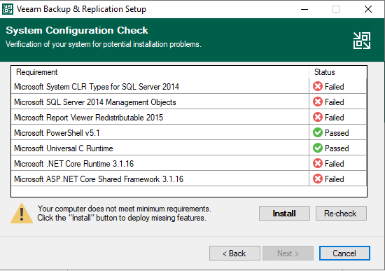
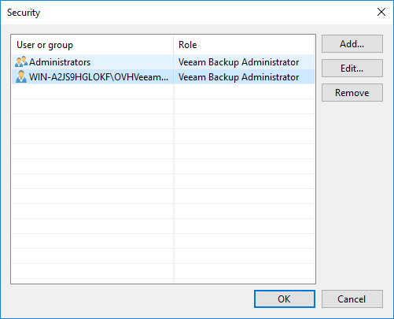

**Letzte Aktualisierung am 08/02/2022**

## Ziel

Veeam Backup & Replication ist eine Software zur Datensicherung. Sie bietet zahlreiche Möglichkeiten, um Daten zu sichern, zu replizieren und wiederherzustellen.

**Diese Anleitung erklärt wie Sie einen Veeam Backup & Replication Server einrichten und über den OVHcloud Veeam Enterprise Lizenz-Server registrieren.**


## Voraussetzungen

- Eine [Veeam Enterprise Lösung](https://www.ovhcloud.com/de/storage-solutions/veeam-enterprise/){.external}.
- Windows Server 2012 oder höher.

## In der praktischen Anwendung

### Veeam Backup & Replication installieren

Laden Sie **Veeam Backup & Replication** über die Website von [Veeam herunter](https://www.veeam.com/downloads.html?ad=top-sub-menu){.external}. Sollten Sie bei Veeam noch nicht als Benutzer registriert sein, erstellen Sie zunächst einen kostenlosen Kunden-Account.

Die Installationsdatei zum Download ist ein Image (ISO-Format). Nachdem Sie diese Datei auf Ihren Server transferiert haben, wählen Sie das CD-Laufwerk des Servers und dann das Image aus.

Auf dem Server kann die Installation nun über den Installationsassistenten gestartet werden. Klicken Sie auf `Veeam Backup & Replication (Install)`{.action}.

{.thumbnail}

Wenn Sie den Lizenzvertrag gelesen haben, akzeptieren Sie diesen mit `Next`{.action}.

{.thumbnail}

Überspringen Sie die Auswahl der Lizenzdatei mit `Next`{.action}.

{.thumbnail}

Ändern Sie bei der Auswahl der Komponenten nichts. Bei Bedarf können Sie jedoch den Zielpfad für die Installationsdateien anpassen. Bestätigen Sie anschließend mit `Next`{.action}.

{.thumbnail}

Der Installationsassistent überprüft nun Ihre Systemvoraussetzungen. Bei einer reinen Windows-Installation werden einige fehlende Komponenten identifiziert. Der Installationsassistent wird diese automatisch herunterladen und installieren. Bestätigen Sie anschließend mit `Next`{.action}.

{.thumbnail}

Warten Sie die Installation der fehlenden Komponenten ab.

{.thumbnail}

Bestätigen Sie nach diesem Schritt die Installation von **Veeam Backup & Replication** mit `Next`{.action}.

{.thumbnail}

Im Schritt zur Anpassung der Installation bestätigen Sie diese mit einem Klick auf `Install`{.action}.

{.thumbnail}

Warten Sie, während Veeam Backup & Replication installiert wird.

{.thumbnail}

Klicken Sie nach erfolgreicher Installation auf `Finish`{.action}, um den Assistenten zu schließen.

{.thumbnail}

Sie werden zum Startassistenten weitergeleitet. Schließen Sie einfach das Fenster.

### Veeam Enterprise Service-Account erstellen

#### Service-Account erstellen

Generieren Sie zunächst ein **komplexes** Passwort.

Starten Sie zunächst Windows Powershell als Administrator.

Erstellen Sie dann den Service-Account, indem Sie als Administrator folgende Befehle eingeben:

```powershell
New-LocalUser "OVHVeeamEnterprise" -Password (ConvertTo-SecureString -AsPlainText "P@ssword01" -Force) -Description "OVH Service Account for Veeam Enterprise" -PasswordNeverExpires:$true -UserMayNotChangePassword:$true -AccountNeverExpires:$true
```

Beachten Sie, dass der Name des Accounts und das Passwort hier nur beispielhaft eingefügt sind. Ersetzen Sie beide Angaben mit Ihren eigenen Werten.

- Account-Name: OVHVeeamEnterprise
- Passwort: P@ssword01

#### Berechtigungen für den Service-Account festlegen

Starten Sie die Veeam-Konsole.

{.thumbnail}

Überprüfen Sie in der rechten unteren Ecke, dass Sie sich im Modus **Community Edition** befinden.

{.thumbnail}

Klicken Sie im Menü auf `Users and Roles`{.action}.

{.thumbnail}

Im Fenster `Security`{.action} klicken Sie auf `Add...`{.action}.

{.thumbnail}

Geben Sie dann im Fenster `Add User`{.action} den zuvor erstellten Account-Namen ein. Wählen Sie die Rolle **Veeam Backup Administrator** aus und bestätigen Sie mit `OK`{.action}.

{.thumbnail}

Im Fenster **Security** können Sie nun überprüfen, ob Ihr Account korrekt eingerichtet wurde.

{.thumbnail}

#### Durchführungs- und Aktivierungsgenehmigungen

Der OVHVeeamEnterprise Benutzer ist nur lokal verfügbar. Um die Remote-Verbindung zu aktivieren, müssen Sie in der Windows GUI Berechtigungen hinzufügen.

Über das grafische Benutzerinterface:

1. Geben Sie in der Windows Suche `Component Services`{.action} ein und starten Sie den Dienst.
2. Klicken Sie links in der Ordnerstruktur auf `Component Services`{.action}, dann `Computers`{.action} und `My Computer`{.action}.
3. Klicken Sie rechts unter dem Tab `Actions`{.action} auf `More Actions`{.action} und dann auf `Properties`{.action}.
4. Gehen Sie zu `COM Security`{.action} und klicken Sie unter `Launch and Activation Permissions`{.action} auf `Edit Limits`{.action}. Als Nächstes klicken Sie auf `Add...`{.action}.

{.thumbnail}

<ol start="5">
<li>Klicken Sie auf `Advanced`{.action}, um das zuvor hinzugefügte Dienstkonto zu finden, und klicken Sie auf `Find Now`{.action}. Wählen Sie den Benutzer `OVHVeeamEnterprise`{.action} aus der Liste der Benutzer aus.</li>

{.thumbnail}

<ol start="6">
<li>Klicken Sie auf `OK`{.action}', um die Auswahl zu bestätigen, und auf `OK`{.action}', um die Auswahl zu bestätigen. Als Nächstes aktivieren Sie alle Berechtigungen für den Benutzer `OVHVeeamEnterprise`{.action}.</li>

{.thumbnail}

<ol start="7">
<li>Klicken Sie auf `OK`{.action}, um zu bestätigen und auf `Apply`{.action}, um die Änderungen anzuwenden.</li>
</ol>

Ihr OVHVeeamEnterprise Benutzer ist jetzt lokal und über Fernzugriff verfügbar.

### Veeam Backup Server registrieren

## Im OVHcloud Kundencenter

Gehen Sie im Kundencenter in den Bereich `Hosted Private Cloud`{.action} und wählen Sie unter `Plattformen und Dienstleistungen`{.action} den Dienst **backupserverenterprise**. Wählen Sie in der Sektion "Shortcuts" `Lizenz aktivieren`{.action} aus.

{.thumbnail}

Geben Sie im daraufhin geöffneten Fenster folgende Informationen ein:

- die öffentliche IP-Adresse, über die mit Ihrem **Veeam Backup & Replication** Server kommuniziert werden kann
- den Port Ihres **Veeam Backup & Replication** Servers (normalerweise **9392/TCP**)
- den Account-Namen des zuvor erstellten Veeam-Service-Accounts und das zugehörige Passwort

Bestätigen Sie anschließend mit `OK`{.action}.

{.thumbnail}

Nach der Aktivierung finden Sie die Hauptinformationen auf der Seite des Dienstes.

{.thumbnail}

## Mit der OVHcloud API

Ermitteln Sie zunächst Ihren *serviceName*:

> [!api]
>
> @api {GET} /veeam/veeamEnterprise
>

Nehmen Sie dann die Registrierung vor:

> [!api]
>
> @api {POST} /veeam/veeamEnterprise/{serviceName}/register
>

Sie benötigen folgende Informationen:

- die öffentliche IP-Adresse, über die mit Ihrem **Veeam Backup & Replication** Server kommuniziert werden kann
- den Port Ihres **Veeam Backup & Replication** Servers (normalerweise **9392/TCP**)
- den Account-Namen des zuvor erstellten Veeam-Service-Accounts und das zugehörige Passwort

Die öffentliche IP-Adresse, die Veeam Enterprise zur Kommunikation mit Ihrem **Veeam Backup & Replication** Server benötigt, erhalten Sie mit diesem Au fruf:

> [!api]
>
> @api {GET} /veeam/veeamEnterprise/{serviceName}
>

### Registrierung überprüfen

Starten Sie die Veeam-Konsole.

{.thumbnail}

Klicken Sie links im Menü auf `License`{.action}.

{.thumbnail}

Überprüfen Sie, dass es sich bei den Angaben um Ihre OVHcloud Lizenz handelt.

{.thumbnail}

## Weiterführende Informationen

Für den Austausch mit unserer User Community gehen Sie auf <https://community.ovh.com/en/>.
