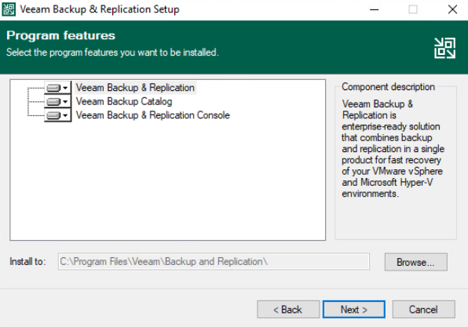

**Última atualização: 29/11/2018**

## Sumário

O Veeam Backup & Replication é um programa de proteção de dados, que oferece várias possibilidades de backup, replicação e restauro.

**Aprenda a instalar um servidor Veeam Backup & Replication e a registá-lo no nosso servidor de licenças Veeam Enterprise.**


## Requisitos

* Dispor de um serviço Veeam Enterprise.
* Dispor de uma máquina Windows Server 2012 ou 2016.

> [!primary]
>
> As nossas ofertas Veeam não são compatíveis com a versão mais recente (10) proposta pela Veeam. A OVHcloud continuará a propor a versão 9.5 até indicação em contrário. Tenha em conta este ponto durante a configuração do Veeam para os seus serviços.
>

## Instruções

### Instalar o Veeam Backup & Replication

Descarregue o programa **Veeam Backup & Replication** a partir do site da Veeam e,  caso não tenha conta, crie uma (gratuitamente).

O ficheiro apresenta-se sob a forma de uma imagem de disco no formato ISO. Depois de o ter transferido para o servidor, selecione o leitor CD da máquina e escolha a imagem.

Agora já pode executar o instalador na máquina. Selecione a opção `Veeam Backup & Replication Install`{.action}.

{.thumbnail}

Leia e aceite o contrato de licença e clique em `Next`{.action}.

{.thumbnail}

Ignore a introdução do ficheiro de licença clicando em `Next`{.action}.

{.thumbnail}

Na etapa de seleção dos componentes a instalar, não faça qualquer modificação. No entanto, se precisar, pode alterar o destino da instalação. A seguir, valide clicando em `Next`{.action}.

{.thumbnail}

O instalador realizará uma análise dos requisitos. Se partir de uma instalação bruta de Windows, alguns componentes estarão em falta, mas não se preocupe: o instalador vai descarregar e instalar estes últimos de forma automática. A seguir, valide clicando em `Next`{.action}.

{.thumbnail}

Aguarde enquanto os requisitos são instalados.

{.thumbnail}

Após esta etapa, valide a instalação do **Veeam Backup & Replication** clicando em `Next`{.action}.

{.thumbnail}

Na etapa de personalização da instalação, aceite a configuração predefinida selecionando a opção `Install`{.action}.

{.thumbnail}

Aguarde que a instalação seja finalizada.

{.thumbnail}

Quando esta for concluída, saia do instalador clicando em `Finish`{.action}.

{.thumbnail}

O instalador irá pedir-lhe que reinicie o Windows de forma a finalizar a operação. Escolha a opção `Yes`{.action}.

{.thumbnail}

### Criar uma conta de serviço Veeam Enterprise

#### Criar a conta de serviço

Em primeiro lugar, é necessário gerar uma palavra-passe **complexa**. Para isso, pode utilizar um gerador de palavras-passe.

A seguir, crie uma conta de serviço introduzindo o seguinte comando a partir de um acesso de administrador:

```powershell
New-LocalUser "OVHVeeamEnterprise" -Password (ConvertTo-SecureString -AsPlainText "P@ssword01" -Force) -Description "OVH Service Account for Veeam Enterprise" -PasswordNeverExpires:$true -UserMayNotChangePassword:$true -AccountNeverExpires:$true
```

Tenha em atenção que o nome da conta e a palavra-passe correspondem a um exemplo, pelo que devem ser substituídos:
 * Nome da conta: OVHVeeamEnterprise
 * Palavra-passe: P@ssword01

#### Definir as autorizações da conta de serviço

Abra a consola Veeam e conecte-se.

{.thumbnail}

Verifique se está em modo **Free Edition** no canto inferior direito.

{.thumbnail}

No menu, clique em `Users and Roles`{.action}.

{.thumbnail}

Na janela `Security`{.action}, selecione a opção `Add...`{.action}.

{.thumbnail}

Na janela `Add User`{.action}, introduza a conta de serviço criada anteriormente. Selecione o papel **Veeam Backup Administrator** e valide clicando em `OK`{.action}.

{.thumbnail}

Ao voltar à janela **Security**, pode verificar se a conta aparece.

{.thumbnail}

#### Registar o servidor Veeam Backup & Replication

**Através da Área de Cliente OVH
**

A partir da Área de Cliente OVH, abra o universo Cloud e, na secção `Platforms and services`{.action}, selecione o seu serviço **backupserverenterprise**.

{.thumbnail}

Na página principal do serviço, selecione a opção `Enable the license`{.action}.

{.thumbnail}

Na nova janela, introduza as seguintes informações:
 * o endereço de IP público através do qual pode comunicar com o servidor **Veeam Backup & Replication**;
 * a porta do servidor **Veeam Backup & Replication** (normalmente, **9392/TCP**);
 * o nome de utilizador da conta criada anteriormente;
 * a palavra-passe da conta.

Em seguida, confirme clicando em `OK`{.action}.
Quando a ativação estiver concluída, poderá encontrar as informações principais na página do serviço.

{.thumbnail}

**Com a API da OVH**

Para começar, obtenha o serviceName:

> [!api]
>
> @api {GET} /veeam/veeamEnterprise
>

De seguida, faça o registo:

> [!api]
>
> @api {POST} /veeam/veeamEnterprise/{serviceName}/register
>

Necessitará das seguintes informações:

 * o endereço de IP público através do qual pode comunicar com o servidor **Veeam Backup & Replication**;
 * a porta do servidor **Veeam Backup & Replication** (normalmente, **9392/TCP**);
 * o nome de utilizador da conta criada anteriormente;
 * a palavra-passe da conta.

Pode obter da seguinte forma o endereço de IP público utilizado pelo Veeam Enterprise para comunicar com o servidor **Veeam Backup & Replication**:

> [!api]
>
> @api {GET} /veeam/veeamEnterprise/{serviceName}
>

#### Verificar o registo

Abra a consola Veeam e conecte-se.

{.thumbnail}

No menu, clique em `License`{.action}.

{.thumbnail}

Verifique que a informação apresentada corresponde à sua licença da OVH.

{.thumbnail}

## Quer saber mais?

Fale com a nossa comunidade de utilizadores em [https://community.ovh.com/en/](https://community.ovh.com/en/){.external}.