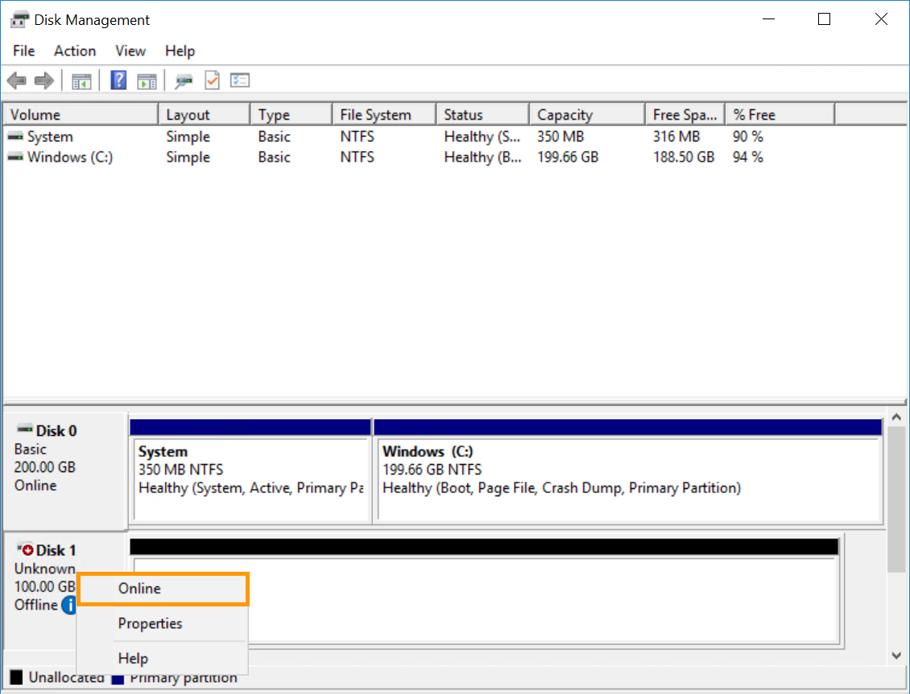
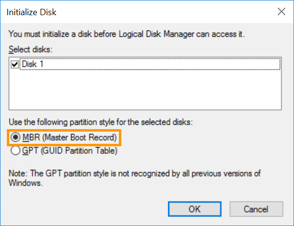
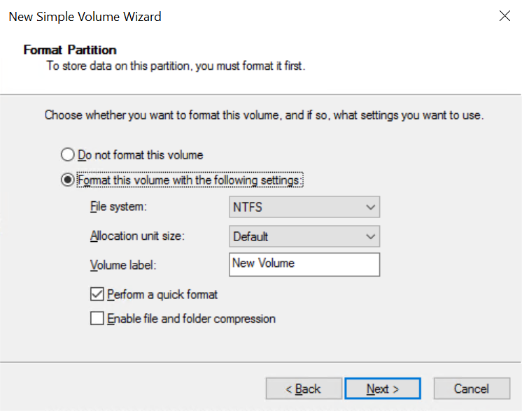

**Last updated 24th February 2021**

## Objective

With OVHcloud Virtual Private Servers you have the possibility to add a secure storage space as a service option. This storage is separated from the internal storage capacity of the VPS solution which makes it a secure place for your backups or other static data. The additional disk will only be accessible from the server's IP address and data stored on it will remain unaffected, even if the VPS is reinstalled or should suffer data loss.

**This guide explains how to enable the additional disk option and configure the storage space for use with the VPS.**

## Requirements

- a [VPS](https://www.ovhcloud.com/en-gb/vps/) in your OVHcloud account
- access to the [OVHcloud Control Panel](https://www.ovh.com/auth/?action=gotomanager&from=https://www.ovh.co.uk/&ovhSubsidiary=GB)
- administrative access via SSH or RDP to your VPS

## Instructions

Log in to the [OVHcloud Control Panel](https://www.ovh.com/auth/?action=gotomanager&from=https://www.ovh.co.uk/&ovhSubsidiary=GB), go to the `Bare Metal Cloud`{.action} section and select your server from the list in the left-hand menu under `Virtual Private Servers`{.action}.

### Subscribing to the additional disk option

After selecting your VPS, click on the `Additional disk`{.action} tab in the horizontal menu. Click on `Order an additional disk`{.action} and choose a disk size from the selection that appears.

{.thumbnail}

Take note of the pricing information, then click on `Order`{.action}. You will be guided through the order process and receive a confirmation email as soon as the disk is installed.

### Mounting the new storage space

> [!warning]
>OVHcloud is providing you with services for which you are responsible, with regard to their configuration and management. You are therefore responsible for ensuring they function correctly.
>
>If you encounter any difficulties performing these actions, please contact a specialised service provider and/or discuss the issue with our community on https://community.ovh.com/en/. OVHcloud cannot provide you with technical support in this regard.
>

#### On a Linux VPS

Use the command terminal or a SSH client application to connect to your VPS.

If a GNU/Linux distribution is installed on your VPS, establish an SSH connection to your server from the command line terminal or by using a SSH client application.

The examples below presume you are logged in as a user with elevated permissions.

You can use the following command to verify the name of the newly attached device:

```
$ lsblk

sda       8:0    0   80G  0 disk
├─sda1    8:1    0 79.9G  0 part /
├─sda14   8:14   0    4M  0 part
└─sda15   8:15   0  106M  0 part /boot/efi
sdb       8:16   0   50G  0 disk
```

In this example, the additional disk is named `sdb`.

Execute `fdisk` to create a partition on the disk; when prompted, enter `n` for a new partition and accept the subsequent defaults by pressing Enter ("↩"). Finally, use the `w` command to write the changes to the disk.

```
$ sudo fdisk /dev/sdb

Welcome to fdisk (util-linux 2.34).
Changes will remain in memory only, until you decide to write them.
Be careful before using the write command.
```

```
Command (m for help): n

Partition type
   p   primary (0 primary, 0 extended, 4 free)
   e   extended (container for logical partitions)

Select (default p):
```
```
Partition number (1-4, default 1): 

First sector (2048-104857599, default 2048):
Last sector, +/-sectors or +/-size{K,M,G,T,P} (2048-104857599, default 104857599):

Created a new partition 1 of type 'Linux' and of size 50 GiB.
```

```
Command (m for help): w

The partition table has been altered.
Calling ioctl() to re-read partition table.
Syncing disks.
```

Now that the partition `sdb1` is created, you can format it with ext4:

```
$ sudo mkfs.ext4 /dev/sdb1

Creating filesystem with 13106944 4k blocks and 3276800 inodes
Filesystem UUID: a667d351-cf36-49f2-94b4-daf03d7a86a6
Superblock backups stored on blocks:
32768, 98304, 163840, 229376, 294912, 819200, 884736, 1605632, 2654208,
4096000, 7962624, 11239424

Allocating group tables: done                           
Writing inode tables: done                           
Creating journal (65536 blocks): done
Writing superblocks and filesystem accounting information: done  
```

The final step is to mount the disk:

```
$ sudo mkdir /mnt/disk
$ sudo mount /dev/sdb1 /mnt/disk
```

You can see in the last line that the additional disk is now mounted at `/mnt/disk`:

```
$ df -h
Filesystem      Size  Used Avail Use% Mounted on
udev            1.9G     0  1.9G   0% /dev
tmpfs           385M  1.1M  384M   1% /run
/dev/sda1        78G  2.4G   75G   4% /
tmpfs           1.9G     0  1.9G   0% /dev/shm
tmpfs           5.0M     0  5.0M   0% /run/lock
tmpfs           1.9G     0  1.9G   0% /sys/fs/cgroup
/dev/sda15      105M  3.9M  101M   4% /boot/efi
/dev/loop1       68M   68M     0 100% /snap/lxd/18150
/dev/loop3       32M   32M     0 100% /snap/snapd/10707
/dev/loop4       56M   56M     0 100% /snap/core18/1944
/dev/loop5       70M   70M     0 100% /snap/lxd/19188
tmpfs           385M     0  385M   0% /run/user/0
/dev/loop6       56M   56M     0 100% /snap/core18/1988
/dev/loop2       32M   32M     0 100% /snap/snapd/11036
tmpfs           385M     0  385M   0% /run/user/1000
/dev/sdb1        49G   53M   47G   1% /mnt/disk
```

> [!primary]
>
This previous step is not persistent because the disk will be detached if the VPS is restarted. In order to automate the mounting process, the `fstab` file needs to be edited.
>

First, retrieve the UUID (block ID) of the device:

```
$ sudo blkid
/dev/sda1: LABEL="cloudimg-rootfs" UUID="e616a2cd-3c02-4c79-9823-9b1bb5c13b26" TYPE="ext4" PARTUUID="a44089a3-f407-41e6-b7a5-1ed7672cef20"
/dev/sda15: LABEL_FATBOOT="UEFI" LABEL="UEFI" UUID="4411-1580" TYPE="vfat" PARTUUID="e1746ac7-80c1-4859-9b4d-fa6ce11b3ae9"
/dev/loop1: TYPE="squashfs"
/dev/loop2: TYPE="squashfs"
/dev/loop3: TYPE="squashfs"
/dev/loop4: TYPE="squashfs"
/dev/loop5: TYPE="squashfs"
/dev/loop6: TYPE="squashfs"
/dev/sda14: PARTUUID="7d19a2c9-75df-443e-8301-0bb85931df7d"
/dev/sdb1: UUID="87571b68-30e1-498b-a64c-49ec5cd4f31c" TYPE="ext4" PARTUUID="c965cbdf-01"
```

Open `/etc/fstab` with a text editor:

```
$ sudo nano /etc/fstab
```

Add the line below to the file and replace the UUID with your own:

```
UUID=87571b68-30e1-498b-a64c-49ec5cd4f31c /mnt/disk ext4 nofail 0 0
```

Save and exit the editor. The disk should be automatically mounted after every reboot from now on.


#### On a Windows VPS

If a Windows OS is installed on your VPS, establish a remote desktop (RDP) connection to your server.

Once logged in, right-click on the `Start Menu`{.action} button and open `Disk Management`{.action}.

{.thumbnail}

The new disk will be displayed as an unknown volume with unallocated space.

{.thumbnail}

If the disk is marked as offline here, it needs to be initialised first. You can use the [Windows GUI](#initDiskManagement) or the [DISKPART utility](#initDiskpart) to achieve this. Otherwise, proceed with [formatting the disk in Disk Management](#formatDiskManagement).

##### **Initialising the disk in Disk Management** <a name="initDiskManagement"></a>

 Right-click on the disk and select `Online`{.action}. 

{.thumbnail}

Then right-click on the disk again and this time select `Initialise Disk`{.action}.

{.thumbnail}

Select `MBR`{.action} in the new window and click `OK`{.action}.

{.thumbnail}

##### **Initialising the disk with DISKPART** <a name="initDiskpart"></a>

Right-click on the `Start Menu`{.action} button and open `Run`{.action}.

{.thumbnail}

Type `cmd` and click `OK`{.action} to open the command line application.

{.thumbnail}

At the command prompt, open DISKPART:

```
C:\> diskpart
```

Use the following series of DISKPART commands to set the disk to online:

```
DISKPART> san

SAN Policy : Offline Shared
```

```
DISKPART> san policy = OnlineAll

DiskPart successfully changed the SAN policy for the current operating system.

- Implementation of the strategy on the extra disk:
[Code] DISKPART> list disk

Disk ### Status Size Free Dyn Gpt
-------- ------------- ------- ------- --- ---
Disk 0 Online 200 GB 0 B
* Disk 1 Offline 10 GB 1024 KB
```

```
DISKPART> select disk 1

Disk 1 is now the selected disk.
```

```
DISKPART> attributes disk clear readonly

Disk attributes cleared successfully.
```

```
DISKPART> attributes disk

Current Read-only State : No
Read-only : No
Boot Disk : No
Pagefile Disk : No
Hibernation File Disk : No
Crashdump Disk : No
Clustered Disk : No
```

```
DISKPART> online disk

DiskPart successfully onlined the selected disk.
```

##### **Formatting the disk** <a name="formatDiskManagement"></a>

In `Disk Management`{.action}, right-click on the new disk and select `New Simple Volume...`{.action}.

{.thumbnail}

In the wizard, click `Next`{.action} to specify the volume size. It should be set to maximum by default. Click `Next`{.action} to continue.

{.thumbnail}

Leave the new drive letter at default or select a different one, then click `Next`{.action}.

{.thumbnail}

Label the volume (optional) and confirm the formatting options by clicking `Next`{.action}.

{.thumbnail}

In the last window, click `Finish`{.action} to format the disk. It will be available as a drive in File Explorer after the operation.

### Cancelling the additional disk option

From the `Home`{.action} tab, scroll down to the box labelled **Summary of options**. Click on `...`{.action} next to the option "Additional disks" and in the context menu click on `Cancel`{.action}.

{.thumbnail}

## Go further

Join our community of users on <https://community.ovh.com/en/>.