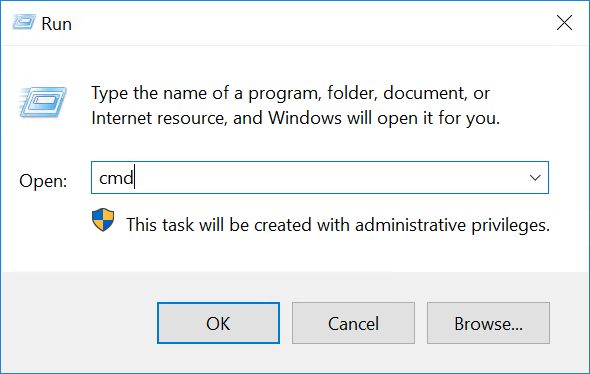
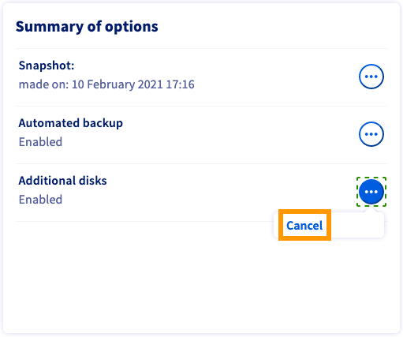

> [!primary]
> Esta traducción ha sido generada de forma automática por nuestro partner SYSTRAN. En algunos casos puede contener términos imprecisos, como en las etiquetas de los botones o los detalles técnicos. En caso de duda, le recomendamos que consulte la versión inglesa o francesa de la guía. Si quiere ayudarnos a mejorar esta traducción, por favor, utilice el botón «Contribuir» de esta página.
> 

**Última actualización: 24 de febrero de 2021**

## Objetivo

Con los VPS de OVHcloud, puede añadir un espacio de almacenamiento seguro como opción de servicio. Este almacenamiento está separado de la capacidad de almacenamiento interna de la solución VPS, lo que lo convierte en un lugar seguro para sus copias de seguridad u otros datos estáticos. Solo podrá acceder al disco adicional desde la dirección IP del servidor y los datos que contiene no se verán afectados, aunque el VPS sea reinstalado o deba perderse los datos.

**Esta guía explica cómo activar la opción de disco adicional y configurar el espacio de almacenamiento para utilizarlo con el VPS.**

## Requisitos

- Tener un [VPS](https://www.ovhcloud.com/es/vps/) en su cuenta de OVHcloud.
- Haber iniciado sesión en el [área de cliente de OVHcloud](https://www.ovh.com/auth/?action=gotomanager&from=https://www.ovh.es/&ovhSubsidiary=es).
- Tener acceso administrativo a su VPS por SSH o RDP.

## Procedimiento

Conéctese al [área de cliente de OVHcloud](https://www.ovh.com/auth/?action=gotomanager&from=https://www.ovh.es/&ovhSubsidiary=es), acceda a la sección `Bare Metal Cloud`{.action} y seleccione el servidor en la lista del menú de la izquierda, en `Servidores privados virtuales`{.action}.

### Contratar un disco adicional

Una vez seleccionado el VPS, abra la pestaña `Disco adicional`{.action} del menú horizontal. Haga clic en `Contratar un disco adicional`{.action} y seleccione el tamaño del disco en la selección que se muestra.

{.thumbnail}

Tome nota de la información sobre los precios y haga clic en `Contratar`{.action}. Le guiaremos en el proceso de pedido y recibirá un mensaje de correo electrónico de confirmación una vez instalado el disco.

### Subir el nuevo espacio de almacenamiento

> [!warning]
> OVHcloud le ofrece los servicios que usted es responsable de configurar y gestionar. Usted es responsable de su buen funcionamiento.
>
>Si necesita ayuda, póngase en contacto con un proveedor de servicios especializado o debata el problema con nuestra comunidad de usuarios en https://community.ovh.com/en/. OVHcloud no puede ofrecerle soporte técnico sobre este asunto.
>

#### En un VPS Linux

Si tiene instalada una distribución GNU/Linux en su VPS, conéctese por SSH al servidor desde el terminal de línea de comandos o utilizando una aplicación cliente SSH.

Los siguientes ejemplos suponen que está conectado como usuario con altos permisos.

Puede utilizar el siguiente comando para comprobar el nombre del nuevo dispositivo:

```
$ lsblk

sda 8:0 0 80G 0 disk
├─sda1    8:1    0 79.9G  0 part /
├─sda14   8:14   0    4M  0 part
safe15 8:15 0 106M 0 part /boot/efi
sdb 8:16 0 50G 0 disk
```

En este ejemplo, el disco adicional se llama `sdb`.

Ejecute `fdisk` para crear una partición en el disco. Cuando se le pida, introduzca `n` para una nueva partición y acepte los siguientes valores predeterminados pulsando Entrar (" ↩"). Por último, utilice el comando `w` para escribir los cambios en el disco.

```
$ sudo fdisk /dev/sdb

Welcome to fdisk (util-linux 2.34).
Changes will remain in memory only, until you to Decit write them.
Be careful before using the write command.
```

```
Command (m for help): n

Partición tipo
   p primary (0 primary, 0 extended, 4 free)
   e extended (container for logical partitions)

Select (default p):
```

```
Partition number (1-4, default 1): 

First sector (2048-104857599, default 2048):
Last sector, +/-sectores or +/-size {K,M,G,T,P} (2048-104857599, default 104857599):

Created a new partition 1 of type 'Linux' and of size 50 GiB.
```

```
Command (m for help): w

La partición mesa cuenta con una buena alternativa.
Calling ioctl() to re-read partition table.
Syncing disks.
```

Una vez creada la partición `sdb1`, puede formatearla con ext4:

```
$ sudo mkfs.ext4 /dev/sdb1

Creating filesystem with 13106944 4k blocks and 3276800 inodes
Filesystem UUID: a667d351-cf36-49f2-94b4-daf03d7a86a6
Superblock backups stored on blocks:
32768, 98304, 163840, 229376, 294912, 819200, 884736, 1605632, 2654208,
4096000, 7962624, 11239424

Allocating group tables: done                           
Writing inode tables: done                           
Creating journal (65536 blocks): done
Writing superblocks and filesystem accounting information: done  
```

Para terminar, montar el disco:

```
$ sudo mkdir /mnt/disk
$ sudo mount /dev/sdb1 /mnt/disk
```

En la última línea, puede ver que el disco adicional está ahora montado a `/mnt/disk`:

```
$ df -h
Filesystem Size Used Avail Use% Mounted on
udev 1.9G 0 1.9G 0% /dev
tmpfs 385M 1.1M 384M 1% /run
/dev/sda1        78G  2.4G   75G   4% /
tmpfs           1.9G     0  1.9G   0% /dev/shm
tmpfs           5.0M     0  5.0M   0% /run/lock
tmpfs           1.9G     0  1.9G   0% /sys/fs/cgroup
/dev/sda15 105M 3.9M 101M 4% /boot/efi
/dev/loop1       68M   68M     0 100% /snap/lxd/18150
/dev/loop3       32M   32M     0 100% /snap/snapd/10707
/dev/loop4       56M   56M     0 100% /snap/core18/1944
/dev/loop5       70M   70M     0 100% /snap/lxd/19188
tmpfs 385M 0 385M 0% /run/user/0
/dev/loop6       56M   56M     0 100% /snap/core18/1988
/dev/loop2       32M   32M     0 100% /snap/snapd/11036
tmpfs 385M 0 385M 0% /run/user/1000
/dev/sdb1        49G   53M   47G   1% /mnt/disk
```

> [!primary]
>
Este paso anterior no es persistente, ya que el disco se desvinculará si se reinicia el VPS. Para automatizar el proceso de montaje, debe modificar el archivo "fstab".
>

En primer lugar, obtenga el UUID (ID de bloque) del periférico:

```
$ sudo blkid
/dev/sda1: LABEL="cloudimg-rootfs" UUID="e616a2cd-3c02-4c79-9823-9b1bb5c13b26" TYPE="ext4" PARTUUID="a44089a3-f407-41e6-b7a5-1ed7672cef20"
/dev/sda15: LABEL_FATBOOT="UEFI" LABEL="UEFI" UUID="4411-1580" TYPE="vfat" PARTUUID="e1746ac7-80c1-4859-9b4d-fa6ce11b3ae9"
/dev/loop1: TYPE="squashfs"
/dev/loop2: TYPE="squashfs"
/dev/loop3: TYPE="squashfs"
/dev/loop4: TYPE="squashfs"
/dev/loop5: TYPE="squashfs"
/dev/loop6: TYPE="squashfs"
/dev/sda14: PARTUUID="7d19a2c9-75df-443e-8301-0bb85931df7d"
/dev/sdb1: UUID="87571b68-30e1-498b-a64c-49ec5cd4f31c" TYPE="ext4" PARTUUID="c965cbdf-01"
```

Abra `/etc/fstab` con un editor de texto:

```
$ sudo nano /etc/fstab
```

Añada la siguiente línea al archivo y sustituya el UUID por el suyo:

```
UUID=87571b68-30e1-498b-a64c-49ec5cd4f31c /mnt/disk ext4 nofail 0 0
```

Guarde y salga del editor. A continuación, el disco debe montarse automáticamente tras cada reinicio.

#### En un VPS Windows

Si tiene instalado un sistema operativo Windows en su VPS, conéctese al servidor mediante un escritorio remoto (RDP).

Una vez que se haya conectado, haga clic derecho en el botón `Menú Iniciar`{.action} y abra la herramienta de `gestión de discos`{.action}.

{.thumbnail}

El nuevo disco se muestra en forma de volumen desconocido con espacio no destinado.

{.thumbnail}

Si el disco está marcado como desconectado, primero debe inicializarse. Para ello, puede utilizar la [interfaz gráfica Windows](#initDiskManagement) o la [utilidad DISKPART](#initDiskpart). De lo contrario, realice el [formateo del disco en la herramienta "Gestión de discos"](#formatDiskManagement).

##### **Inicializar el disco en la herramienta de gestión de discos** <a name="initDiskManagement"></a>

 Haga clic derecho en el disco y seleccione `En línea`{.action}. 

{.thumbnail}

 Haga clic derecho en el disco y seleccione `Inicializar disco`{.action}.

{.thumbnail}

Seleccione `MBR`{.action} (Sector de inicio principal) en la nueva ventana y haga clic en `Aceptar`{.action}.

{.thumbnail}

##### **Iniciar el disco con DISKPART** <a name="initDiskpart"></a>

 Haga clic derecho en el `menú Inicio`{.action} y abra `Ejecutar`{.action}.

{.thumbnail}

Pulse `cmd` y haga clic en `Aceptar`{.action} para abrir la aplicación de línea de órdenes.

{.thumbnail}

En la línea de comandos, abra DISKPART:

```
C:\> diskpart
```

Utilice la siguiente serie de comandos DISKPART para configurar el disco en línea:

```
DISKPART> san

SAN Policy: Offline Shared
```

```
DISKPART> san policy = OnlineAll

DiskPart successfully changed the SAN policy for the current operating system.

- Implementation of the strategy on the extra disk:
[Código] DISKPART> list disk

Disk ### Status Size Free Dyn Gpt
-------- ------------- ------- ------- --- ---
Disk 0 Online 200 GB 0 B
* Disk 1 Offline 10 GB 1024 KB
```

```
DISKPART> select disk 1

Disk 1 is now the selected disk
```

```
DISKPART> atributos disk clear readonly

Disk atributos cleared successfully.
```

```
DISKPART> atributos disk

Current Read-only State : No
Read-only: No
Boot Disk: No
Pagefile Disk: No
Hibernación File Disk : No
Crashdump Disk: No
Clustered Disk: No
```

```
DISKPART> online disk

DiskPart successfully onlined the selected disk.
```

##### **Formatear el disco en la herramienta de gestión de discos** <a name="formatDiskManagement"></a>

En `Gestión de discos`{.action}, haga clic derecho en el nuevo disco y seleccione `Nuevo volumen simple...`{.action}.

{.thumbnail}

En el Asistente, haga clic en `Siguiente`{.action} para especificar el tamaño del volumen. Debe estar definido por defecto en el máximo. Haga clic en `Siguiente`{.action} para continuar.

{.thumbnail}

Guarde la nueva letra predeterminada del reproductor o seleccione otra y haga clic en `Siguiente`{.action}.

{.thumbnail}

Asigne un nombre al volumen (opcional) y confirme las opciones de formato haciendo clic en `Siguiente`{.action}.

{.thumbnail}

En la última ventana, haga clic en `Finalizar`{.action} para dar formato al disco. Estará disponible como reproductor en el Explorador de archivos después de la operación.

### Dar de baja la opción de disco adicional

En la pestaña `Inicio`{.action}, desplace la pantalla hasta el cuadro **Resumen de las opciones**. Haga clic en `...`{.action} delante de la opción "Discos adicionales". Haga clic en `Dar de baja`{.action} en el menú contextual.

{.thumbnail}

## Más información

Únase a nuestra comunidad de usuarios en <https://community.ovh.com/en/>.
