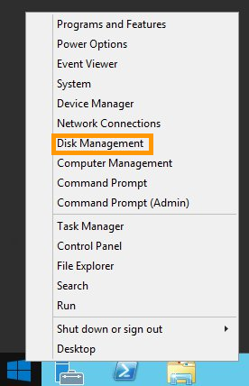
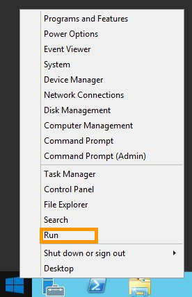

> [!primary]
> Questa traduzione è stata generata automaticamente dal nostro partner SYSTRAN. I contenuti potrebbero presentare imprecisioni, ad esempio la nomenclatura dei pulsanti o alcuni dettagli tecnici. In caso di dubbi consigliamo di fare riferimento alla versione inglese o francese della guida. Per aiutarci a migliorare questa traduzione, utilizza il pulsante "Contribuisci" di questa pagina.
>

**Ultimo aggiornamento: 15/02/2023**

## Obiettivo

Con i VPS OVHcloud è possibile aggiungere spazio di storage sicuro come opzione di servizio. Questo storage è separato dalla capacità di storage interno della soluzione VPS, che lo rende un luogo sicuro per i tuoi backup o altri dati statici. Il disco aggiuntivo sarà accessibile esclusivamente dall'indirizzo IP del server e i dati in esso contenuti non subiranno modifiche, anche se il VPS sarà reinstallato o subirà una perdita di dati.

**Questa guida ti mostra come attivare l'opzione di disco supplementare e configurare lo spazio di storage per utilizzarla con il VPS.**

## Prerequisiti

- Disporre di un [VPS](https://www.ovhcloud.com/it/vps/) nel proprio account OVHcloud
- Avere accesso allo [Spazio Cliente OVHcloud](https://www.ovh.com/auth/?action=gotomanager&from=https://www.ovh.it/&ovhSubsidiary=it)
- Avere accesso amministrativo via SSH o RDP al VPS

## Procedura

Accedi allo [Spazio Cliente OVHcloud](https://www.ovh.com/auth/?action=gotomanager&from=https://www.ovh.it/&ovhSubsidiary=it), clicca su `Bare Metal Cloud`{.action} e seleziona il tuo server nella sezione `Server Privati Virtuali`{.action}.

### Ordina un disco aggiuntivo

Dopo aver selezionato il tuo VPS, clicca sulla scheda `Disco aggiuntivo`{.action} nel menu orizzontale. Clicca su `Ordina un disco aggiuntivo`{.action} e seleziona una dimensione del disco nella selezione che appare.

{.thumbnail}

Annota le informazioni relative alla tariffazione e clicca su `Ordina`{.action}. Riceverai un'email di conferma durante il processo d'ordine.

### Montare il nuovo spazio di storage

> [!warning]
> OVHcloud fornisce i servizi di cui sei responsabile per la configurazione e la gestione. Sei quindi responsabile del loro corretto funzionamento.
>
>In caso di difficoltà nell'effettuare queste azioni, contatta un fornitore di servizi specializzato e/o discuta il problema con la nostra Community di utenti all'indirizzo https://community.ovh.com/en/. OVHcloud non può fornirti assistenza tecnica su questo argomento.
>

#### Su un VPS Linux

Se sul tuo VPS è installata una distribuzione GNU/Linux, connettiti in SSH al tuo server dal terminale della linea di comando o utilizzando un'applicazione cliente SSH.

Gli esempi che seguono suppongono di essere connessi come utenti con diritti elevati.

Per verificare il nome della nuova periferica utilizza il seguente comando:

```bash
$ lsblk

sda       8:0    0   80G  0 disk
├─sda1    8:1    0 79.9G  0 part /
├─sda14   8:14   0    4M  0 part
└─sda15   8:15   0  106M  0 part /boot/efi
sdb       8:16   0   50G  0 disk
```

In questo esempio, il disco aggiuntivo è chiamato `sdb`.

Esegui `fdisk` per creare una partizione sul disco. Quando ti viene chiesto, inserisci `n` per una nuova partizione e accetta i valori predefiniti qui sotto premendo "Enter". e utilizza il comando `w` per scrivere le modifiche sul disco.

```bash
$ sudo fdisk /dev/sdb

Welcome to fdisk (util-linux 2.34).
Changes will remain in memory only, until you decide to write them.
Be careful before using the write command.
```

```bash
Command (m for help): n

Partition type
   p   primary (0 primary, 0 extended, 4 free)
   e   extended (container for logical partitions)

Select (default p):
```

```
Partition number (1-4, default 1): 

First sector (2048-104857599, default 2048):
Last sector, +/-sectors or +/-size{K,M,G,T,P} (2048-104857599, default 104857599):

Created a new partition 1 of type 'Linux' and of size 50 GiB.
```

```bash
Command (m for help): w

The partition table has been altered.
Calling ioctl() to re-read partition table.
Syncing disks.
```

Una volta creata la partizione `sdb1`, è possibile formattarla con ext4:

```bash
$ sudo mkfs.ext4 /dev/sdb1

Creating filesystem with 13106944 4k blocks and 3276800 inodes
Filesystem UUID: a667d351-cf36-49f2-94b4-daf03d7a86a6
Superblock backups stored on blocks:
32768, 98304, 163840, 229376, 294912, 819200, 884736, 1605632, 2654208,
4096000, 7962624, 11239424

Allocating group tables: done                           
Writing inode tables: done                           
Creating journal (65536 blocks): done
Writing superblocks and filesystem accounting information: done  
```

L'ultimo step consiste nel mount del disco:

```bash
$ sudo mkdir /mnt/disk
$ sudo mount /dev/sdb1 /mnt/disk
```

Sull'ultima riga puoi vedere che il disco aggiuntivo è stato montato a `/mnt/disk`:

```bash
$ df -h
Filesystem      Size  Used Avail Use% Mounted on
udev            1.9G     0  1.9G   0% /dev
tmpfs           385M  1.1M  384M   1% /run
/dev/sda1        78G  2.4G   75G   4% /
tmpfs           1.9G     0  1.9G   0% /dev/shm
tmpfs           5.0M     0  5.0M   0% /run/lock
tmpfs           1.9G     0  1.9G   0% /sys/fs/cgroup
/dev/sda15      105M  3.9M  101M   4% /boot/efi
/dev/loop1       68M   68M     0 100% /snap/lxd/18150
/dev/loop3       32M   32M     0 100% /snap/snapd/10707
/dev/loop4       56M   56M     0 100% /snap/core18/1944
/dev/loop5       70M   70M     0 100% /snap/lxd/19188
tmpfs           385M     0  385M   0% /run/user/0
/dev/loop6       56M   56M     0 100% /snap/core18/1988
/dev/loop2       32M   32M     0 100% /snap/snapd/11036
tmpfs           385M     0  385M   0% /run/user/1000
/dev/sdb1        49G   53M   47G   1% /mnt/disk
```

> [!primary]
>
Questo step precedente non è persistente perché il disco verrà scollegato se il VPS verrà riavviato. Per automatizzare il processo di mount, il file fstab deve essere modificato.
>

Per prima cosa recupera l'UUID (ID del blocco) della periferica:


```bash
$ sudo blkid
/dev/sda1: LABEL="cloudimg-rootfs" UUID="e616a2cd-3c02-4c79-9823-9b1bb5c13b26" TYPE="ext4" PARTUUID="a44089a3-f407-41e6-b7a5-1ed7672cef20"
/dev/sda15: LABEL_FATBOOT="UEFI" LABEL="UEFI" UUID="4411-1580" TYPE="vfat" PARTUUID="e1746ac7-80c1-4859-9b4d-fa6ce11b3ae9"
/dev/loop1: TYPE="squashfs"
/dev/loop2: TYPE="squashfs"
/dev/loop3: TYPE="squashfs"
/dev/loop4: TYPE="squashfs"
/dev/loop5: TYPE="squashfs"
/dev/loop6: TYPE="squashfs"
/dev/sda14: PARTUUID="7d19a2c9-75df-443e-8301-0bb85931df7d"
/dev/sdb1: UUID="87571b68-30e1-498b-a64c-49ec5cd4f31c" TYPE="ext4" PARTUUID="c965cbdf-01"
```

Apri `etc/fstab` con un editor di testo:

```bash
$ sudo nano /etc/fstab
```

Aggiungi la riga qui sotto al file e sostituisci l'UUID con la tua:

```
UUID=87571b68-30e1-498b-a64c-49ec5cd4f31c /mnt/disk ext4 nofail 0 0
```

Salva e lascia l'editor. A questo punto, il disco dovrebbe essere montato automaticamente dopo ogni riavvio.

#### Su un VPS Windows

Se sul tuo VPS è installato un sistema operativo Windows, connetti desktop remoto (RDP) al tuo server.

Una volta connesso, clicca con il tasto destro sul pulsante `Menu Inizia`{.action} e apri il tool di `Gestione disco`{.action}.

{.thumbnail}

Il nuovo disco viene visualizzato come volume sconosciuto con spazio non allocato.

{.thumbnail}

Se il disco è marcato come disco "off-connection", deve prima essere avviato. Per farlo, puoi utilizzare l'[interfaccia grafica Windows](#initDiskManagement) o l'[utility DISKpart](#initDiskpart). Altrimenti, esegui la [formattazione del disco nel tool "Gestione disco"](#formatDiskManagement).

##### **Inizializzare il disco nello strumento "Gestione dei dischi"** <a name="initDiskManagement"></a>

Clicca con il tasto destro sul disco e seleziona `online`{.action}. 

{.thumbnail}

Fai un nuovo click con il tasto destro sul disco e seleziona questa volta `Inizializza il disco`{.action}.

{.thumbnail}

Seleziona `MBR`{.action} (settore principale di avvio) nella nuova finestra e clicca su `OK`{.action}.

{.thumbnail}

##### **Iniziare il disco con DISKpart** <a name="initDiskpart"></a>

Clicca con il tasto destro sul `Menu Inizia`{.action} e apri `Esegui`{.action}.

{.thumbnail}

Clicca su `cmd` e clicca su `OK`{.action} per aprire l'applicazione della riga di comando.

{.thumbnail}

Nel prompt dei comandi, apri DISKPART:

```powershell
C:\> diskpart
```

Per configurare il disco online, utilizza questo set di comandi DISKpart:

```powershell
DISKPART> san

SAN Policy: Offline Shared
```

```powershell
DISKPART> san policy = OnlineAll

DiskPart successfully changed the SAN policy for the current operating system.

- Implementation of the strategy on the extra disk:
[Code] DISKPART> list disk

Disk ### Status Size Free Dyn Gpt
-------- ------------- ------- ------- --- ---
Disk 0 Online 200 GB 0 B
* Disk 1 Offline 10 GB 1024 KB
```

```powershell
DISKPART> select disk 1

Disk 1 is now the selected disk.
```

```powershell
DISKPART> attributes disk clear readonly

Disk attributes cleared successfully.
```

```powershell
DISKPART> attributes disk

Current Read-only State : No
Read-only : No
Boot Disk : No
Pagefile Disk : No
Hibernation File Disk : No
Crashdump Disk : No
Clustered Disk : No
```

```powershell
DISKPART> online disk

DiskPart successfully onlined the selected disk.
```

##### **Formattare il disco nel tool "Gestione dei dischi"** <a name="formatDiskManagement"></a>

Nella `gestione dei dischi`{.action}, clicca con il tasto destro sul nuovo disco e seleziona `Nuovo volume semplice...`{.action}.

{.thumbnail}

Nell'assistente, clicca su `Avanti`{.action} per specificare la dimensione del volume. Dovrebbe essere definito di default sul massimo. Clicca su `Avanti`{.action} per continuare.

{.thumbnail}

Conserva la nuova lettera del lettore di default o scegline un'altra, poi clicca su `Seguente`{.action}.

{.thumbnail}

Assegna un nome al volume (facoltativo) e conferma le opzioni di formattazione cliccando su `Avanti`{.action}.

{.thumbnail}

Nell'ultima finestra, clicca su `Terminare`{.action} per formattare il disco. Dopo l'operazione sarà disponibile come lettore nell'Explorer di File.

### Disattiva l'opzione di disco aggiuntivo

Nella scheda `Home`{.action}, sposta lo schermo fino all'area intitolata **Sintesi delle opzioni**. Clicca sui tre puntini `...`{.action} in corrispondenza dell'opzione "Dischi aggiuntivi". Clicca su `Disattiva`{.action} il menu contestuale.

{.thumbnail}

## Per saperne di più

Unisciti alla nostra Community di utenti <https://community.ovh.com/en/>.
